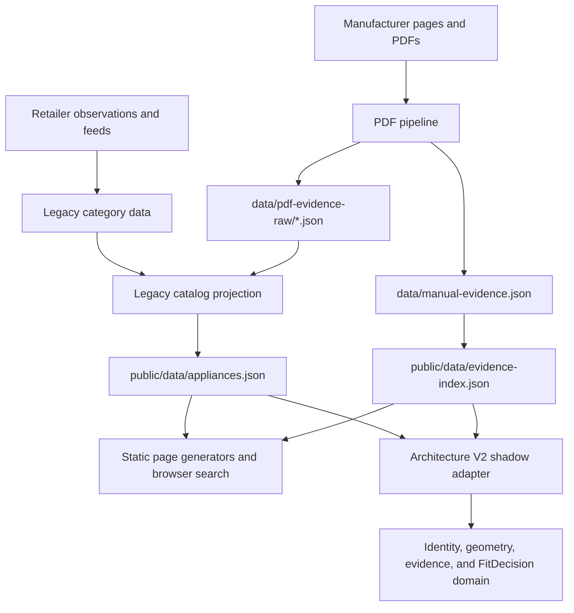

# FitAppliance Repository Architecture Audit

Status: living audit baseline  
Last verified: 2026-07-11  
Scope: product ingestion, manufacturer evidence, dimensions, installation
requirements, Fit decisions, generated pages, and legacy migration

## Purpose

This document preserves the architectural findings that led to Architecture V2.
It is not a claim that every file has been rewritten or every data row is
correct. It records the current system boundaries, verified baseline, known
failure modes, and decisions that future work must not silently reverse.

The companion execution document is
[`remediation-master-plan.md`](./remediation-master-plan.md).

## Executive Finding

FitAppliance should be progressively replaced inside the existing repository,
not rewritten as a new project. The current site has valuable production URLs,
retailer observations, manufacturer evidence, static generators, tests, and
reviewer-facing trust pages. A clean rewrite would discard provenance and create
a high-risk data migration without first resolving product identity or Fit
semantics.

The central problem is not the number of scripts. It is that source
observations, approved facts, derived geometry, Fit decisions, and public
presentation have historically been allowed to overlap. Architecture V2 creates
explicit boundaries and runs beside the legacy system until parity and evidence
gates are proven.

## Verified Baseline

The following values were reproduced in the Architecture V2 worktree on
2026-07-11:

| Measure | Current value |
| --- | ---: |
| Runtime products audited | 2,268 |
| Shadow products adapted | 2,259 |
| Products quarantined | 9 |
| Evidence-index matches | 427 |
| Official dimensions applied in shadow mode | 331 |
| Full automated tests | 1,560 passing |
| Generated pages checked by schema audit | 2,348 |
| Structured-data blocks checked | 7,193 |
| Schema errors | 0 |

Reproduce the architecture counts with:

```bash
npm run build-evidence-index
npm run test:architecture-v2
node scripts/architecture-v2/shadow-audit.mjs
```

Run the broader compatibility gates with:

```bash
npm test -- --runInBand
npm run validate-schema
```

## Current Data Flow



The production path still uses legacy projections. Architecture V2 is currently
diagnostic and must not be described as the production Fit engine.

## Existing Assets Worth Preserving

- Stable public routes, canonical URLs, sitemap policy, and static deployment.
- Retailer observations and affiliate links with historical availability data.
- Manufacturer PDF files, extraction records, source URLs, and manual review
  metadata.
- Existing page generators and 1,560 regression tests.
- GSC remediation, reviewer-readiness, disclosure, business identity, and
  editorial trust work.
- Category pages, cavity pages, doorway pages, product pages, guides, and
  comparison pages that already have search history.

## Architectural Debt

### 1. Product identity is not canonical

Legacy IDs, retailer IDs, discovery IDs, GEMS identifiers, model strings, and
display names have served as interchangeable identity keys. Normalized model
strings are useful lookup keys but are not sufficient canonical identity.

Risks:

- colour or hinge variants can be attached to the wrong document;
- duplicate retailer rows can be mistaken for separate manufacturer products;
- a renamed display model can break joins;
- fuzzy matching can attach dimensions from a related model family.

Architecture V2 requires scheme-specific identifiers and exact or explicitly
approved alias mappings.

### 2. Retailer observations and manufacturer facts are mixed

Retailer feeds are useful for price, URL, availability, title, image, and a
dimension hint. They are not automatically authoritative for installation
clearance or manufacturer geometry.

The PDF pipeline now prevents known retailer-hosted evidence from taking
priority over an available manufacturer factsheet for Electrolux Group models.
This policy must become a general source-document rule rather than remain a
brand-specific branch.

### 3. PDF presence has historically been too easy to confuse with verification

A downloaded PDF proves only that bytes were retrieved. It does not prove:

- the PDF belongs to the target model;
- width, height, and depth were mapped to the correct axes;
- clearance values are installation requirements rather than diagram labels;
- the document is manufacturer-authored;
- the PDF is complete rather than an error document;
- the extracted fields are sufficient for a Fit decision.

The current strict path separates `dimensions_verified` from `verified_fit`.
Factsheets without installation clearance remain dimensions-only evidence.

### 4. Unknown clearance has been vulnerable to zero substitution

An explicit manufacturer requirement of `0 mm` is valid. Missing clearance is
unknown and must not be represented as zero in the domain model. Some legacy
pipeline schemas still need numeric placeholders, so trust metadata must prevent
those placeholders from becoming verified installation requirements.

Architecture V2 represents unknown installation values as `null` and never
promotes factsheet dimensions into clearance evidence.

### 5. Dimension axes have contained systematic inversions

The initial real shadow audit found 32 upright refrigerators whose legacy width
and height were obviously reversed. Exact manufacturer factsheets and strict
label parsing reduced that quarantine to 9 without swapping axes heuristically.

The approved method is:

1. bind a source to an exact model;
2. parse explicit `Total height`, `Total width`, and `Total depth` labels;
3. save dimensions-only evidence;
4. project the verified dimensions into the slim evidence index;
5. let the shadow adapter replace legacy axes only after identity and confidence
   checks pass.

Automatic `w/h` swapping is prohibited.

### 6. Fit logic has multiple historical representations

Legacy code contains scores, labels, clearance rules, and browser calculations
that do not yet share one authoritative contract. A high score must never
override a failed physical constraint.

Architecture V2 defines deterministic outcomes:

- `NO_FIT`
- `INSUFFICIENT_DATA`
- `CONDITIONAL_FIT`
- `LIKELY_FIT_ESTIMATED`
- `VERIFIED_FIT`

Production has not yet cut over to this engine.

### 7. Availability is a retailer observation, not a permanent product fact

The current catalog combines archived and current products, while retailer
availability can change independently. Future ingestion must retain observation
time, retailer, source URL, and status instead of overwriting one global
`available` truth.

### 8. Generated output magnifies upstream errors

One incorrect product or clearance rule can propagate into product, brand,
cavity, doorway, location, comparison, sitemap, schema, and browser-search
artifacts. Generator tests are strong compatibility protection, but they cannot
make an unverified source fact correct.

## Architecture V2 Boundaries

### Source observation

An immutable record of what a retailer, feed, manufacturer page, PDF, GEMS
record, or manual review stated at a particular time.

### Source document

A fetched document with URL, author type, transport host, retrieval time, hash,
document type, model binding, and processing state.

### Approved field evidence

One field value with model identity, document hash, page, quote, parser version,
and approval status. Approval is field-level, not document-level.

### Canonical product

A stable internal entity with explicit external identifiers. Retailer offers and
source documents link to it but do not define its identity.

### Product geometry

Separate envelopes for closed dimensions, installation requirements, operation
space, and delivery constraints. Missing values remain unknown.

### Fit decision

A deterministic evaluation of required and advisory checks. Evidence level and
physical outcome remain separate.

### Public projection

A compatibility artifact for static pages and browser search. It is generated
from approved domain state and must not become a second source of truth.

## Remaining Dimension Quarantine

These rows remain quarantined as of 2026-07-11:

| Legacy ID | Brand | Model | Reason automatic repair is blocked |
| --- | --- | --- | --- |
| `fridge-arf2445` | Electrolux | `EBE5367BC` | Exact factsheet returns 404; historical guide lists `EBE5367SC`, not `BC`. |
| `fridge-arf2581` | Westinghouse | `WTB2500AH` | Exact factsheet returns 404; historical guide lists `WTB2500WH`, not `AH`. |
| `fridge-arf2582` | Kelvinator | `KTB2502AB` | Exact factsheet returns 404; `WB` evidence is not an approved alias. |
| `fridge-arf2584` | Kelvinator | `KTB2802AB` | Exact factsheet returns 404; `WB` evidence is not an approved alias. |
| `fridge-arf2595` | Kelvinator | `KTB2302AB` | Exact factsheet returns 404; `WB` evidence is not an approved alias. |
| `fridge-arf3916` | Westinghouse | `WHE7074BA` | Exact factsheet returns 404; `SA` evidence is not an approved alias. |
| `fridge-arf3968` | Westinghouse | `WHE6000BB` | Exact factsheet returns 404; dimension guide lists `SB`, not `BB`. |
| `fridge-arf3969` | Westinghouse | `WHE6060BB` | Exact factsheet returns 404; dimension guide lists `SB`, not `BB`. |
| `fridge-arf3970` | Westinghouse | `WHE6874BA` | Official PDF is an error document without dimensions; existing retailer PDF cannot be promoted to official. |

These rows require an exact manufacturer source or a separately reviewed alias
record. Similar dimensions, matching capacity, colour-only assumptions, or
sibling model evidence are insufficient.

## Completed Architecture Ledger

| Commit | Result |
| --- | --- |
| `0b417daf` | Added explicit geometry contract. |
| `9b262688` | Added reproducible field-evidence gate. |
| `33fc102a` | Added deterministic Fit decisions and golden fixtures. |
| `70a08fdc` | Added conservative legacy shadow adapter. |
| `23dafc98` | Added deterministic real-catalog shadow audit. |
| `a3f35b61` | Recorded Phase 0 completion. |
| `902c0a32` | Added exact Electrolux Group factsheet ingestion. |
| `2057cacd` | Added verified dimension overlay in shadow mode. |
| `1e79081b` | Added exact factsheet fallback and official-source priority. |
| `b308983e` | Added seven additional exact group dimension records. |

The commit ledger is supporting evidence, not a substitute for this audit or
the remediation plan.

## Non-Negotiable Guardrails

1. Do not derive canonical identity from mutable display text.
2. Do not fuzzy-match a PDF to a model.
3. Do not treat a retailer feed as manufacturer clearance evidence.
4. Do not represent unknown domain values as zero.
5. Do not convert dimensions-only evidence into `verified_fit`.
6. Do not auto-swap width and height.
7. Do not approve a sibling model without an explicit alias record.
8. Do not change production Fit labels before shadow parity is measured.
9. Do not rewrite public URLs as part of the domain migration.
10. Do not remove legacy paths until rollback artifacts and parity gates pass.

## Related Documents

- [`Architecture V2 Phase 0 Design`](../superpowers/specs/2026-07-11-architecture-v2-phase0-design.md)
- [`Architecture V2 Phase 0 Plan`](../superpowers/plans/2026-07-11-architecture-v2-phase0.md)
- [`Data Accuracy Audit`](../data-accuracy-audit.md)
- [`PDF Evidence Audit`](../pdf-evidence-audit.md)
- [`Manual Evidence Pipeline`](../manual-evidence-pipeline.md)
- [`Retailer Data Expansion Plan`](../retailer-data-expansion-plan.md)

