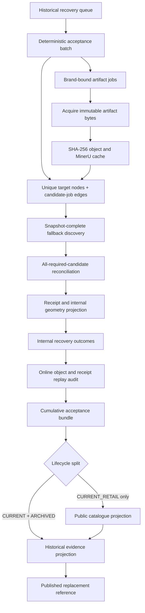

# Historical Evidence Recovery Workflow Implementation Plan

> **For agentic workers:** REQUIRED SUB-SKILL: Use
> `superpowers:subagent-driven-development` (recommended) or
> `superpowers:executing-plans` to implement this plan task-by-task. Steps use
> checkbox (`- [ ]`) syntax for tracking.

- **Status:** Ready for execution; Task 0 complete
- **Date:** 2026-07-13
- **Canonical product policy:** [`docs/product-core-brief.md`](../../product-core-brief.md)
- **Storage policy:** [`docs/architecture-v2/storage-layout.md`](../../architecture-v2/storage-layout.md)

**Goal:** Create one production-grade, resumable workflow that turns a queued
exact-model document lead into immutable source bytes, MinerU JSON, field-level
evidence, a verified receipt, an internal geometry projection and, only after a
separate release gate, the public catalogue and historical replacement index.

**Architecture:** Keep the candidate acquisition and evidence-verification
primitives from `runEvidenceResearchCycle`, but do not preserve its current
first-success finalisation behaviour. The recovery batch is a bipartite graph:
brand-authorised artifact jobs are independent from unique evidence targets,
and each target owns an ordered set of primary and alternate artifact-job IDs.
This prevents the same target being finalised twice when two legacy documents
point at it, while still allowing one shared PDF to be downloaded and converted
once for every target in the same authority context. Split payload acquisition
from brand-sensitive authority checks and target-specific evidence attestation
so byte reuse never shares identity or publication authority.
Legacy brand code may contribute candidate URLs only; legacy parsers and
inferred values never enter Architecture V2 evidence. Recovery writes external
run state and internal outcomes. A cumulative, audited acceptance bundle then
feeds two separate release paths: current products may update the public
catalogue, while current and archived products may update the historical
replacement reference.

**Tech stack:** Node.js ESM, `node:test`, Architecture V2 evidence receipts,
MinerU `content_list_v2`, SHA-256 content-addressed storage, atomic JSON
checkpoints, existing official transport and discovery modules.

---

## 1. Why This Work Comes First

The current components are individually useful but do not form one recoverable
system:

- `scripts/pdf-pipeline/*-official.js` contains 23 brand discovery paths but no
  shared Architecture V2 adapter contract.
- The old `scripts/pdf-pipeline/parsers/` and merge scripts can infer semantics
  or coerce missing values. They are not acceptable evidence producers.
- `runEvidenceResearchCycle` currently fetches, converts, extracts and attests
  for one target inside one private function. Shared manuals therefore repeat
  work and cannot be resumed at artifact and target granularity.
- `runPdfBrandAcceptanceBatch` already performs most of the correct work, but
  orchestration, storage and checkpoint logic live in a one-purpose CLI with no
  dedicated tests.
- The public projection reads two acceptance-result files directly. Historical
  recovery has no separate audit/promotion boundary yet.

This is why 4,951 historical records can already contain complete W/H/D while
only 11 are auto-fillable: the missing capability is mostly evidence migration
and receipt throughput, not raw number extraction.

### Architecture review corrections applied on 2026-07-13

The first draft was not safe to execute unchanged. This revision corrects these
dependency and failure-mode defects:

- Required uncommitted queue work could have been omitted by creating a
  worktree directly from HEAD; baseline consolidation now precedes isolation.
- Field semantics originally followed runner extraction, which would have
  forced the runner interface to be rewritten twice; versioned claims now come
  first.
- The queue is job-centric but the proposed runner was target-centric; the
  runner now acquires a shared primary artifact once and then fans out targets.
- Current research stops at its first verified source; final target acceptance
  now requires an explicit reconciliation stage.
- A single replaceable acceptance-results file could erase earlier accepted
  targets; promotion now produces one cumulative atomic bundle.
- Archived products cannot be projected through the current-catalogue
  acceptance function; lifecycle-specific release paths now separate current
  catalogue and historical reference updates.
- Online object replay conflicted with the external-drive-free build rule;
  online promotion audit and offline CI verification are now distinct.
- Existing MinerU object-path and receipt-v1 compatibility were missing from the
  draft; both are now explicit gates.
- Resume equality incorrectly included operational timestamps; the invariant is
  now a semantic outcome digest.
- Adjustable ranges were at risk of being forced into scalar replacement data;
  ranges remain receipt-bound but non-auto-fill until a safe public contract is
  implemented.
- URL-only queue jobs omitted the brand context required by the official-host
  transport policy. Every artifact job now carries one canonical authority
  brand and authority mode; cross-brand URL reuse deduplicates immutable bytes
  only after each brand-bound transport decision succeeds.
- Nine targets currently appear under two different queue jobs. The acceptance
  batch now has one target node with an ordered candidate-job set instead of
  running and promoting the same target twice.
- "Other official candidates" was not a closed reconciliation rule. Acceptance
  now requires a hashed candidate inventory, completion status for every
  configured resolver and a typed outcome for every required candidate.
- Adding queue generation to the normal Architecture V2 build created a stale
  cross-release loop (`bundle -> public -> historical -> next queue`). Queue
  generation is explicit and belongs to the next recovery epoch; normal build
  verifies committed artifacts but does not regenerate the queue.

### Second architecture preflight verdict

The revised plan passed the mandatory preflight on 2026-07-13:

- current producers, consumers, persistence and lifecycle assumptions are
  mapped in Section 4.1;
- first run, retry/resume, repeated batch, duplicate target, cross-brand URL,
  conflict, archived publication, range and disconnected-storage traces are
  specified in Section 4.3;
- the release flow is acyclic within one epoch and next-epoch queue generation
  is explicit;
- every implementation task has an earlier-only dependency set in Section 7.1;
- no acceptance gate depends on a later task;
- the focused documentation audit reports zero issues; and
- the plan remains fail-closed for incomplete discovery, unresolved official
  conflict, receipt/schema drift and lifecycle ambiguity.

## 2. Baseline and Scope

The deterministic recovery queue currently contains:

| Metric | Baseline |
| --- | ---: |
| Source documents | 1,600 |
| Deduplicated fetch jobs | 1,556 |
| Unique references | 1,591 |
| Targets assigned to more than one source job | 9 |
| Direct official receipt rebuild | 23 |
| Official-host authority validation | 254 |
| Mirror parse and official rediscovery | 1,223 |
| Official source discovery required | 56 |
| Current-retail missing-dimension targets with a candidate | 1,064 / 1,115 |

The workflow is complete only when it handles acquisition, parsing, identity,
field semantics, conflict checks, receipts, projection, resume and explicit
release. It is not complete merely because a PDF downloads or tests pass.

### In scope

- A deterministic batch generated from the recovery queue.
- Resumable artifact and target processing with bounded concurrency.
- Official discovery through current Architecture V2 discovery plus safe
  adapters around legacy brand resolvers.
- MinerU-only PDF extraction into `content_list_v2`.
- Exact-model or existing strict official-marketing-alias identity gates.
- Per-axis fixed/range dimension evidence and measurement-scope validation.
- Receipt-bound internal geometry and explicit, audited publication.
- Rebuilding historical replacement data from accepted W/H/D while preserving
  the direct old-appliance-to-new-appliance comparison mode.

### Out of scope until this workflow passes

- Processing all 7,103 government registry records.
- Changing cavity-fit or FitDecision scoring.
- Treating Energy Rating, WELS, EESS or retailer data as installation truth.
- Paying for GS1/Icecat or adding manufacturer APIs before a measured pilot.
- UI expansion or affiliate-content work.

## 3. Non-Negotiable Safety Rules

1. A legacy, retailer or registry dimension remains a hint until a receipt
   proves the individual field.
2. PDF extraction must use MinerU `content_list_v2`; legacy regex/AI parsers do
   not write evidence.
3. Each target model is attested independently even when models share a PDF.
4. Width, height and depth each retain source label/order, unit, fixed/range
   value, measurement scope, page, fragment/bbox, source hash and receipt.
5. Package, cavity, body-only, door-open and handle-excluded dimensions cannot
   silently satisfy closed-envelope W/H/D.
6. Adjustable height stays a range. It is never collapsed into a convenient
   fixed value.
7. A retailer mirror can be parsed only in `reference` authority mode. Its
   claims can help rediscover or hash-match an official artifact but can never
   produce a publishable receipt.
8. Energy Rating and WELS support Australian model identity, lifecycle and
   conflict checks. They do not override exact-model installation evidence.
9. Exact official dimension evidence may support replacement matching. It does
   not imply installation clearance or `VERIFIED_FIT`.
10. Any unresolved identity, scope, axis or source conflict fails closed into a
    typed terminal result; no manual approval is required.
11. Recovery never mutates public files. Only a separate promotion command may
    create the acceptance input consumed by public projection.
12. Normal tests, builds and deploys must work with
    `FITAPPLIANCE_STORAGE_ROOT` unset and the external drive disconnected.
13. Every official transport decision is bound to one authority brand and
    authority mode. Content hashes may deduplicate storage, but a host verdict
    for one brand never authorises another brand.
14. A target may have multiple candidate artifacts but exactly one target state
    and one terminal outcome per batch.
15. Acceptance requires a complete candidate-inventory snapshot. Resolver
    timeout, truncation or unknown completion state is retryable and cannot be
    interpreted as "no contradiction found".

## 4. Canonical Workflow



The two independent units of work are:

- **Artifact job:** fetch/hash/store/convert one URL under one authority brand,
  authority mode and transport-policy SHA. Its immutable bytes can be reused by
  content hash, but its authority decision cannot cross that boundary.
- **Evidence target:** one stable target ID for brand + model + category +
  reference ID + requested field set. It points to one or more ordered artifact
  jobs and creates exactly one terminal outcome.

This separation prevents both repeated MinerU work and unsafe evidence sharing.

### 4.1 Current-state contract map

| Stage | Current producer | Current consumer | Defect this plan must remove |
| --- | --- | --- | --- |
| Recovery lead | `buildHistoricalEvidenceRecoveryQueue()` | no production runner | URL job lacks authority brand; duplicate targets span jobs |
| Candidate discovery | `discoverRankedCandidateUrls()` | `runEvidenceResearchCycle()` | string-only output has no resolver completion proof |
| Acquisition and attestation | private `acquireCandidate()` | first-success research loop | payload, identity and receipt are coupled per target |
| PDF conversion | `runMineruPdfToJson()` | `parseMineruContentListV2()` | reusable artifact state is not independently checkpointed |
| Research outcome | `runEvidenceResearchCycle()` | resolution/PDF acceptance callers | first verified source returns before reconciliation |
| Acceptance persistence | PDF and range result JSON files | `build-public-projection.mjs` | independent replaceable files are not cumulative |
| Current publication | `buildReceiptBoundAcceptanceProjection()` | public catalogue | assumes every accepted target is a current catalog product |
| Historical publication | `buildHistoricalApplianceReference()` | replacement shards | accepts registry + current public catalogue only |

### 4.2 Versioned release DAG

One recovery epoch is acyclic:

```text
queue[n] + policy[n]
  -> batch[n]
  -> run results[n]
  -> online audit[n]
  -> cumulative acceptance bundle[n]
  -> current public projection[n]
  -> historical reference[n]
  -> published replacement shards[n]
  -> queue[n+1]
```

`queue[n+1]` is planning input for the next epoch, not a prerequisite that is
rebuilt inside the normal build for epoch `n`. The normal build consumes the
committed acceptance bundle and performs offline structural verification only.
Commands requiring raw evidence or registry objects remain explicit release
commands with the external storage mounted.

### 4.3 Required adversarial traces

Before implementation is marked ready, every contract and task must account for
these traces:

1. First run succeeds with one exact official PDF.
2. A process dies after artifact parse and resumes without network or MinerU.
3. A later batch excludes an earlier accepted target and cannot erase it.
4. Two queue jobs nominate the same target; one target outcome is produced.
5. One URL is nominated under two brands; authority is checked independently.
6. Official exact sources conflict; no first-source acceptance is possible.
7. Registry or retailer hints conflict with an exact official source; the lower
   authority conflict is recorded but cannot overwrite the official claim.
8. An archived target reaches historical output only.
9. Adjustable or partial dimensions remain internal and never become scalar
   replacement auto-fill.
10. The external drive is unavailable during normal build and deploy.

## 5. Data and State Contracts

### 5.1 Tracked repository artifacts

Add these keys to `architectureV2Paths`:

| Key | Path | Purpose |
| --- | --- | --- |
| `historicalEvidenceRecoveryPolicy` | `data/architecture-v2/policies/historical-evidence-recovery-policy.json` | Limits, authority rules and tool-version pins |
| `historicalEvidenceRecoveryBatch` | `data/architecture-v2/reviews/automated/historical-evidence-recovery-batch.json` | Immutable selected input |
| `historicalEvidenceRecoveryResults` | `data/architecture-v2/reviews/automated/historical-evidence-recovery-results.json` | Complete accepted and failed internal outcomes |
| `historicalEvidenceRecoveryAudit` | `data/architecture-v2/reviews/automated/historical-evidence-recovery-audit.json` | Replay and safety gate |
| `historicalEvidenceRecoveryAcceptanceBundle` | `data/architecture-v2/reviews/automated/historical-evidence-recovery-acceptance-bundle.json` | Cumulative, atomic batch + outcomes + audit binding |
| `historicalEvidenceProjection` | `data/architecture-v2/generated/historical-evidence-projection.json` | Receipt-bound current and archived scalar evidence for historical reference construction |

All tracked artifacts include `schemaVersion`, input SHA-256 values and policy
SHA-256. A queue or policy hash change invalidates resume and promotion until a
new batch is generated. The batch stores `artifactJobs[]`, `targets[]` and
target-to-candidate-job edges separately. Every target ID appears exactly once;
every candidate edge resolves to a declared artifact job. Promotion merges new
accepted targets into the existing bundle by canonical target ID; it never
replaces prior accepted targets merely because a later work batch excludes
them. A conflicting replacement is allowed only through a separately designed
source-refresh/supersession workflow.

### 5.2 External storage

Use `FITAPPLIANCE_STORAGE_ROOT`, normally
`/Volumes/UGREEN-1TB/FitAppliance`, for:

```text
.fitappliance-storage-root.json
evidence/web/sha256/<aa>/<bb>/<sha>.pdf
evidence/web/sha256/<aa>/<bb>/<sha>.html
evidence/derived/mineru-json/sha256/<aa>/<bb>/<json-sha>.json
runs/historical-evidence-recovery/<run-id>/state.json
runs/historical-evidence-recovery/<run-id>/lock.json
runs/historical-evidence-recovery/<run-id>/events.ndjson
```

Paths must be resolved under the configured root, writes must be atomic, and an
existing content-addressed object with different bytes is a fatal collision.
The marker contains a fixed project identifier, schema version and expected
volume UUID. Preflight compares the marker, mounted volume UUID and configured
root before opening a run lock. It contains no secret or machine credential.

### 5.3 Artifact state machine

```text
queued -> discovering -> fetching -> fetched -> parsed
   |           |           |          |
   +-----------+-----------+----------+-> retryable_failure -> queued
                                      \-> terminal_failure
```

Artifact state contains requested/final URL, redirect chain, authority mode,
content type, byte size, content SHA, object path, MinerU artifact identity,
attempt count, next retry time and typed failure history.

### 5.4 Target state machine

```text
queued -> researching -> evidence_collected -> identity_verified
       -> claims_verified -> conflict_checked -> receipt_accepted -> projected
       -> identity_rejected | claims_incomplete | conflict_quarantined
       -> retryable_failure | terminal_failure
```

An artifact being parsed does not advance a target. A target advances only when
its own exact identity and requested fields are verified.

The state document owns one record per target ID. Artifact completion is
referenced through candidate-job edges and cannot create a second target state.
Fallback discovery may append immutable discovered artifact jobs to run state,
but it must also record resolver ID/version, completion state and a canonical
candidate-inventory SHA before reconciliation.

### 5.5 Idempotency keys

- Artifact job: authority brand key + normalized requested URL + authority mode
  + transport-policy SHA.
- Transport cache: authority brand key + normalized requested URL + authority mode +
  transport-policy SHA. This prevents an official-host verdict for one brand
  leaking into another brand.
- Raw object: content SHA-256.
- MinerU object: PDF SHA-256 + parser version + model revision.
- Target: reference ID + legacy runtime ID + case identity + evidence field
  set. Canonical product ID and lifecycle are bound inputs but do not determine
  target ownership.
- Candidate inventory: target ID + ordered artifact-job IDs + resolver
  IDs/versions + per-resolver completion states.
- Receipt: case identity + source hash + claims + evidence policy versions.
- Batch: recovery queue SHA + recovery policy SHA + ordered selection.
- Semantic outcome: identity + source hashes + claims + decisions + policy
  versions, excluding operational timestamps and event ordering.
- Projection: existing accepted-evidence conflict/idempotency rules.

### 5.6 Failure taxonomy

Every attempted target must end with an accepted result or one typed reason:

| Class | Examples | Retry policy |
| --- | --- | --- |
| `environment` | drive absent, MinerU unavailable, lock held | Stop run; do not consume target attempt |
| `queue_drift` | queue/policy SHA changed | Stop run; generate new batch |
| `discovery` | no official candidate, resolver error | Retry only after seed/resolver version changes |
| `discovery_incomplete` | timeout, truncation, unknown resolver completion | Retry; never reconcile as conflict-free |
| `transport` | timeout, 429, transient 5xx | Up to 3 bounded retries with backoff |
| `payload` | non-HTTPS, oversize, MIME/magic mismatch | Terminal for candidate |
| `mineru` | conversion crash, invalid JSON contract | Retry once after tool recovery, then quarantine |
| `identity` | target model absent, sibling/family only | Terminal for candidate; continue other candidates |
| `claim_semantics` | swapped/ambiguous axes, package dimensions, partial range | Quarantine target |
| `source_authority` | retailer mirror only, unapproved host | Continue official rediscovery; never publish |
| `conflict` | exact official sources disagree | Automated research, then quarantine |
| `receipt` | locator/hash/replay failure | Terminal and block promotion |

### 5.7 Reconciliation closure

The internet cannot be proven exhaustively searched. This workflow therefore
defines a finite, reproducible candidate inventory instead of claiming global
completeness. For each target the inventory contains:

1. all queue candidates bound to that target;
2. every active receipt source already attached to the exact case;
3. all candidates returned by each configured deterministic brand resolver;
4. exact-model document links found on every successfully resolved official
   product page; and
5. lower-authority registry, retailer and legacy hints used only as conflict
   signals.

Each configured resolver returns `complete`, `incomplete` or `failed` plus its
version and search scope. Reconciliation may accept only when every required
resolver is `complete`, every official candidate in the resulting inventory has
a typed outcome, and at least one exact official source proves the requested
claims. Resolver failure or pagination truncation produces
`discovery_incomplete`, not acceptance.

Two active exact official sources with different field values quarantine unless
an explicit same-resource supersession receipt proves which one is current.
Registry, retailer or legacy disagreement cannot overwrite exact manufacturer
evidence; it is preserved as a lower-authority conflict reason and triggers the
configured second-source search before final acceptance.

## 6. Resource and Recovery Policy

- Network concurrency: 2 globally and 1 per host by default.
- MinerU concurrency: 1.
- Fetch retries: 3, using current timeout, byte limit, redirect, magic-byte and
  curl-fallback controls from `official-artifact-transport.mjs`.
- One process lock per batch, created with exclusive `open(..., 'wx')`. It
  records host, PID, process-start identity and heartbeat. A stale lock is
  reclaimed through an atomic compare-and-replace only when the owning process
  identity is absent and its heartbeat exceeds the policy timeout.
- Checkpoint after every artifact transition and every target outcome.
- The atomic state JSON is authoritative. The NDJSON event stream is diagnostic
  and may discard an incomplete final line after a crash.
- State writes fsync the temporary file and parent directory before/after atomic
  rename. Existing parsed artifacts are rehydrated from their immutable object
  paths on resume; an in-memory cache is never the only resume mechanism.
- `SIGINT`/`SIGTERM` finishes the active atomic write, marks the run
  `interrupted`, releases the lock and exits non-zero.
- Resume skips accepted terminal states, retries eligible transient states and
  rejects queue/policy/tool-version drift.
- A `--force-research` run creates a new run ID; it never rewrites prior event
  history.

## 7. Definition of Done

The first complete workflow milestone requires all of the following:

1. Fisher & Paykel `WD8560F1` (`recovery_f22800464225ad1821023b0e`) moves from
   its official QRG through raw PDF, MinerU JSON, exact identity, per-axis
   claims, receipt, dimensions projection, audited promotion and rebuilt
   historical reference.
2. The projection remains dimensions-only unless installation fields are also
   independently proven. It must not become `VERIFIED_FIT` from W/H/D alone.
3. A shared Electrolux document is fetched and converted once while each listed
   Westinghouse model receives an independent identity outcome.
4. A retailer-mirror canary is parsed as reference material but produces no
   acceptance result until an official artifact is found and verified.
5. Killing a two-target run after the first target and resuming produces the
   same semantic outcome digest as an uninterrupted run. Operational retrieval
   and event timestamps may differ and are not part of that digest.
6. Changing the queue or policy SHA blocks resume and promotion.
7. A real archived canary, Kelvinator `KBM5302AC`, updates only the historical
   replacement evidence and never appears in the current public catalogue.
8. Existing PDF-brand and identity-range publication outputs remain unchanged
   unless the cumulative audited acceptance bundle adds a non-conflicting
   current product.
9. Full tests, lint, Architecture V2 build and production build pass; the normal
   build also passes without the external drive.

### 7.1 Dependency order

| Task | Depends on | Independently testable output |
| ---: | --- | --- |
| 0 | none | isolated reproducible baseline |
| 1 | 0 | authority-safe queue and acyclic epoch boundary |
| 2 | 1 | strict policy/state schemas and canonical paths |
| 3 | 2 | deterministic artifact-job/target batch graph |
| 4 | 2 | receipt-compatible v2 field semantics |
| 5 | 4 | reusable artifacts and target-specific attestation |
| 6 | 3, 5 | complete candidate inventory and conflict decision |
| 7 | 6 | deterministic graph runner with bounded concurrency |
| 8 | 7 | durable lock/checkpoint/resume CLI |
| 9 | 6 | typed resolver adapters with completion proof |
| 10 | 8, 9 | synthetic gates and real internal canary outcomes |
| 11 | 10 | replay audit and cumulative atomic promotion |
| 12 | 11 | lifecycle-split current and historical publication |
| 13 | 12 | official-host lane evidence funnel |
| 14 | 13 | non-authoritative mirror rediscovery lane |
| 15 | 13, 14 | all brand adapters and measured parity funnel |
| 16 | 15 | staged scale, runbook and conditional retirement |

No task gate relies on a later task. Real network execution begins only after
the synthetic contract, graph, reconciliation and resume gates are green.

---

## 8. Implementation Tasks

### Task 0: Consolidate the dirty baseline, then isolate execution

**Files:**

- Read: `AGENTS.md`
- Read: `data/architecture-v2/reviews/automated/historical-evidence-recovery-queue.json`
- Read: current `git status --short` and all task-related uncommitted diffs
- Create: external run directory only after the tracked prerequisite state is
  reproducible

- [x] Classify every dirty path as prerequisite work, unrelated user work or
  generated output. Never move or stage the user-owned `AGENTS.md` implicitly.
- [x] Verify the existing queue builder, path and test changes as one coherent
  prerequisite batch. Commit that batch, or explicitly export only those
  reviewed diffs into the feature worktree. Do not create a worktree from HEAD
  while silently leaving required uncommitted files behind.
- [x] Create the isolated feature worktree only after its starting tree contains
  the exact queue and canonical-brief prerequisites required by this plan.
- [x] Record `git rev-parse HEAD`, queue SHA-256, policy-input hashes, Node,
  MinerU and parser/model versions in the implementation log.
- [x] Verify the mounted storage root is the expected journaled HFS+ project
  volume and create/validate a non-secret
  `.fitappliance-storage-root.json` project marker. A different volume mounted
  at the same path must fail preflight.
- [x] Run the current focused baseline:

```bash
npm run test:architecture-v2
npm run lint
npm run build:architecture-v2
```

- [x] Confirm `AGENTS.md` and unrelated dirty files remain user-owned and are
  not staged or modified.

**Gate:** the isolated tree reproduces the current queue SHA and contains every
reviewed prerequisite while excluding unrelated user changes. Baseline commands
and the starting commit are recorded before new implementation work.

**Execution record:** worktree
`.worktrees/historical-evidence-recovery-v2` on
`codex/historical-evidence-recovery-v2`, starting commit `83555ba6`; queue SHA
`a0b334aa9814f5ad110511d85235e9792d74d36b5e46905c17220cb0ad0c95d1`;
evidence policy SHA `3a90fe676c07a86e46cd4db2f78f33926a8207fe41ca0cd335e2350bb074eed7`;
manufacturer policy SHA
`32b87021db50a7c0c4c6955b1347ef5ad1497645ea77b9a22d64c844cc38ab4e`;
Node `v22.23.1`; MinerU `3.4.4`; model revision
`ed6b654c018d742e65a17671e379c5e6ecc87ec9`; mounted Journaled HFS+ volume
UUID `5125E5C5-EFF3-3C42-94B7-DF4B340A6AD4`; storage marker validated.
Architecture V2: 346 tests passed; lint and Architecture V2 build passed.

### Task 1: Repair queue authority, target ownership and epoch boundaries

**Files:**

- Modify: `src/domain/historical-evidence-recovery.mjs`
- Modify: `tests/architecture-v2/historical-evidence-recovery.test.mjs`
- Modify: `scripts/architecture-v2/build-historical-evidence-recovery-queue.mjs`
- Modify: `package.json`
- Modify: `src/domain/architecture-v2-paths.mjs`
- Modify: `tests/architecture-v2/architecture-v2-paths.test.mjs`
- Regenerate: `data/architecture-v2/reviews/automated/historical-evidence-recovery-queue.json`

- [x] Add failing tests proving every queue job has one `authorityBrand`, one
  `authorityMode` and target brands compatible with that authority context.
- [x] Add a cross-brand same-URL fixture. Split it into brand-bound transport
  jobs while preserving later content-hash deduplication; never select an
  arbitrary target brand to authorise the fetch.
- [x] Group jobs by normalized URL + canonical authority brand + authority mode.
  Manufacturer-host routes use `official`; retailer mirrors use `reference`.
  Keep route as workflow intent, not as a substitute for authority mode.
- [x] Add a duplicate-target fixture proving the queue preserves all candidate
  job bindings and reports them instead of implying 1,600 independent targets.
- [x] Give each target a stable target ID independent of artifact job and batch
  membership. Reject conflicting identity, lifecycle or hint metadata for the
  same target ID.
- [x] Keep `build:historical-evidence-recovery-queue` as an explicit command,
  but remove it from `build:architecture-v2`. Document and test that queue
  generation occurs after epoch publication to create `queue[n+1]`.
- [x] Regenerate twice, compare canonical SHA-256, and record the counts of
  unique targets, candidate edges, multi-candidate targets and authority jobs.

**Gate:** the queue contains no authority-ambiguous job, duplicate targets are
represented as one identity with multiple candidates, and normal Architecture
V2 build cannot silently produce a next-epoch queue from a stale historical
reference.

**Execution record:** queue schema v2 contains 1,556 authority-bound artifact
jobs, 1,591 unique target nodes, 1,600 candidate edges and 9 multi-candidate
targets. The focused 11-test queue/path suite passes; queue generation completes
in under one second and is absent from `build:architecture-v2`.

### Task 2: Add recovery contracts, policy and canonical paths

**Files:**

- Create: data/architecture-v2/policies/historical-evidence-recovery-policy.json
- Create: src/domain/historical-evidence-recovery-contract.mjs
- Create: tests/architecture-v2/historical-evidence-recovery-contract.test.mjs
- Modify: `src/domain/architecture-v2-paths.mjs`
- Modify: `tests/architecture-v2/architecture-v2-paths.test.mjs`

- [x] Add only the policy path in this task. Batch, results, audit, acceptance
  bundle and historical projection paths are registered by Tasks 3, 8, 11 and
  12 when each task also creates its first valid artifact; registered paths may
  never point at missing files.
- [x] Write failing tests for the policy path, strict schema versions,
  ordered artifact jobs/unique targets/candidate edges, accepted status enums,
  authority brands and modes, failure codes,
  lifecycle release destinations, cumulative acceptance-bundle invariants,
  SHA-256 fields and unknown-key rejection.
- [x] Run:

```bash
node --test tests/architecture-v2/historical-evidence-recovery-contract.test.mjs tests/architecture-v2/architecture-v2-paths.test.mjs
```

  Confirm failure is caused by missing contracts/paths.
- [x] Implement these public functions:

```js
validateHistoricalEvidenceRecoveryPolicy(value)
validateHistoricalEvidenceRecoveryBatch(value)
validateHistoricalEvidenceRecoveryResults(value)
validateHistoricalEvidenceRecoveryAudit(value)
validateHistoricalEvidenceRecoveryAcceptanceBundle(value)
canonicalJsonSha256(value)
```

- [x] Pin concurrency, retry, timeout, byte-limit, lock-heartbeat, parser
  contract and allowed authority modes in policy JSON. Do not duplicate host
  allowlists already owned by official source policy.
- [x] Keep recovery result schemas dependent on the versioned evidence-source
  verifier rather than duplicating claim fields. Reserve supported claim
  semantics versions `1` and `2` and receipt schema versions `2` and `3`;
  Task 4 implements claim semantics v2 in receipt schema v3 while existing
  receipt schema v2 remains a compatibility contract.
- [x] Require every target to declare `CURRENT_RETAIL` or
  `CATALOG_ARCHIVED` release scope. Registry-only identities may be researched
  later but are not introduced through this legacy-document queue.
- [x] Define the acceptance bundle as one atomic document containing cumulative
  accepted entries/outcomes, source batch lineage and the online audit SHA.
- [x] Rerun the focused tests and `git diff --check`.

**Gate:** malformed policy/state fixtures, unknown authority modes and missing
queue/policy hashes fail before any network or filesystem work; every registered
repository path resolves to an existing artifact.

**Execution record:** strict recovery policy `2026-07-13.1` pins queue schema
v2, receipt schemas v2/v3, claim semantics v1/v2, bounded network/MinerU
concurrency, retry/size/time limits, lock timing and MinerU parser identity.
Canonical hashing and strict batch/results/audit/cumulative-bundle validators
reject unknown keys, malformed graph edges, duplicate outcomes, unsafe lifecycle
release and broken audit lineage. The focused 9-test contract/path suite and
`git diff --check` pass.

### Task 3: Materialize a deterministic bipartite acceptance batch

**Files:**

- Create: src/domain/historical-evidence-recovery-batch.mjs
- Create: scripts/architecture-v2/build-historical-evidence-recovery-batch.mjs
- Create: tests/architecture-v2/historical-evidence-recovery-batch.test.mjs
- Modify: `package.json`
- Modify: `src/domain/architecture-v2-paths.mjs`

- [x] Write failing tests for deterministic ordering, route/priority filters,
  artifact-job reuse, unique target ownership, multi-candidate edges,
  cumulative accepted-target exclusion and stable batch SHA across two builds.
- [x] Implement:

```js
buildHistoricalEvidenceRecoveryBatch({
  queue,
  policy,
  existingAcceptanceBundles,
  selection,
})
```

- [x] Keep `legacyDimensionHintMm` in diagnostic context only. Set every new
  target to `publicationEligible: false`.
- [x] Materialise separate `artifactJobs[]` and `targets[]` arrays. Every target
  has ordered `candidateJobIds`, exactly one `primaryJobId` and no duplicate
  state owner. Every artifact job lists linked target IDs. Validate both sides
  of the graph and reject dangling or contradictory edges.
- [x] Snapshot deterministic reconciliation context per target: active
  receipt-bound source references, registry dimension hints with snapshot SHA,
  and legacy hints with source-document IDs. Label registry/legacy values
  non-authoritative so they can trigger research/quarantine but never satisfy a
  claim.
- [x] Exclude targets already accepted by the existing PDF-brand,
  identity-range or cumulative historical-recovery bundles. Never remove their
  prior cumulative acceptance entries when generating a new work batch.
- [x] Add CLI filters `--job-id`, `--route`, `--priority`, `--brand`, `--limit`
  and command:

```json
"build:historical-evidence-recovery-batch": "node scripts/architecture-v2/build-historical-evidence-recovery-batch.mjs"
```

- [x] Build twice and compare the tracked batch SHA.

**Gate:** a one-target canary batch and a full batch are reproducible from the
same queue/policy, preserve shared-document reuse, retain all alternate
candidates for selected targets and do not cause prior accepted targets to
disappear from the cumulative release bundle.

**Execution record:** the deterministic full batch contains 1,591 targets,
1,556 artifact jobs and 1,600 candidate edges. All 472 available registry hints
retain their official snapshot SHA, while every legacy hint is now paired with
its exact source-document ID so conflicting documents cannot lose provenance.
Target filters retain alternate candidate jobs and accepted-target exclusion
recognises both stable target IDs and exact brand/model/category identities.
Two builds produced canonical queue SHA
`075be4cf7f4ee6b21edfd56789f75705e11d00502c7f43f61ff36fb5a77c4eab`
and batch SHA
`4cd1ed0a1e5d6b66e0d08d702ee9e82b94134a84d2fe07161ac0ff18dbd8f6af`;
the focused 22-test queue/batch/contract/path suite passes.

### Task 4: Version field-level dimension semantics before refactoring runners

**Files:**

- Create: src/domain/dimension-evidence-claim.mjs
- Create: tests/architecture-v2/dimension-evidence-claim.test.mjs
- Modify: `src/domain/mineru-document.mjs`
- Modify: `tests/architecture-v2/mineru-document.test.mjs`
- Modify: `src/domain/evidence-artifact-verifier.mjs`
- Modify: `src/domain/evidence-source-verifier.mjs`
- Modify: `tests/architecture-v2/evidence-artifact-verifier.test.mjs`
- Modify: `tests/architecture-v2/evidence-source-verifier.test.mjs`
- Modify: `src/domain/evidence-geometry-projector.mjs`
- Modify: `tests/architecture-v2/evidence-geometry-projector.test.mjs`

- [x] Freeze current claim replay and receipt fixtures before changing parser
  output. Existing receipt schema-v2 sources must continue to verify with their
  exact historical binding SHA.
- [x] Introduce receipt schema v3 with `claimSemanticsVersion: 2` and dispatch
  MinerU replay by source version. Do not make the current parser emit new keys
  for old receipt-v2 sources, because that would invalidate their canonical
  claim digest. Derived MinerU artifact schema v1 remains unchanged.
- [x] Add adversarial fixtures for `W x H x D`, `H x W x D`, high/wide/deep,
  body-only, handles included/excluded, package, cavity, door-open, multiple
  models in one table, family manuals and adjustable height.
- [x] Define the v2 claim contract:

```js
{
  field,
  value: { kind: 'fixed', mm } | { kind: 'range', minMm, maxMm },
  sourceLabel,
  sourceAxisOrder,
  sourceUnit,
  measurementScope,
  includesDoor,
  includesHandle,
  page,
  fragmentSha256,
  bbox,
}
```

- [x] Map v2 fixed claims into existing geometry scalars. Map adjustable height
  into the already-supported `closedEnvelope.heightMm` range. Width/depth ranges
  remain accepted internal claims but cannot create a public dimensions
  projection until geometry supports them.
- [x] Do not collapse an adjustable-height range for historical replacement.
  Until the replacement reference supports partial/range confirmation, retain
  the receipt in the acceptance bundle but keep that reference out of
  `AUTO_FILL`. This workflow must report that as
  `receipt_accepted_non_scalar`, not as parser failure.
- [x] Keep clearance, door, water, power, drain and ventilation independent from
  closed-envelope dimensions. W/H/D-only evidence cannot produce
  `VERIFIED_FIT`.

**Gate:** old receipts replay unchanged, v2 claims carry explicit scope, and all
known axis/scope ambiguities either resolve from source semantics or fail closed
without forcing a scalar.

**Execution record:** schema-v2 replay remains byte-semantically stable at the
frozen fixture binding
`9815b5544350bba85aa307d2cd0d1b964ca67cc52b76434df07714b88907674c`.
Schema v3 binds claim semantics v2, explicit source axis/unit/scope, door/handle
inclusion and page-level provenance. MinerU v2 rejects unresolved family manuals,
multiple-model scope, body/cavity/package substitutions and ambiguous axes;
handle-inclusive physical depth is distinguishable from body-only depth.
Adjustable height projects as a range, while width/depth ranges remain accepted
non-scalar evidence and cannot populate public geometry. The focused 118-test
evidence suite and `git diff --check` pass.

### Task 5: Split artifact acquisition from target attestation

**Files:**

- Create: src/domain/evidence-artifact-pipeline.mjs
- Create: tests/architecture-v2/evidence-artifact-pipeline.test.mjs
- Modify: `src/domain/evidence-research-runner.mjs`
- Modify: `tests/architecture-v2/evidence-research-runner.test.mjs`
- Modify: `src/domain/mineru-runner.mjs`

- [x] Write failing tests proving two targets sharing one URL cause one fetch,
  one raw-object write and one MinerU conversion, but two identity/claim/receipt
  decisions.
- [x] Implement target-independent:

```js
acquireEvidenceArtifact(candidate, {
  authorityBrand,
  authorityMode,
  transportPolicySha256,
  fetchArtifact,
  processPdf,
  writeObject,
  artifactCache,
})
```

  The reusable artifact contains bytes/hash/MinerU metadata plus the transport
  decision bound to `authorityBrand`, authority mode and policy SHA.
  Manufacturer authority is evaluated again for each target and is not cached
  as a universal property of the bytes.

- [x] Implement target-specific:

```js
attestEvidenceArtifactForCase(caseRecord, artifact, {
  now,
  requestedFields,
})
```

- [x] Cache in-flight transport promises by brand + normalized URL + authority
  mode + transport-policy SHA so concurrent targets do not race or inherit a
  different brand's host verdict. Reuse raw/MinerU objects by content SHA even
  if two accepted URLs return the same PDF.
- [x] Persist enough artifact metadata to rehydrate fetched/parsed state after a
  process restart. Do not rely on the in-memory promise cache for resume.
- [x] Preserve current `runEvidenceResearchCycle` external behavior while
  delegating its private acquisition/attestation work to the new module.
- [x] Test that an exact identity for target A cannot leak into sibling target
  B and that one target rejection does not poison the shared artifact.

**Gate:** shared-document processing is efficient without weakening
brand-specific authority or target-specific identity proof, and existing object
paths remain compatible with `evidence-source-verifier.mjs`.

**Execution record:** transport promises are isolated by brand, normalized URL,
authority mode and policy SHA; immutable bytes and MinerU output are reused by
content SHA. Two concurrent targets sharing one PDF perform one fetch, one
MinerU conversion and one raw/derived object write, but receive independent
identity/claim/receipt decisions. A sibling rejection does not poison the
artifact, cross-brand host verdicts are never shared, and persisted metadata can
rehydrate both immutable objects without network or MinerU. The compatibility
research cycle remains idempotent; failed parsing may retain a raw diagnostic
object but cannot create a source or receipt. The focused 35-test suite passes.

### Task 6: Build a complete candidate inventory and reconcile evidence

**Files:**

- Create: src/domain/evidence-candidate-inventory.mjs
- Create: src/domain/evidence-claim-reconciliation.mjs
- Create: tests/architecture-v2/evidence-candidate-inventory.test.mjs
- Create: tests/architecture-v2/evidence-claim-reconciliation.test.mjs
- Modify: `src/domain/evidence-research-runner.mjs`
- Modify: `src/domain/evidence-source-discovery.mjs`
- Modify: `tests/architecture-v2/evidence-research-runner.test.mjs`
- Modify: `tests/architecture-v2/evidence-source-discovery.test.mjs`

- [x] Freeze the current `runEvidenceResearchCycle()` first-success behaviour in
  compatibility tests before introducing a collector API.
- [x] Implement a versioned candidate-inventory contract:

```js
collectEvidenceCandidates(caseRecord, {
  batchCandidateJobIds,
  activeReceiptSources,
  resolvers,
  acquireAndAttest,
})
```

- [x] Require each resolver to return ID, version, declared scope, completion
  state and ordered typed candidates. Hash the canonical inventory and reject
  unknown, timed-out or truncated completion as `discovery_incomplete`.
- [x] Attempt every required official candidate and retain typed acquisition,
  identity and claim outcomes. No successful candidate may terminate the
  collector early.
- [x] Implement reconciliation against active official receipts, all exact
  official candidate outcomes and lower-authority registry/retailer/legacy
  conflict hints. Hints can trigger research and remain visible but cannot win
  claim authority.
- [x] Accept one exact manufacturer source only after the inventory is complete
  and no active exact official contradiction exists. Two conflicting active
  exact sources require an attested same-resource supersession; otherwise
  quarantine.
- [x] Keep the old function as a compatibility wrapper whose old callers retain
  current behaviour until migrated:

```js
runEvidenceResearchCycle(caseRecord, options) // compatibility wrapper
```

- [x] Test first-success bypass, resolver timeout, duplicate URL, same-hash
  sources, official conflict, supersession, registry axis conflict and
  lower-authority disagreement.

**Gate:** historical recovery can obtain acceptance only from a complete,
hash-bound candidate inventory; first-source success cannot bypass conflict
checks, while existing research callers remain behaviourally compatible.

**Execution record:** `evidence-candidate-inventory.mjs` now produces one
deterministic, hash-bound inventory across batch edges and versioned resolvers.
All required official URLs are attempted, while timeout, truncation, unknown
completion and unrepresented batch edges fail closed as
`discovery_incomplete`. `evidence-claim-reconciliation.mjs` replays exact
official receipts, deduplicates identical content, recognises only attested
same-resource supersession, quarantines unresolved official conflicts and
registry axis permutations, and keeps ordinary lower-authority disagreements
visible without letting them win. The legacy first-success research cycle is
covered as an intentional compatibility path. The full Architecture V2 suite
passes 388/388 tests.

### Task 7: Run the bipartite artifact/target graph

**Files:**

- Create: `src/domain/receipt-bound-evidence-batch-runner.mjs`
- Create: tests/architecture-v2/receipt-bound-evidence-batch-runner.test.mjs
- Modify: `scripts/architecture-v2/run-pdf-brand-acceptance.mjs`
- Create: tests/architecture-v2/pdf-brand-acceptance-runner.test.mjs

- [x] Capture existing PDF-brand acceptance behaviour with injected fakes and
  preserve its schema through a one-target/one-artifact graph adapter.
- [x] Implement:

```js
runReceiptBoundEvidenceBatch(batch, {
  acquireArtifact,
  attestTarget,
  collectCandidates,
  reconcileClaims,
  projectGeometry,
  onTransition,
  networkSemaphore,
  mineruSemaphore,
})
```

- [x] Schedule `artifactJobs[]` independently and reuse parsed artifacts across
  linked targets. Schedule every `targets[]` node exactly once after its
  required candidate artifacts become available.
- [x] Merge alternate candidate jobs and discovered candidates into the one
  target inventory; never create a second outcome for the same target ID.
- [x] Emit transition deltas rather than rewriting the growing outcomes array.
  Materialise deterministic results only after every selected target has one
  accepted, retryable or typed terminal outcome.
- [x] Use separate bounded semaphores for network and MinerU work. Prove global
  network concurrency, one-per-host concurrency and MinerU concurrency are
  actually enforced.
- [x] Test one shared artifact/multiple targets, one target/multiple candidate
  jobs, target rejection isolation and deterministic scheduling under reversed
  input order.

**Gate:** artifact reuse and target ownership match the batch graph, every
target is adjudicated once, all outcomes are accounted for, and the PDF-brand
runner remains behaviourally compatible.

**Execution record:** the graph runner now pre-schedules each batch artifact
once, then adjudicates every target once with all primary and alternate edges.
Shared artifacts receive independent target attestations; one sibling identity
failure cannot poison another model. Deterministic outcome materialisation is
separate from transition deltas, discovered artifact cache keys include brand
and authority mode, and global network, one-per-host and MinerU limits are
covered under concurrent execution. The PDF-brand runner retains its legacy
result schema through an injectable graph adapter. The focused Task 6-7 suite
passes 28/28 tests.

### Task 8: Add atomic run state, locking, resume and semantic replay

**Files:**

- Create: src/domain/evidence-recovery-state-store.mjs
- Create: tests/architecture-v2/evidence-recovery-state-store.test.mjs
- Create: scripts/architecture-v2/run-historical-evidence-recovery.mjs
- Create: tests/architecture-v2/run-historical-evidence-recovery.test.mjs
- Modify: `package.json`

- [x] Write failing tests for fresh run, exclusive lock, live-lock rejection,
  safe stale-lock recovery, checkpoint, interruption, persistent artifact
  rehydration, retryable resume, terminal skip, duplicate-target rejection,
  storage-marker mismatch and input/tool drift rejection.
- [x] Implement state and events under
  `FITAPPLIANCE_STORAGE_ROOT/runs/historical-evidence-recovery/<run-id>/` using
  the lock and durability rules in Section 6.
- [x] Treat state JSON as source of truth. Recover or discard a truncated final
  NDJSON event without changing completed states.
- [x] On resume, load raw and MinerU objects recorded in artifact state; do not
  refetch/reparse merely because the in-memory cache was lost.
- [x] Record actual retrieval/verification times but compute
  `semanticOutcomeSha256` without operational timestamps or event ordering.
- [x] Implement CLI flags `--input`, `--output`, `--run-id`, `--resume`,
  `--dry-run`, `--job-id`, `--route`, `--limit`,
  `--network-concurrency` and `--mineru-concurrency`.
- [x] Add `recover:historical-evidence`. `--dry-run` validates batch, policy,
  storage marker/volume identity, tools, lock and both sides of the execution
  graph without network or tracked writes.
- [x] Use injected clock, process identity and filesystem seams in tests; do not
  depend on real delays or PIDs.

**Gate:** interrupted and uninterrupted executions produce the same semantic
outcome digest, completed artifacts are not repeated, and no stale-lock race can
start two writers for one batch.

**Execution record:** the external run directory now has an fsync-backed atomic
state document, exclusive owner-token lock, heartbeat, diagnostic NDJSON and
content-addressed object access. Two stale-lock reclaimers cannot both become
writer; a stale lock is recoverable only when its process-start identity is no
longer live. Resume preserves terminal targets, requeues retryable/interrupted
work, retains dynamically discovered jobs and rehydrates persisted artifact
records. The CLI binds batch, queue, policy, toolchain, storage marker and volume
UUID, supports the planned filters and bounded concurrency, and excludes
operational timestamps from semantic replay. A real one-target `--dry-run`
verified `/Volumes/UGREEN-1TB/FitAppliance`, volume UUID
`5125E5C5-EFF3-3C42-94B7-DF4B340A6AD4`, Node 22.23.1 and MinerU 3.4.4 with the
pinned model revision. The Architecture V2 suite passes 408/408 tests.

### Task 9: Unify official discovery without changing legacy resolver behaviour

**Files:**

- Create: src/domain/evidence-source-adapter-contract.mjs
- Create: scripts/pdf-pipeline/architecture-v2-resolver-adapters.mjs
- Create: tests/architecture-v2/evidence-source-adapter-contract.test.mjs
- Create: tests/architecture-v2/architecture-v2-resolver-adapters.test.mjs
- Modify: `src/domain/evidence-source-discovery.mjs`
- Modify: `tests/architecture-v2/evidence-source-discovery.test.mjs`

- [x] Define a candidate object containing URL, resolver ID/version, discovery
  method, source document type, source-model hint and
  `authorityMode: official | reference`. Reject parsed appliance fields.
- [x] Add a metadata- and completion-preserving API while retaining the existing
  string API for compatibility:

```js
discoverRankedEvidenceCandidates(caseRecord, options)
discoverRankedCandidateUrls(caseRecord, options) // compatibility wrapper
```

  The new result includes resolver ID/version/scope, completion state and typed
  candidates. A partial resolver result is never marked complete.

- [x] Wrap Fisher & Paykel, LG and Electrolux-group discovery exports without
  modifying their implementation in this first pass. Import only explicitly
  approved discovery exports; never import parser, merge, batch or vault entry
  points.
- [x] Preserve current explicit URL, product-page and deterministic-template
  precedence. Downgrade retailer URLs returned by legacy resolvers to
  `reference`.
- [x] Defer Energy Rating/WELS seed expansion until after the direct-official
  canary. It is not a prerequisite for proving the core pipeline.
- [x] Use import-graph and runtime-spy tests to prove Architecture V2 cannot call
  any file under `scripts/pdf-pipeline/parsers/`.

**Gate:** the three pilot resolvers supply typed candidates without breaking old
callers or allowing legacy parsing output into evidence.

**Execution record:** the typed resolver contract binds canonical HTTPS URL,
resolver/version, discovery method, document type, source-model hint, authority
mode and required-attempt semantics while rejecting unknown or parsed appliance
fields. Core discovery preserves deterministic template and product-page PDF
ranking, marks any partial product-page/sitemap traversal incomplete, and keeps
the legacy official string API compatible. Fisher & Paykel, LG and
Electrolux-group adapters import only the approved finder exports; injected
runtime spies and static import checks prove the adapter path has no parser,
merge, batch or vault dependency. Retailer candidates are retained only as
`reference`. The focused 25-test suite and full Architecture V2 suite pass
422/422 tests.

### Task 10: Prove the synthetic and real direct-official vertical slice

**Files:**

- Read: `data/architecture-v2/reviews/automated/historical-evidence-recovery-queue.json`
- Write: external content-addressed objects and run state
- Generate: `data/architecture-v2/reviews/automated/historical-evidence-recovery-results.json`
- Create: tests/architecture-v2/historical-evidence-recovery-canary.test.mjs

- [x] Build a one-target batch for Fisher & Paykel `WD8560F1`, using
  `recovery_f22800464225ad1821023b0e` as its deterministic primary artifact job
  while retaining every alternate queue job bound to the same target.
- [x] First run synthetic graph, duplicate-target, conflict, resume and
  lifecycle fixtures through Tasks 2-9. Do not touch the network until every
  synthetic outcome and invariant passes.
- [x] Run `--dry-run`, then the real workflow with the official QRG URL.
- [x] Inspect the real raw PDF, MinerU JSON, source model, page/bbox locators,
  W/H/D labels, source hash, receipt replay and geometry projection.
- [x] Add a fixture derived from the verified artifact metadata without adding
  raw PDF bytes to the repository.
- [x] Kill and resume a two-target canary and compare final semantic outcome
  digests; separately verify actual retrieval timestamps remain truthful.
- [x] Run the shared Electrolux job
  `recovery_c7b2607143927f52941508e1` with a low target limit and verify one
  fetch/parse plus independent model outcomes.

**Gate:** the real artifacts reach internal receipt and geometry projection,
shared-document reuse works, and resume is correct. Audited promotion and
historical/public release are deliberately not claimed until Tasks 11-12. Any
failure is fixed in canonical modules, not patched into canary data.

**Execution record:** the real WD8560F1 slice retained both its official QRG
and retailer-reference edge. The first live run exposed a canonical first-use
null dereference under `requireRequestedFieldCoverage`; a focused failing test
reproduced it and the shared attestation module was fixed before rerunning.
The accepted run binds official PDF SHA
`7fcec1d5a9dbe4a9bfe86d701c118d3dad9028173adc91012472a843db3ab098`,
MinerU SHA
`019d08ca030317d36cb547600caf40f0007f1b545287aa66bbc3bd9c77a19909`,
page-1 labelled values 600 x 850 x 645 mm, exact repeated model headers and a
schema-v3 receipt. Rendered-page and text inspection match the bound locators.
The projection is dimensions-only, reports `INSUFFICIENT_DATA`, and is not
verified-fit eligible. A two-target state-store test now completes target A,
interrupts, resumes only target B and matches uninterrupted semantic output.
Shared Electrolux job `recovery_c7b2607143927f52941508e1` was fetched and
parsed once for two targets; WTB2800WH accepted through its exact factsheet
while sibling WTB2800AH was independently identity-rejected. No retailer
receipt was created.

### Task 11: Add automated audit and explicit promotion

**Files:**

- Create: src/domain/historical-evidence-recovery-audit.mjs
- Create: scripts/architecture-v2/audit-historical-evidence-recovery.mjs
- Create: scripts/architecture-v2/promote-historical-evidence-recovery.mjs
- Create: tests/architecture-v2/historical-evidence-recovery-audit.test.mjs
- Modify: `package.json`

- [x] Audit queue/policy/batch hashes, target completeness, object existence,
  MinerU contract/version, exact identity, per-axis semantics, source authority,
  candidate-inventory completion, receipt replay, projection level,
  duplicate/conflicting targets/products and outcome accounting.
- [x] Split audit modes explicitly:
  - Online replay requires `FITAPPLIANCE_STORAGE_ROOT` and verifies raw/MinerU
    objects against hashes and locators before promotion.
  - Offline structural verification checks the committed bundle, receipt
    bindings, audit SHA and projection invariants without opening external
    objects. Only this mode may run in normal build/CI.
- [x] Make any online violation exit non-zero and omit acceptance output.
- [x] Implement promotion as a deterministic merge from successful internal
  outcomes plus a passing online audit into one cumulative acceptance bundle.
  Preserve prior accepted targets, reject conflicting replacements, discard
  failures/reference-only artifacts, and retain receipt-accepted ranges or
  partial fields internally even when they are not publicly scalar-projectable.
- [x] Structurally replay every prior cumulative entry before merge and raw-
  object replay every newly promoted or superseded entry. A separately invoked
  full audit replays all cumulative raw objects; promotion cannot trust a
  malformed prior bundle merely because it was committed previously.
- [x] Write the cumulative batch+outcomes+lineage+audit binding as one atomic
  JSON file so a crash cannot leave batch and results out of sync.
- [x] Add commands:

```json
"audit:historical-evidence-recovery": "node scripts/architecture-v2/audit-historical-evidence-recovery.mjs",
"promote:historical-evidence-recovery": "node scripts/architecture-v2/promote-historical-evidence-recovery.mjs"
```

- [x] Test that editing one claim, source hash, authority mode or queue hash
  prevents promotion.
- [x] Test a second promotion where the work batch excludes an already accepted
  canary; the cumulative bundle must still retain that canary exactly once.

**Gate:** the recovery command alone cannot create a public-consumable file;
promotion succeeds only after complete online replay audit, and a later batch
cannot erase prior accepted evidence.

**Execution record (2026-07-13):** Online audit
`historical-recovery-audit-eab9acc2d67fa379f2c4c6b9` replayed the WD8560F1
raw PDF, MinerU object, exact-model receipt and geometry projection with zero
violations. The promoted cumulative bundle contains one accepted target and one
lineage row; offline replay opens zero external objects and passes. Mutation
tests fail closed for batch, claim, authority, inventory and geometry changes.
A later empty batch retains the canary, while re-promoting the same audited
batch returns the prior bundle byte-for-byte instead of creating conflicting
lineage. The full Architecture V2 suite passes 429 tests.

### Task 12: Integrate accepted recovery into public and historical projection

**Files:**

- Create: src/domain/historical-evidence-publication.mjs
- Create: tests/architecture-v2/historical-evidence-publication.test.mjs
- Modify: `scripts/architecture-v2/build-public-projection.mjs`
- Modify: `src/domain/accepted-evidence-publication.mjs`
- Modify: `tests/architecture-v2/accepted-evidence-publication.test.mjs`
- Modify: `scripts/architecture-v2/build-historical-appliance-reference.mjs`
- Modify: `tests/architecture-v2/historical-appliance-reference.test.mjs`
- Modify: `src/domain/architecture-v2-paths.mjs`
- Modify: `package.json`

- [x] Split the cumulative bundle by lifecycle before projection:
  - `CURRENT_RETAIL` targets may enter the current public catalogue only when
    their catalog product exists and identity matches.
  - `CURRENT_RETAIL` and `CATALOG_ARCHIVED` targets may enter a historical
    evidence projection keyed by reference ID and exact identity.
  - Archived targets must never be passed to
    `buildReceiptBoundAcceptanceProjection`, which requires a current catalog
    product and would otherwise fail or leak archived inventory publicly.
- [x] Merge the current-only projection with existing PDF-brand and
  identity-range projections while preserving duplicate/conflict rejection.
- [x] Extend historical reference construction to accept the historical
  evidence projection directly in addition to government snapshots and the
  current public projection. Exact receipt-bound scalar W/H/D takes precedence
  over registry dimensions; conflicting receipts quarantine rather than
  overwrite.
- [x] Keep range/partial receipts in the cumulative bundle. Do not mark a
  historical record `AUTO_FILL` until all three values can be safely exposed by
  the current scalar replacement contract.
- [x] Verify `WD8560F1` updates the current catalogue and replacement reference.
  Verify archived Kelvinator `KBM5302AC`
  (`recovery_b613fd47007c9b9a4d111b38`) updates only the historical reference.
- [x] Separate release commands:
  1. Online object replay and promotion with the external drive mounted.
  2. Public projection build using the committed cumulative bundle.
  3. Historical reference rebuild with official registry storage mounted.
  4. Historical shard publication and audit.
  5. Normal CI/build replay with the drive unmounted.
  6. Explicitly generate the next-epoch recovery queue from the released
     historical reference; do not run this step inside normal build.
- [x] Add only offline structural bundle verification to the normal build graph;
  raw-object replay remains an explicit release prerequisite and next-epoch
  queue generation remains an explicit post-release planning command.
- [x] Compare before/after product IDs and field-level values; only audited
  canary dimensions and historical evidence states may change.

**Gate:** WD8560F1 becomes receipt-bound replacement data without receiving
clearance, installation or verified-fit claims; KBM5302AC remains unavailable
and absent from the current purchasable projection while its compatibility row
receives no recovery fields; and all unrelated records remain byte-stable or
have an explained deterministic rebuild delta.

**Execution record (2026-07-13):** The cumulative bundle now contains two
online-replayed entries and two lineage rows. Current WD8560F1 publishes only
600 x 850 x 645 mm dimensions and remains `INSUFFICIENT_DATA` for Fit.
Archived KBM5302AC was fetched from the official Kelvinator/Electrolux PDF,
parsed through MinerU and accepted as 796 x 1718 x 727 mm only in the historical
lane. Its `unavailable:true` compatibility catalogue row receives no geometry
or acceptance metadata. Historical publication contains 8,095 records, 13
`AUTO_FILL`, 90 quarantines and exactly two semantic record changes from the
prior release. Recovery-managed geometry is excluded from the base catalogue
hash because the cumulative bundle independently binds it; this prevents one
receipt from rewriting every catalog-linked historical record. The build graph
now models the committed bundle as an immutable release-epoch input and treats
the queue as the next epoch, avoiding a publication/recovery cycle. Architecture
V2 tests and `env -u FITAPPLIANCE_STORAGE_ROOT npm run build:architecture-v2`
pass; the latter opens zero external evidence objects.

### Task 13: Prove official-host authority validation

**Files:**

- Modify: official source policy only if a live host is genuinely missing
- Add fixtures: `tests/fixtures/architecture-v2/historical-recovery/`
- Modify: `tests/architecture-v2/official-artifact-transport.test.mjs`
- Modify: `tests/architecture-v2/evidence-source-verifier.test.mjs`

- [ ] Run LG `WD1275A1` and one shared Electrolux/Westinghouse document from the
  `OFFICIAL_HOST_AUTHORITY_VALIDATION` route.
- [ ] Verify redirects, final official host, PDF magic bytes, exact model in the
  artifact and per-target receipt behavior.
- [ ] Add Energy Rating/WELS identifiers and official product URLs as discovery
  seeds only after the direct-official path is stable. Preserve seed provenance
  and prohibit registry dimensions from becoming manufacturer claims.
- [ ] Treat wildcard/family model tokens such as `WTB3700**` as unresolved
  unless existing automated alias rules prove the exact marketed SKU.
- [ ] Process all 254 official-host jobs only after the canaries pass with zero
  false acceptance in adversarial replay.

**Gate:** every official-host outcome has a typed accepted/quarantined reason;
host ownership alone never proves model identity.

### Task 14: Add reference-mirror rediscovery without mirror publication

**Files:**

- Create: src/domain/reference-artifact-transport.mjs
- Create: src/domain/official-artifact-rediscovery.mjs
- Create: tests/architecture-v2/reference-artifact-rediscovery.test.mjs
- Modify: `src/domain/evidence-source-discovery.mjs`

- [ ] Implement a separate bounded `reference` transport that applies payload
  safety checks but stamps every object non-authoritative.
- [ ] Extract only discovery fingerprints: content hash, document title,
  manufacturer/brand text, model tokens, filename, PDF metadata and linked
  official domains. Do not expose dimension claims to attestation.
- [ ] Rediscover official equivalents through exact hash, official title/model
  search, product-page document links and brand resolver candidates.
- [ ] Test Fisher & Paykel `E450LXFD` retailer mirror: mirror-only ends
  `source_authority` quarantine; official equivalent, when found, starts a new
  official artifact path and only that path can produce a receipt.
- [ ] Add rate/robots/terms controls before scaling to the 1,223 mirror jobs.

**Gate:** no result sourced solely from a retailer mirror appears in acceptance
results, including when mirror and legacy hints agree perfectly.

### Task 15: Migrate all brand resolvers in bounded groups

**Files:**

- Modify: scripts/pdf-pipeline/architecture-v2-resolver-adapters.mjs
- Read: corresponding `scripts/pdf-pipeline/*-official.js` discovery modules;
  modify only when a resolver cannot be adapted externally and its old callers
  remain covered
- Modify: tests/architecture-v2/architecture-v2-resolver-adapters.test.mjs
- Create: data/architecture-v2/reviews/automated/historical-evidence-recovery-brand-funnel.json

- [ ] Migrate discovery modules only, in this order:
  1. Fisher & Paykel, Haier, Electrolux/Westinghouse, LG, Samsung.
  2. Beko, Hisense, Miele, Liebherr, Midea, CHiQ.
  3. Artusi, Esatto, Euromaid, InAlto, Kogan, Omega, Robinhood, Sub-Zero,
     Teco and Vogue.
- [ ] For every group, run exact-model, regional suffix, sibling model,
  family-manual and retailer-output adversarial tests.
- [ ] Record per brand: targets, discovered official candidates, fetched,
  parsed, identity accepted, all-axis accepted, receipt accepted, quarantined
  by reason and official-host coverage.
- [ ] Fix systemic failures in shared code. Keep truly brand-specific URL
  construction inside the adapter.
- [ ] Require old resolver behaviour tests before any direct resolver edit, so
  Architecture V2 migration cannot silently reduce legacy discovery coverage.

**Gate:** each adapter conforms to the same candidate contract and no legacy
parser, merge script or vault promotion path is reachable from Architecture V2.

### Task 16: Scale in controlled stages and retire only proven duplicate runtime

**Files:**

- Create: docs/architecture-v2/historical-evidence-recovery-runbook.md
- Modify: `scripts/pdf-pipeline/README.md`
- Modify: `docs/product-core-brief.md` only for final measured outcomes
- Modify/Delete: obsolete old pipeline entry points only after parity proof

- [ ] Execute in stages: one direct official canary, all 23 direct official,
  official-host canaries, all 254 official-host, discovery-required jobs by
  brand, then mirror rediscovery in bounded batches. Never launch all 1,556 at
  once.
- [ ] At each stage require zero unsafe promotion, 100% outcome accounting,
  deterministic replay and no unresolved object/receipt references.
- [ ] Write operational commands, resume procedure, lock recovery, failure
  taxonomy, storage checks, audit/promotion flow and rollback in the runbook.
- [ ] Treat the reviewed git commit containing cumulative bundle, public
  projection, historical reference and publication manifest as the release
  transaction boundary. Deploy none of those generated files from an
  uncommitted partial rebuild.
- [ ] Record pre-release bundle/public/historical hashes. Rollback reverts that
  release commit, rebuilds/deploys the previous tracked artifacts and leaves
  immutable external evidence objects intact for diagnosis.
- [ ] Mark old discovery entry points deprecated once adapters reach parity.
  Delete old parsers/merge/vault runtime only after CodeGraph and `rg` prove no
  production or Architecture V2 caller remains and regression fixtures are
  retained.
- [ ] Run final gates:

```bash
npm test
npm run lint
npm run build:architecture-v2
env -u FITAPPLIANCE_STORAGE_ROOT npm run build
git diff --check
```

  Run the Task 11 recovery-audit command immediately before this final command
  block.

- [ ] Run one final evidence-focused code review and one real-runtime audit of
  raw PDF, MinerU JSON, receipt, public projection and historical output.

**Gate:** the canonical workflow is the only supported path from discovery to
publication, normal deployment is external-drive independent, and old runtime
removal does not reduce discovery coverage.

---

## 9. Rollout Decision Gates

| Gate | Required evidence | Failure action |
| --- | --- | --- |
| A: Synthetic recovery | Resume, cache, target isolation and drift tests pass | Fix contracts/state before network work |
| B: Direct official canary | Real PDF + MinerU JSON + receipt + dimensions projection | Fix canonical shared modules |
| C: Explicit release | Replay audit and promotion mutation tests pass | Keep results internal |
| D: Lifecycle integration | Current canary updates public + historical; archived canary updates historical only | Reject acceptance bundle |
| E: Official-host batch | Zero false identity acceptance; every outcome typed | Stop before mirror lane |
| F: Mirror lane | Mirror-only acceptance count remains zero | Disable reference transport |
| G: Scale | Deterministic funnel, bounded resource use, external-drive-independent build | Reduce batch and fix systemic cause |
| H: Legacy retirement | Adapter parity and no runtime callers | Keep old discovery module read-only |

## 10. Measured Success Metrics

- Unsafe or false auto-fill acceptance: **0**.
- Mirror-only receipt or public claim: **0**.
- Promoted axis with complete model/source/semantic/locator/receipt proof:
  **100%**.
- Attempted targets ending in accepted, retryable or typed terminal state:
  **100%**.
- MinerU conversions per unique PDF hash: **1** for a pinned tool version.
- Repeated uninterrupted/resumed semantic outcome digest equality: **100%**.
- Normal build dependency on `FITAPPLIANCE_STORAGE_ROOT`: **0**.
- W/H/D-only evidence promoted to `VERIFIED_FIT`: **0**.
- Coverage improvement is reported by lifecycle, category, brand, route and
  failure reason; no denominator is hidden.

## 11. Commit Boundaries During Execution

Use one conventional commit per coherent, green milestone:

1. `feat(evidence): define historical recovery contracts and batches`
2. `feat(evidence): version field-level dimension semantics`
3. `refactor(evidence): separate artifacts from target attestation`
4. `feat(evidence): add job-first reconciliation and resume`
5. `feat(evidence): adapt official document discovery`
6. `feat(evidence): add cumulative audited evidence promotion`
7. `feat(catalog): split current and historical evidence publication`
8. `docs(evidence): document recovery operations and retire legacy runtime`

Do not commit generated acceptance/public changes before their real-object
audit passes. Do not stage user-owned unrelated files.
