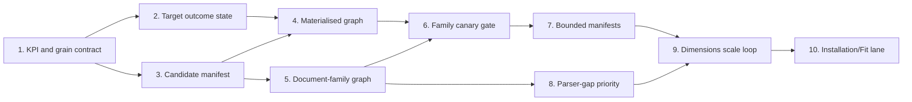

# Historical Evidence Scale Control Plane Implementation Plan

> **For agentic workers:** REQUIRED SUB-SKILL: Use
> `superpowers:executing-plans` to implement this plan task-by-task. Steps use
> checkbox (`- [ ]`) syntax for tracking. Do not start a task until this file
> has been read and its dependencies are complete.

- **Status:** In execution
- **Date:** 2026-07-19
- **Parent workflow:**
  [`2026-07-13-historical-evidence-coverage-recovery.md`](2026-07-13-historical-evidence-coverage-recovery.md)
- **Canonical runbook:**
  [`historical-evidence-recovery-runbook.md`](../../architecture-v2/historical-evidence-recovery-runbook.md)
- **Active task:** None - Task 4 complete; Task 5 pending

**Goal:** Move the 8,089-model historical evidence programme from a safe but
low-throughput recovery loop to a measurable, family-aware, bounded and
resumable system that gives every model a deterministic terminal evidence
state, while keeping dimensions evidence separate from full Fit evidence.

**Architecture:** Add a tracked control plane above the existing immutable
artifact, MinerU, receipt and publication pipeline. The control plane separates
model, source, document, parser and Fit grains; materialises official candidate
URLs before execution; gates fan-out through document-family canaries; and
emits bounded batches plus target-level outcomes. Existing exact-model receipt
and fail-closed publication rules remain authoritative.

**Tech stack:** Node.js ESM, `node:test`, Architecture V2 JSON contracts,
MinerU `content_list_v2`, SHA-256 content-addressed evidence storage, generated
Markdown reports, existing official-source resolvers and receipt replay.

## Global Constraints

1. The current canonical inventory is 8,089 unique historical model references.
2. A PDF, MinerU document, parser replay, model receipt and Fit decision are
   different grains and must never share an unlabeled completion percentage.
3. Official HTML or API evidence may complete model dimensions when no official
   PDF exists; the terminal state must record the source lane truthfully.
4. One immutable document may serve multiple targets, but every model and field
   still requires independent identity, semantics and receipt validation.
5. Registry, retailer and mirror evidence remain discovery or conflict hints.
6. W/H/D evidence cannot create `VERIFIED_FIT`.
7. Normal builds must remain network-free and external-drive-optional.
8. Online discovery, acquisition and MinerU conversion must be explicit,
   bounded operations with resumable external state.
9. No task may weaken existing publication, lifecycle, identity, axis or
   receipt-replay gates to improve coverage.
10. The unrelated untracked root file `typescript` is user-owned and must not
    be modified, removed or committed.

---

## Execution Discipline

This file is the durable task anchor for the whole programme.

Before every implementation task or operational batch:

```bash
sed -n '1,260p' docs/superpowers/plans/2026-07-19-historical-evidence-scale-control-plane.md
```

Then follow this protocol:

1. Confirm every dependency in the progress register is complete.
2. Mark exactly one task `IN_PROGRESS` and update **Active task**.
3. Write a focused failing test and confirm the expected failure.
4. Implement only that task's contract.
5. Run focused tests, relevant Architecture V2 tests and generated-artifact
   validation.
6. Reread this file before interpreting the result.
7. Record exact verification evidence and mark the task complete.
8. Commit one coherent task. Do not combine unrelated later tasks.

If a task exposes a plan defect, mark it `BLOCKED`, record the concrete defect
under that task, repair the plan first, and only then resume implementation.

## Progress Register

| Task | Problem addressed | Status | Verification evidence |
| --- | --- | --- | --- |
| 0 | Lock the ten-problem solution and execution order | COMPLETE | This plan created and self-reviewed |
| 1 | Mixed KPI definitions and incomparable grains | COMPLETE | 9 focused tests; Architecture V2 877/877; lint/build passed; 8,089-model report generated |
| 2 | Source-level ledger cannot show model outcomes; terminal queue noise | COMPLETE | 9 projection tests; 32 focused tests; Architecture V2 887/887; lint/build/diff passed; all 8,089 targets projected |
| 3 | 6,321 models lack document links or materialised official candidates | COMPLETE | 12 manifest tests; 55 focused tests; Architecture V2 899/899; two immutable ASKO canaries; lint/build/refresh/diff passed |
| 4 | Executable graph has resolver-only targets and zero fetch jobs | COMPLETE | 68 focused tests; Architecture V2 905/905; lint/build/diff passed; 6 fetch jobs and 6 candidate edges; 4,982 bounded discovery targets; zero resolver-only acquisition targets |
| 5 | PDF/MinerU/document-family/model relationships are not canonical | PENDING | - |
| 6 | Per-model runs repeat family-level source failures | PENDING | - |
| 7 | Generated batches are operationally too broad | PENDING | - |
| 8 | Parser repairs are not prioritised by reusable family impact | PENDING | - |
| 9 | Dimensions recovery lacks a controlled P0/P1 scale loop | PENDING | - |
| 10 | Full installation/Fit evidence has no separate scale pipeline | PENDING | - |

## Ten-Problem Solution Map

| Original problem | Structural solution | Primary task |
| --- | --- | ---: |
| 1. PDF, parsing, receipt and Fit completion are conflated | Versioned KPI catalogue with explicit grain, numerator and denominator | 1 |
| 2. Source acquisition is the dominant bottleneck | Persisted official-candidate manifest with provenance and terminal no-source state | 3 |
| 3. Executable queue contains resolver-only targets | Build fetch jobs and candidate edges from the persisted candidate manifest | 4 |
| 4. Family failures are repeated per model | One canary per brand/category/document family before target fan-out | 6 |
| 5. Document and model metrics are not comparable | Canonical content-hash document-family-to-model graph | 5 |
| 6. Attempt ledger does not expose a model funnel | Append-safe target outcome projection derived from runs and receipts | 2 |
| 7. Parser gaps are repaired ad hoc | Impact-ranked parser-gap queue with accept/reject fixtures | 8 |
| 8. Terminal targets remain visible in future work | Tracked target terminal state with policy/epoch reopening rules | 2 |
| 9. Default execution graph is thousands of targets | Deterministic bounded manifests and explicit reviewed `--allow-all` prohibition | 7 |
| 10. W/H/D recovery is mistaken for Fit completion | Independent installation-evidence contract, queue, receipts and Fit gate | 10 |

## Dependency Order



---

### Task 1: Versioned Evidence Programme KPI and Grain Contract

**Solves:** Problem 1 and the observability part of Problem 5.

**Files:**
- Create: `src/domain/historical-evidence-program-status.mjs`
- Create: `scripts/architecture-v2/build-historical-evidence-program-status.mjs`
- Create: `tests/architecture-v2/historical-evidence-program-status.test.mjs`
- Create: `data/architecture-v2/reviews/automated/historical-evidence-program-status.json`
- Create: `docs/architecture-v2/historical-evidence-program-status.md`
- Modify: `package.json`

**Interfaces:**
- Consumes the committed classification, knowledge-base observations,
  acquisition queue, executable queue, cumulative acceptance bundle, attempt
  ledger, MinerU backfill audit, receipt replay audit, replacement audit and Fit
  publication audit.
- Produces `buildHistoricalEvidenceProgramStatus(inputs)` and
  `renderHistoricalEvidenceProgramStatusMarkdown(status)`.
- Every metric contains `grain`, `numerator`, `denominator`, `rateBasisPoints`,
  `sourceArtifact` and an unambiguous label.

- [x] Write tests proving model, document, source, receipt and Fit metrics remain
  separate and that acceptance source lanes classify as PDF-only, HTML-only,
  JSON-only or mixed.
- [x] Write tests that fail on cross-artifact invariant drift, including
  classification totals, acquisition accounting, receipt replay mismatch and
  replacement-reference mismatch.
- [x] Implement the pure domain builder and Markdown renderer.
- [x] Implement the CLI with explicit input/output defaults and stable JSON.
- [x] Add `build:historical-evidence-program-status` to `package.json` and run it
  at the end of `refresh:historical-evidence-recovery`.
- [x] Generate current JSON/Markdown and verify the current 8,089-model baseline.
- [x] Run:
  `node --test tests/architecture-v2/historical-evidence-program-status.test.mjs`.
- [x] Run the focused historical classification, executable queue, attempt
  ledger, receipt replay, replacement and Fit publication tests.
- [x] Update this task with exact counts and commit.

**Completed evidence (2026-07-19):** The generated report contains 20 metrics
across explicit model, physical-PDF, unique-PDF, MinerU-document, parser-replay,
accepted-entry and current-product grains. Six cross-artifact controls pass.
Current critical baselines are 8,089 classified models, 1,768 with links, 401
current valid receipts, 382 cumulative accepted entries, 516/516 indexed unique
backfill PDFs, 495/925 recognized valid MinerU knowledge documents, 321
replacement auto-fill models, 332/3,515 receipt-bound current dimensions and
0/3,515 receipt-bound Verified Fit. Focused tests passed 9/9, the full
Architecture V2 suite passed 877/877, `npm run lint`,
`npm run build:architecture-v2` and `git diff --check` passed.

**Acceptance:** No completion percentage can be emitted without a named grain
and denominator. Document records from different inventories are never silently
combined. Current accepted sources replay with zero failures.

**Stop condition:** Any input total is inconsistent or an input artifact has an
unknown schema. Do not paper over the mismatch with `Math.min`, inferred totals
or a warning-only result.

---

### Task 2: Target Outcome Projection and Suppression Audit

**Solves:** Problems 6 and 8.

**Depends on:** Task 1.

**Files:**
- Create: `src/domain/historical-evidence-target-state.mjs`
- Create: `scripts/architecture-v2/build-historical-evidence-target-state.mjs`
- Create: `tests/architecture-v2/historical-evidence-target-state.test.mjs`
- Create: `data/architecture-v2/reviews/automated/historical-evidence-target-state.json`
- Modify: `package.json`

**Interfaces:**
- Produces one state per `referenceId`: `UNSEEN`, `CANDIDATE_READY`,
  `SOURCE_DISCOVERY_REQUIRED`, `RETRYABLE`, `BLOCKED_SAME_EPOCH`,
  `NO_OFFICIAL_SOURCE`, `IDENTITY_RESEARCH`, `CONFLICT_QUARANTINE`,
  `DIMENSIONS_RECEIPT`, or `FIT_RECEIPT`.
- Suppression terminal states carry policy SHA, resolver-contract SHA,
  processor epoch, run ID and reopening conditions. Receipt terminal states
  instead carry immutable receipt/evidence bindings and no automatic reopening;
  conflict terminal states carry the classification or decision artifact that
  created the conflict. A state must not fabricate bindings that do not apply.
- The projection audits the executable queue but does not become its upstream
  input, avoiding a queue -> state -> queue dependency cycle. Existing
  source-attempt suppression remains authoritative until Task 4 materializes
  the candidate graph. A terminal candidate URL suppresses only that source;
  the model remains discoverable unless a complete candidate inventory created
  a target-level terminal attempt.

- [x] Test deterministic rebuild after repeated ledger attempts, queue reopening
  after policy/resolver/processor changes, accepted-receipt precedence and
  malformed cumulative ledger rows. The executable-queue tests remain the
  authority for deciding whether a concrete binding change reopens work.
- [x] Implement deterministic target-state reduction from cumulative bundle,
  attempt ledger and immutable run outcomes.
- [x] Prove same-epoch target-level terminals are absent from actionable queue
  rows while candidate-level terminal failures leave the model discoverable.
- [x] Preserve source-level attempt ledger rows for transport/parser learning.
- [x] Generate current state and prove every 8,089 reference has exactly one
  control-plane state.
- [x] Run focused queue, ledger, run-history and contract tests.
- [x] Update this task and commit.

**Completed evidence (2026-07-19):** The deterministic projection assigns one
state to all 8,089 references: 7,564 actionable, 401 completed and 124 blocked.
The detailed state counts are 7,420 `SOURCE_DISCOVERY_REQUIRED`, 10
`RETRYABLE`, 401 `DIMENSIONS_RECEIPT`, 134 `IDENTITY_RESEARCH`, 83
`CONFLICT_QUARANTINE`, 33 `NO_OFFICIAL_SOURCE` and 8
`BLOCKED_SAME_EPOCH`. A candidate-level terminal remains source-only; only a
complete target inventory suppresses the model. Receipt precedence, repeated
ledger rebuilds, malformed bindings and queue/accounting drift fail-closed
tests pass. The target projection passed 9/9 tests, the queue/ledger focused
set passed 32/32, the full Architecture V2 suite passed 887/887, and
`npm run lint`, `npm run build:architecture-v2`, both generated builders and
`git diff --check` passed.

**Acceptance:** The queue and KPI report agree on target states; a true
target-level terminal disappears from actionable work until a recorded
reopening condition changes, while one failed source never suppresses the whole
model.

**Stop condition:** Any target receives two terminal states or accepted evidence
can be weakened by a later failure.

**Plan correction (2026-07-19):** This task originally described append/merge
of a second persisted state history. That would duplicate the append-only
attempt ledger and create competing truth. The committed artifact is instead a
deterministic projection rebuilt from the cumulative ledger, receipts,
classification and executable queue. Policy, resolver and processor changes
are tested where they alter queue eligibility; this projection verifies the
result and never independently reimplements reopening policy.

---

### Task 3: Persisted Official Candidate Discovery Manifest

**Solves:** Problem 2.

**Depends on:** Task 1.

**Files:**
- Create: `src/domain/historical-official-candidate-manifest.mjs`
- Create: `scripts/architecture-v2/build-historical-official-candidate-manifest.mjs`
- Create: `scripts/architecture-v2/run-historical-official-candidate-discovery.mjs`
- Create: `tests/architecture-v2/historical-official-candidate-manifest.test.mjs`
- Create: `data/architecture-v2/reviews/automated/historical-official-candidate-manifest.json`
- Modify: `package.json`

**Interfaces:**
- Stores normalized candidate URL, authority brand, category, discovery
  strategy/version, retrieval time, source rank, expected content type,
  applicable reference IDs and resolver completeness.
- Records `NO_CANDIDATE_COMPLETE` only after every required resolver reports a
  complete inventory; timeout and truncation remain retryable.

- [x] Test URL normalization, official-host validation, cross-brand isolation,
  duplicate candidates, incomplete resolvers and exact-model URL signals.
- [x] Build a network-free manifest reducer and a bounded online discovery CLI.
- [x] Seed it from current acquisition candidates without granting evidence
  authority to retailer or registry links.
- [x] Run one brand/category canary and retain immutable discovery output on the
  evidence disk.
- [x] Update this task and commit.

**Completed evidence (2026-07-19):** The committed manifest projects all 7,688
acquisition records into exactly one state: 6 `CANDIDATES_READY`, 5,021
`DISCOVERY_RETRYABLE`, 2,659 `RESEARCH_REQUIRED` and 2
`NO_CANDIDATE_COMPLETE`. Six classified official URLs are materialised; all
retailer and registry links remain hints. The ASKO `D5424SS` and `D5436SS`
canaries retained complete resolver results in two content-addressed objects;
the second also proved the immutable run-ID pointer path. Content SHA/byte
bindings were verified, and the network-free reducer remains idempotent at
semantic SHA `6ea26dc16f11043656c49aeab4a003e67de5b4cceb82c36c37116d8a7f53b9c5`.
Tests cover crash recovery without a second network call, global resolver-call
concurrency, Australian discovery-provenance replay, multi-strategy metadata
replay and generated-time seed deduplication. The manifest suite passed 12/12,
the resolver/refresh focused set passed 55/55, the complete Architecture V2
suite passed 899/899, and `npm run lint`, `npm run build:architecture-v2`, the
mounted-storage historical refresh, repeated manifest builds and
`git diff --check` passed.

**Acceptance:** Candidate discovery is inspectable before acquisition; each
queued model has either materialized candidates, retryable discovery, research
required or a complete no-source terminal state.

**Stop condition:** A resolver cannot report completion semantics or candidate
authority cannot be bound to one canonical brand.

---

### Task 4: Materialised Fetch-Job and Candidate-Edge Graph

**Solves:** Problem 3.

**Depends on:** Tasks 2 and 3.

**Files:**
- Modify: `src/domain/historical-model-pdf-acquisition.mjs`
- Modify: `src/domain/historical-executable-recovery-queue.mjs`
- Modify: `src/domain/historical-evidence-recovery-batch.mjs`
- Modify: `src/domain/historical-evidence-target-state.mjs`
- Modify: `src/domain/historical-evidence-program-status.mjs`
- Modify: `docs/architecture-v2/historical-evidence-recovery-runbook.md`
- Modify: corresponding Architecture V2 tests and builder scripts

**Interfaces:**
- The executable queue consumes the candidate manifest and emits deduplicated
  fetch jobs plus explicit target edges.
- Resolver-only targets remain legal only for bounded discovery batches, not
  ordinary acquisition batches.

- [x] Test one URL shared by models, cross-brand same-URL isolation, alternate
  candidates, prior source suppression and zero-edge invariant failures.
- [x] Materialize fetch jobs from candidate records and preserve target priority.
- [x] Add a control-plane gate: an acquisition batch with targets but zero
  candidate edges fails before network access.
- [x] Regenerate the graph and reconcile all excluded/suppressed counts.
- [x] Update this task and commit.

**Plan correction (2026-07-19):** The original file list assumed every
materialised candidate belonged to a non-quarantined target. The current six
candidate-ready targets are all conflict-closure records. Fetching and parsing
new evidence for those targets is valid, but it must not turn the product's
conflict state into a publication-ready state. Task 4 therefore also separates
ordinary acquisition targets from bounded discovery targets and updates the
target-state/status accounting so pending evidence work is orthogonal to
publication quarantine. A conflict target may have pending acquisition work
while remaining terminal and blocked for publication.

**Completed evidence (2026-07-19):** The executable graph now partitions all
7,688 queued acquisition records into 6 ordinary acquisition targets, 4,982
bounded discovery targets and 2,700 deferred targets. The 2,700 typed deferrals
are 39 active resolver suppressions, 2 complete no-candidate outcomes and 2,659
research-required outcomes. Six persisted official candidates materialise as
six fetch jobs and six candidate edges; no ordinary acquisition target is
resolver-only and every edge has a valid candidate/job/target back-reference.
The six targets are conflict-closure evidence work, so target state records six
blocked/actionable overlaps while all 83 conflict records remain publication
quarantined. Repeated network-free generation produced identical SHA-256 hashes
for all seven control-plane outputs. Focused tests passed 68/68, the full
Architecture V2 suite passed 905/905, and `npm run lint`,
`npm run build:architecture-v2`, graph invariant checks and `git diff --check`
passed.

**Acceptance:** Ordinary executable acquisition batches have non-zero fetch jobs
and candidate edges; discovery-only work is explicitly labeled and separately
bounded.

**Stop condition:** Candidate edges cannot be reproduced from the manifest or a
target loses all candidates without a typed reason.

---

### Task 5: Canonical Document-Family-to-Model Graph

**Solves:** Problem 5.

**Depends on:** Tasks 1 and 3.

**Files:**
- Create: `src/domain/historical-document-family-graph.mjs`
- Create: `scripts/architecture-v2/build-historical-document-family-graph.mjs`
- Create: `tests/architecture-v2/historical-document-family-graph.test.mjs`
- Create: `data/architecture-v2/generated/historical-document-family-graph.json`
- Modify: `scripts/architecture-v2/build-dimension-expression-knowledge.mjs`

**Interfaces:**
- Canonical nodes: immutable content hash, source URL/version, MinerU object,
  parser grammar and applicable exact-model references.
- Edges distinguish `EXACT_MODEL_PROVEN`, `MODEL_LIST_PROVEN`,
  `FAMILY_SCOPE_ONLY`, `ALIAS_RESEARCH` and `UNMAPPED`.

- [ ] Test physical duplicate PDFs, shared manuals, model lists, family-only
  manuals, suffix aliases and conflicting content under one URL.
- [ ] Build the graph from existing immutable PDF and MinerU indexes.
- [ ] Rebase document KPI metrics on graph nodes without changing model receipt
  authority.
- [ ] Update this task and commit.

**Acceptance:** Every indexed PDF hash has one graph node and every model edge
states its proof level; document-level completion cannot be reported as
model-level completion.

**Stop condition:** A shared manual is fanned out without internal model-list or
exact-model proof.

---

### Task 6: Brand/Category/Document-Family Canary Gate

**Solves:** Problem 4.

**Depends on:** Tasks 4 and 5.

**Files:**
- Create: `src/domain/historical-evidence-family-canary.mjs`
- Create: `scripts/architecture-v2/build-historical-evidence-family-canaries.mjs`
- Create: `tests/architecture-v2/historical-evidence-family-canary.test.mjs`
- Create: `data/architecture-v2/reviews/automated/historical-evidence-family-canaries.json`
- Modify: recovery runner selection and runbook

**Interfaces:**
- A family state is `UNTESTED`, `CANARY_READY`, `PASSED`, `FAILED_SOURCE`,
  `FAILED_IDENTITY`, `FAILED_PARSER`, or `REOPENED`.
- Expansion requires one accepted representative and matching resolver/parser
  contracts; claims are still validated per target.

- [ ] Test representative selection, family failure stop, parser-epoch reopen,
  source-template change and no cross-series leakage.
- [ ] Generate one representative per high-impact family.
- [ ] Block fan-out when the family canary fails and record the shared reason.
- [ ] Prove with a formerly low-yield Westinghouse or Electrolux family.
- [ ] Update this task and commit.

**Acceptance:** One known-bad family endpoint is attempted once per relevant
contract epoch, not once per model.

**Stop condition:** Family membership is inferred only from similar model names
or a marketing series without document proof.

---

### Task 7: Deterministic Bounded Batch Manifests

**Solves:** Problem 9.

**Depends on:** Task 6.

**Files:**
- Create: `src/domain/historical-evidence-bounded-batch.mjs`
- Create: `scripts/architecture-v2/build-historical-evidence-bounded-batches.mjs`
- Create: `tests/architecture-v2/historical-evidence-bounded-batch.test.mjs`
- Create: `data/architecture-v2/reviews/automated/historical-evidence-next-batches.json`
- Modify: recovery runbook and package scripts

**Interfaces:**
- Produces deterministic manifests capped by policy, initially 10 targets and
  one family canary or one passed-family expansion per manifest.
- Stores priority, category, brand, family, expected source lane, reviewed count
  and estimated shared artifact count.

- [ ] Test deterministic ordering, hard cap, no mixed untested families,
  accepted/terminal suppression and explicit empty queues.
- [ ] Generate P0, P1, parser-repair and conflict manifests separately.
- [ ] Make the runner accept a manifest ID and refuse broad default execution.
- [ ] Update this task and commit.

**Acceptance:** Normal operation never hands thousands of targets to the runner;
every run has a tracked bounded manifest and reviewed count.

**Stop condition:** A manifest crosses lifecycle/priority boundaries without an
explicit policy or contains more than its hard cap.

---

### Task 8: Impact-Ranked Parser Gap Queue and Fixture Corpus

**Solves:** Problem 7.

**Depends on:** Task 5.

**Files:**
- Create: `src/domain/historical-parser-gap-priority.mjs`
- Create: `scripts/architecture-v2/build-historical-parser-gap-priority.mjs`
- Create: `tests/architecture-v2/historical-parser-gap-priority.test.mjs`
- Create: `data/architecture-v2/reviews/automated/historical-parser-gap-priority.json`
- Extend: existing MinerU parser fixtures under `tests/fixtures/`
- Modify: dimension-expression knowledge generator

**Interfaces:**
- Scores gaps by affected exact models, lifecycle priority, family reuse,
  source authority, MinerU validity and ambiguity risk.
- Every parser profile requires positive and negative fixtures preserving axis,
  unit, scope, page/table and model identity context.

- [ ] Test ranking, tied scores, invalid MinerU, package/door-open exclusion,
  adjustable ranges and ambiguous D/D'/D'' expressions.
- [ ] Generate the current queue and select the highest reusable family.
- [ ] Add failing fixtures, implement the minimum parser-profile repair and
  replay all documents in that family.
- [ ] Bump processor epoch only when semantic output intentionally changes.
- [ ] Update this task and commit.

**Acceptance:** Parser work is selected by measurable model impact and every
change has accept/reject corpus coverage.

**Stop condition:** A proposed repair relies on brand-wide value sharing,
unlabelled axis order or lossy OCR overriding richer native MinerU content.

---

### Task 9: Controlled P0/P1 Dimensions Recovery Scale Loop

**Solves:** The throughput consequence of Problems 2-9.

**Depends on:** Tasks 7 and 8.

**Files:**
- Update generated control-plane reports, bounded manifests, acceptance bundle,
  target state, attempt ledger and runbook evidence after each batch
- No new parser or resolver code without a failing family canary/fixture

**Interfaces:**
- P0: current-retail models missing trusted dimensions.
- P1: archived/registry historical models missing trusted dimensions.
- Each batch emits discovered, fetched, MinerU-valid, identity-proven,
  dimensions-receipted, terminal and retryable counts.

- [ ] Process P0 by highest-impact passed family until its queue is empty or a
  typed stop condition is reached.
- [ ] Recompute KPIs and verify no publication violations after every batch.
- [ ] Process P1 only after P0 source/parser learning is incorporated.
- [ ] Publish replacement auto-fill only from receipt-bound scalar dimensions.
- [ ] Record weekly throughput and projected remaining batches.

**Acceptance:** Coverage increases monotonically, prior receipts replay, and no
batch can claim progress from downloads or MinerU output alone.

**Stop condition:** Acceptance yield falls below 50% for two same-family
batches; stop expansion and return to candidate, family or parser repair.

---

### Task 10: Independent Installation and Fit Evidence Pipeline

**Solves:** Problem 10.

**Depends on:** Task 9 establishing stable dimensions receipts.

**Files:**
- Create versioned installation-evidence contract/domain/tests
- Create installation candidate, parser-gap and bounded-batch generators
- Modify Fit publication audit only after the new receipt contract passes
- Update product core brief and runbook

**Interfaces:**
- Field groups: installation clearance, ventilation/service space, operation
  envelope, water, power, drainage and delivery envelope.
- Decisions remain `NO_FIT`, `INSUFFICIENT_DATA`, `CONDITIONAL_FIT`,
  `LIKELY_FIT_ESTIMATED` or `VERIFIED_FIT`; numeric scoring may only rank within
  an already determined class.

- [ ] Write the schema and evidence-applicability matrix for all four appliance
  categories before adding parser logic.
- [ ] Test missing/not-applicable/zero distinctions, ranges, professional
  installation requirements and site-observation separation.
- [ ] Pilot refrigerator and dishwasher families with exact-model installation
  manuals.
- [ ] Require receipt replay for every hard condition before `VERIFIED_FIT`.
- [ ] Run adversarial publication and user-claim review.

**Acceptance:** W/H/D-only models stay dimensions-only; `VERIFIED_FIT` appears
only when every applicable hard condition has exact-model evidence and passes.

**Stop condition:** A brand norm, government registry, sibling model or generic
installation guide is being promoted as an exact-model hard requirement.

---

## Programme Completion Criteria

This plan is complete only when:

1. All 8,089 references have one current target state.
2. Every progress percentage has an explicit grain and denominator.
3. Every discoverable official candidate is materialized or has typed resolver
   completion state.
4. Every indexed PDF belongs to one content-hash document node and has explicit
   model applicability edges.
5. Normal runs use bounded manifests and family canaries.
6. Parser changes are backed by positive and negative MinerU fixtures.
7. Receipt and replacement coverage increase monotonically without weakening
   earlier evidence.
8. Dimensions and full Fit evidence remain separate through publication.
9. The full Architecture V2 suite, lint, build, receipt replay, replacement
   audit and Fit publication audit pass.
10. Current counts and unresolved gaps are written back into this file and the
    generated control-plane status report.

## Task 0 Self-Review

- All ten identified shortcomings map to an implementation task.
- Dependencies flow only from earlier tasks to later tasks.
- Acquisition is separated from offline build and publication.
- Document reuse is separated from per-model evidence authority.
- Terminal states have explicit reopening rules.
- Parser and family learning cannot authorise model claims.
- No acceptance criterion depends on a later task.
- No task requires modifying or deleting the unrelated `typescript` file.
