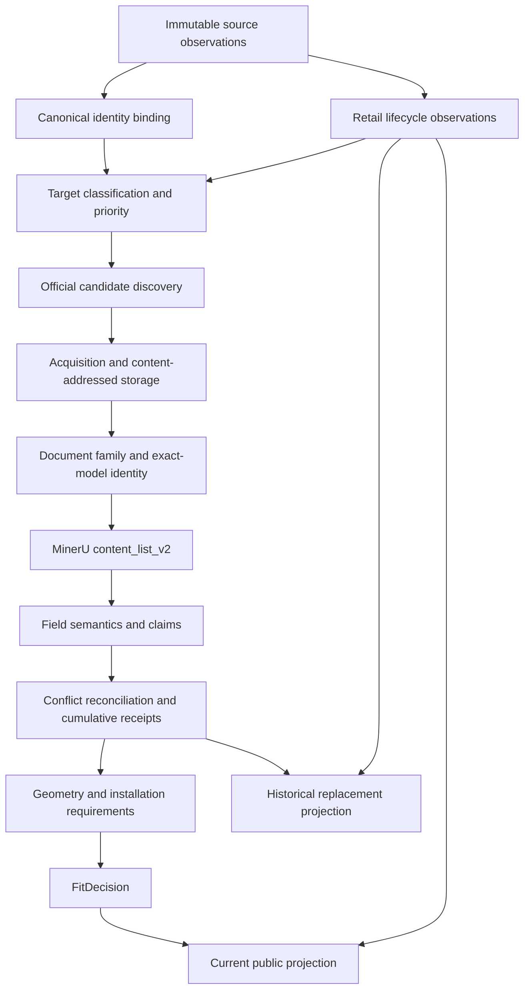
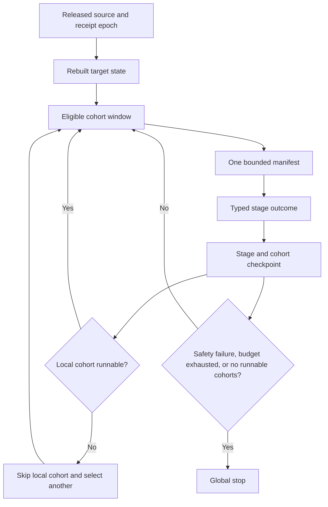

# FitAppliance System-First Repair Control Plan

> **Execution rule:** This is the single active control plan for cross-cutting
> FitAppliance evidence-workflow repairs. Read it before every implementation
> batch. Use `superpowers:executing-plans` for execution and
> `superpowers:test-driven-development` for behavior changes.

- **Status:** EXECUTING - Task 0 in progress
- **Date:** 2026-07-20
- **Active task:** Task 0 - freeze and attest the current whole-system baseline
- **Canonical product contract:**
  [`../../product-core-brief.md`](../../product-core-brief.md)
- **Canonical operations guide:**
  [`../../architecture-v2/historical-evidence-recovery-runbook.md`](../../architecture-v2/historical-evidence-recovery-runbook.md)
- **Completed predecessor:**
  [`2026-07-19-historical-evidence-scale-control-plane.md`](2026-07-19-historical-evidence-scale-control-plane.md)
- **User-owned worktree content:** the untracked root file `typescript` must not
  be modified, removed, staged, or committed.

## 1. Purpose

Stop the recurring loop in which a local defect is repaired and unit-tested,
then a later whole-repository audit discovers that the repair violated another
stage's contract.

The governing change is procedural and architectural:

1. establish the current end-to-end contract before editing code;
2. repair upstream state semantics before downstream parsers or schedulers;
3. test every change at producer, consumer, replay, publication, and second-run
   boundaries;
4. rebuild derived artifacts only in dependency order;
5. call work complete only after an adversarial whole-path replay passes.

Esatto dishwasher recovery is a regression witness for this plan. It is not the
scope or organizing principle of the plan.

## 2. Why the Previous Method Looped

The repeated failures were caused by completion criteria that were local while
the behavior was cross-layer:

| Failure pattern | Why a local test missed it | Required correction |
| --- | --- | --- |
| A symptom selected the repair boundary | The visible parser or controller was tested without its upstream inputs | Trace the first incorrect state, not the first visible failure |
| Lifecycle, identity, evidence, and visibility were collapsed | A product URL and `unavailable: false` were treated as current-sale truth | Keep independent state axes and require a dated retailer observation |
| Generated output was treated as source truth | A stale derived classification could feed the next queue and still validate internally | Bind every generated artifact to source hashes and rebuild in one release DAG |
| One stage's metric controlled another stage | Discovery candidate yield and dimensions receipt yield shared one 50% threshold | Use stage-specific outcomes, denominators, and minimum sample sizes |
| A local cohort halt became a programme halt | The planner exposed one manifest and the controller had no alternative | Produce a candidate window and skip only the failed cohort |
| Parser knowledge accumulated as brand-specific exceptions | Positive fixtures passed while other families and negative structures were not replayed | Use category -> brand -> series -> document-family grammar with negative fixtures |
| A green unit test was accepted as completion | No consumer, replay, publication, or repeated-run assertion was required | Apply the five-boundary acceptance matrix in Section 8 |
| Plans accumulated without one authority | Later plans fixed isolated phases while older assumptions stayed active | This file is the sole active cross-cutting repair plan |

The policy is therefore: **no code change may be justified only by the module in
which the symptom appears.** Every repair starts with a contract trace and ends
with a system trace.

## 3. Planning Authority

Documents have the following precedence:

1. `docs/product-core-brief.md` owns product truth, evidence safety, lifecycle
   separation, replacement search, and Fit semantics.
2. This file owns repair order, task state, dependency gates, and whole-system
   completion for the current programme.
3. `docs/architecture-v2/historical-evidence-recovery-runbook.md` owns supported
   operational commands. It must be updated when implementation changes those
   commands.
4. `docs/architecture-v2/repository-architecture-audit.md` is a living current-
   code map, not an execution plan. Task 0 refreshes its stale 2026-07-11
   baseline.
5. Earlier phase and scale plans are implementation history. They cannot
   authorize new work when they conflict with this file.

Read the full file once when starting/resuming a task or when scope changes:

```bash
PLAN=docs/superpowers/plans/2026-07-20-fitappliance-system-first-repair-control-plan.md
cat "$PLAN"
```

Before another implementation or operational batch in the same task, reread
the status, repair-order/protocol/progress sections, and that task's section;
do not reload all 800+ lines merely to prove compliance:

```bash
sed -n '1,19p' "$PLAN"
sed -n '/^## 6\./,/^## 10\./p' "$PLAN"
TASK=0
awk -v heading="### Task ${TASK}:" '
  index($0, heading) == 1 { print_line=1 }
  print_line && /^### Task [0-9]+:/ && index($0, heading) != 1 { exit }
  print_line { print }
' "$PLAN"
```

Then update exactly one task to `IN_PROGRESS`. If execution exposes a plan
defect, mark that task `BLOCKED`, repair this plan first, and do not patch around
the defect in code. This progressive reread rule preserves the control contract
without recreating the prior skill/context token loop.

## 4. Verified Starting State

These values were read on 2026-07-20 from tracked artifacts generated on
2026-07-19. They are a diagnostic baseline, not a success claim.

| Grain | Current result |
| --- | ---: |
| Historical model references classified | 8,089 / 8,089 |
| Models with document links | 1,768 / 8,089 |
| Models with current valid receipts | 401 / 8,089 |
| Models in cumulative recovery acceptance | 382 / 8,089 |
| Replacement auto-fill models | 321 / 8,089 |
| Unique PDF graph nodes | 941 |
| Valid PDF graph nodes | 926 / 941 |
| Proven document-model applicability edges | 548 / 3,761 |
| Current products with receipt-bound W/H/D | 332 / 3,515 |
| Current products with receipt-bound `VERIFIED_FIT` | 0 / 3,515 |
| Public projection rows with at least one legacy retailer link | 1,384 / 3,515 |
| Public projection rows marked unavailable/history-only | 2,131 / 3,515 |
| Retailer-link rows requiring observation migration | 1,614 |
| P0 assigned / eligible targets | 953 / 943 |
| P1 assigned / eligible targets | 3,974 / 3,939 |

Current controller state is `STOP_LOW_YIELD` for
`dishwasher / Esatto / BOUNDED_DISCOVERY` after two one-target zero-yield
batches. That result is not an adequate whole-programme decision.

### 4.1 Confirmed cross-layer defects

1. `scripts/discovery-pipeline/lib/appliances-online-product-api.js` hardcodes
   every API product stub as `unavailable: false`.
2. `src/domain/historical-appliance-reference.mjs` derives `CURRENT_RETAIL` from
   that boolean plus a product-shaped URL. A URL's existence is not a dated
   availability observation.
3. The repository already has the safer three-state contract in
   `src/domain/retailer-observation.mjs`, but the historical reference and AO
   ingestion path do not consistently consume it.
4. The affected Esatto AO listings can explicitly report that a product is not
   available while the current catalogue still routes it as P0 current work.
5. `scripts/pdf-pipeline/esatto-official.js` searches one current sitemap,
   requires an exact SKU in a product URL, and extracts only anchor-tag PDF
   links. It cannot represent archived support/API evidence as typed source
   lanes.
6. Exact Esatto `EDW456S` content is present in a valid MinerU
   `content_list_v2` object, but `src/domain/mineru-document.mjs` does not accept
   its exact-model cover/page scope for the dimensions table.
7. `src/domain/historical-evidence-bounded-batch.mjs` exposes at most one next
   manifest per workstream even when hundreds of other cohorts are eligible.
8. `src/domain/historical-dimensions-scale-control.mjs` applies one yield policy
   to discovery and dimensions stages, permits one-target samples, and turns a
   halted selected cohort into a global stop instead of selecting another
   eligible cohort.

These are evidence that the repair must span state, acquisition, parsing,
publication, and control-plane boundaries. They must not be implemented as
eight unrelated patches.

## 5. End-to-End Contract Map

### 5.1 Independent state axes

Every canonical product must carry these axes independently:

| Axis | Examples | Authority |
| --- | --- | --- |
| Identity | exact model, GTIN, alias bridge | canonical identity + exact official evidence |
| Retail lifecycle | available, unavailable, unknown, stale, relisted | timestamped retailer observation |
| Registry market state | active AU, inactive AU, mixed, no registry | government registry observation |
| Evidence state | candidate, fetched, parsed, identity-proven, receipt, conflict | evidence pipeline |
| Public visibility | current output, historical input-only, quarantine, hidden | publication policy |
| Fit completeness | dimensions-only, conditional, insufficient, verified | receipt-bound Fit engine |

No axis may infer another. In particular:

- registry-active does not mean currently sold;
- a retailer product URL does not mean available;
- a PDF does not mean exact-model evidence;
- W/H/D does not mean installation Fit;
- historical replacement input eligibility does not mean public result
  eligibility.

### 5.2 Data-plane order



### 5.3 Control-plane order



### 5.4 Contract ownership

| Stage | Producer | Primary consumer | Persisted boundary | Failure scope |
| --- | --- | --- | --- | --- |
| Retail observation | retailer adapter / feed collector | lifecycle reducer | immutable observation/snapshot | source + listing |
| Canonical identity | canonical registry | lifecycle, evidence, publication | versioned ID mapping | product identity |
| Lifecycle reduction | latest valid observations + policy | classification and visibility | lifecycle projection with provenance | product + retailer |
| Classification | historical reference + receipts | acquisition queue | immutable generated classification | model target |
| Candidate discovery | versioned resolvers | executable queue | immutable candidate inventory | resolver + target |
| Acquisition | bounded runner | document registry/MinerU | content-addressed raw object | source URL + hash |
| Document identity | document graph | parser and canary gate | document-model edges | document + model |
| MinerU parsing | pinned MinerU object | field claim parser | immutable `content_list_v2` object | document object |
| Reconciliation | all exact official claims | receipt promotion | cumulative append-safe bundle | target + field |
| Geometry/Fit | accepted receipts + site input | public/replacement engines | receipt-bound geometry/decision | product + query |
| Planner | released target state | runners | candidate manifest window | workstream + cohort |
| Circuit breaker | typed checkpoints | planner | append-only checkpoint ledger | stage + cohort |
| Publication | lifecycle + receipts + Fit | static/runtime catalogue | deterministic projection | release epoch |

### 5.5 Current code owners

This is the current-code map used to derive the task order. Task 0 turns it
into a hash-bound executable artifact.

| Contract | Current owner(s) | Direct downstream owner(s) |
| --- | --- | --- |
| Retailer observation schema | `src/domain/retailer-observation.mjs`, `src/domain/retailer-source-adapter.mjs` | `scripts/architecture-v2/build-retailer-ledger.mjs` |
| AO product/API normalization | `scripts/discovery-pipeline/lib/appliances-online-product-api.js` | legacy catalogue seed, historical reference inputs |
| Historical lifecycle reduction | `src/domain/historical-appliance-reference.mjs` | `scripts/architecture-v2/build-historical-appliance-reference.mjs`, catalogue binding, publication |
| Historical catalogue binding | `src/domain/historical-catalog-binding.mjs` | evidence classification and replacement reference |
| Classification and target priority | `src/domain/historical-model-evidence-classification.mjs` | acquisition queue, target state, bounded planner |
| Official candidate inventory | `src/domain/historical-official-candidate-manifest.mjs`, `scripts/pdf-pipeline/architecture-v2-resolver-adapters.mjs` | executable recovery queue |
| Bounded manifest planning | `src/domain/historical-evidence-bounded-batch.mjs` | discovery and recovery runners, scale controller |
| Scale decision | `src/domain/historical-dimensions-scale-control.mjs` | discovery and recovery runner admission |
| Document/MinerU identity and claims | `src/domain/mineru-document.mjs`, `src/domain/dimension-expression-knowledge.mjs` | recovery reconciliation and receipt creation |
| Cumulative receipt contract | `src/domain/historical-evidence-recovery-contract.mjs` | promotion, public projection, historical reference |
| Lifecycle-aware evidence publication | `src/domain/historical-evidence-publication.mjs` | `scripts/architecture-v2/build-public-projection.mjs` |
| Runtime catalogue publication | `scripts/architecture-v2/publish-runtime-projection.js` | static build and browser search |
| Historical replacement publication | historical reference builder/publisher and replacement audit | replacement match engine |
| Installation/Fit evidence | `src/domain/installation-evidence-pipeline.mjs`, `src/domain/fit-v3.mjs` | Fit publication audit and public Fit claims |

### 5.6 Persistence and rebuild semantics

| State or artifact | Current risk | Required semantics after repair |
| --- | --- | --- |
| Raw retailer/API/page payload | May be flattened into a catalogue row | Immutable content-addressed object plus observation pointer |
| Retailer observations | Legacy builder overwrites a projection | Append observations; deterministically rebuild latest-state projection |
| Canonical identity registry | Deterministic generated artifact | Rebuild; collisions quarantine; never fuzzy-merge silently |
| Lifecycle projection | Derived partly from legacy booleans | Rebuild from bound observations and an explicit `asOf` release instant |
| Candidate discovery run | External run plus tracked projection | Append immutable run; merge distinct model/document observations |
| Raw PDF/HTML/JSON evidence | Content-addressed external object | Immutable and never deleted by rollback |
| MinerU `content_list_v2` | Content-addressed derived object | Immutable per PDF/tool/model epoch; replay by hash |
| Document-family graph | Generated inventory | Deterministic rebuild; never receipt authority |
| Target outcomes and checkpoints | Append-only execution history | Append; reopen only on relevant epoch change |
| Acceptance bundle | Cumulative tracked authority | Append-safe merge; reject destructive replacement or weaker receipt |
| Current public projection | Generated release artifact | Deterministic rebuild from lifecycle + receipts; current products only |
| Historical replacement projection | Generated release artifact | Deterministic rebuild; archived/registry inputs allowed, current outputs forbidden |
| Bounded manifest window | Generated next-epoch control artifact | Rebuild only after current release; semantic ordering and hashes |
| Scale-control decision | Generated from manifests + ledger | Rebuild; local cohort states preserved; no hidden wall-clock input |

For freshness, the release uses an explicit `asOf` timestamp stored in the
released observation epoch. Each source adapter must declare
`expectedCadenceHours` and `maximumCurrentAgeHours`. An observation may
authorize current-sale state only when it is the newest successful observation,
is not superseded by a newer unavailable/stale observation, and is no older
than `maximumCurrentAgeHours` relative to that bound `asOf`. A legacy catalogue
row cannot authorize current status by itself. This keeps offline rebuilds
deterministic while allowing source-specific cadences.

## 6. Locked Repair Order

The order is based on dependency, not on which defect is easiest to patch.


Why this order is mandatory:

1. A scheduler cannot make a correct priority decision while current versus
   archived state is wrong.
2. A parser cannot be judged by discovery yield while the resolver cannot
   represent all official source lanes.
3. A receipt cannot be published until model identity and field semantics are
   proven.
4. A circuit breaker cannot use a meaningful denominator until each stage has
   typed outcomes.
5. A release cannot rebuild queues until the acceptance and lifecycle
   projections for the current epoch are complete.

## 7. No-Point-Fix Protocol

Every behavior change must create a repair record in the task's execution log
with these fields before code is edited:

```text
Symptom:
First incorrect persisted state:
Upstream producers:
Downstream consumers:
Affected state axes:
Affected tracked/external artifacts:
Current contract:
Target contract:
Migration/rebuild required:
Rollback unit:
Positive real canary:
Negative/adversarial canaries:
```

The implementation sequence is fixed:

1. reproduce the fault at the earliest incorrect boundary;
2. map every producer and consumer of that boundary;
3. add a failing producer test;
4. add a failing producer-consumer contract test;
5. add a failing end-to-end or real-artifact replay test;
6. implement the smallest root-contract change;
7. rebuild derived artifacts in Section 6 order;
8. run the five-boundary acceptance matrix in Section 8;
9. perform one adversarial review for the coherent batch;
10. update this file and commit one root-cause unit.

### 7.1 Prohibited shortcuts

- Do not edit generated JSON to make a queue or audit pass.
- Do not weaken exact-model, official-source, axis, range, receipt, lifecycle,
  or publication guards to improve yield.
- Do not add a brand regex without a category/series/document-family rule and a
  reject fixture.
- Do not use a single successful source when another exact official source is
  unresolved or conflicting.
- Do not use one-target percentage yield as a statistical halt signal.
- Do not convert a local cohort halt to a global stop.
- Do not regenerate next-epoch queues before current-epoch publication and
  historical projections are complete.
- Do not claim task completion from focused tests alone.

## 8. Five-Boundary Acceptance Matrix

Every implementation task must pass all applicable columns. `N/A` requires a
written reason in the task log.

| Boundary | Required proof |
| --- | --- |
| Producer | The earliest incorrect state is now emitted correctly, including unknown/failure states |
| Consumer | Every direct consumer accepts the new contract and rejects the old unsafe state |
| Replay | Immutable input produces the same semantic output after restart/resume |
| Publication | Current, historical, quarantine, replacement, and Fit destinations remain isolated |
| Second run | Rebuilding or rerunning is idempotent and does not duplicate, erase, or reorder semantic outcomes |

Mandatory adversarial traces across the programme:

1. an explicitly unavailable retailer page cannot become `CURRENT_RETAIL`;
2. an unknown or failed retailer collection cannot synthesize unavailable or
   available state;
3. a relisted model can become current only through a newer valid observation;
4. an archived model with valid W/H/D can be a replacement input but never a
   current result;
5. exact-model PDF content with identity in a cover header can scope a later
   table only under the approved document-family rule;
6. a sibling/family manual cannot donate a field without an internal model
   applicability edge;
7. `D`, `D'`, and `D"` cannot be collapsed into closed depth without explicit
   semantics;
8. two official sources with different dimensions remain quarantined;
9. a valid dimensions receipt cannot create `VERIFIED_FIT`;
10. a failed local cohort is skipped while another P0 cohort remains runnable;
11. discovery, acquisition, MinerU, identity, receipt, and Fit yields use their
    own denominators;
12. an interrupted run resumes without repeating completed network or MinerU
    work;
13. promotion is append-safe and a later batch cannot erase prior receipts;
14. normal build succeeds with `FITAPPLIANCE_STORAGE_ROOT` unset;
15. rollback reverts the complete release projection without deleting immutable
    evidence objects.

## 9. Progress Register

| Task | Scope | Depends on | Status | Completion evidence |
| ---: | --- | --- | --- | --- |
| 0 | Freeze baseline and executable system contract | none | IN_PROGRESS | Baseline contract tests pending |
| 1 | Lock independent identity/lifecycle/evidence/visibility/Fit axes | 0 | PENDING | Not started |
| 2 | Integrate real retailer availability observations | 1 | PENDING | Not started |
| 3 | Rebuild classification and prove lifecycle destination isolation | 2 | PENDING | Not started |
| 4 | Replace one-path discovery with typed official source lanes | 3 | PENDING | Not started |
| 5 | Repair category/series/document-family MinerU grammar | 4 | PENDING | Not started |
| 6 | Prove receipt-to-publication vertical slices | 5 | PENDING | Not started |
| 7 | Produce deterministic multi-cohort manifest windows | 3, 4 | PENDING | Not started |
| 8 | Add stage-aware local circuit breakers and global stop rules | 6, 7 | PENDING | Not started |
| 9 | Full replay, migration, release DAG, and rollback drill | 8 | PENDING | Not started |
| 10 | Refresh canonical docs and close the release | 9 | PENDING | Not started |

Only one row may be `IN_PROGRESS`. A task is complete only when its own
acceptance gate is independently satisfied; no gate may rely on a later task.

## 10. Implementation Tasks

### Task 0: Freeze and attest the whole-system baseline

**Goal:** Make drift and mixed-epoch input visible before behavior changes.

**Files:**

- Create: `src/domain/historical-evidence-system-contract.mjs`
- Create: `scripts/architecture-v2/build-historical-evidence-system-contract.mjs`
- Create: `tests/architecture-v2/historical-evidence-system-contract.test.mjs`
- Create: `data/architecture-v2/reviews/automated/historical-evidence-system-contract.json`
- Modify: `src/domain/architecture-v2-paths.mjs`
- Modify: `tests/architecture-v2/architecture-v2-paths.test.mjs`
- Modify: `package.json`
- Modify: `docs/architecture-v2/repository-architecture-audit.md`

**Test first:** prove that the contract builder rejects a mixed epoch, missing
source hash, duplicate owner, unknown consumer, cyclic release dependency, or a
tracked queue newer than its released source projection.

**Implementation:** emit an external-drive-free artifact that binds each stage
in Section 5 to its producer, consumers, schema version, semantic SHA, source
artifact SHAs, lifecycle visibility, and next valid transition. Bind the
identity-registry, observation, lifecycle-policy, resolver-contract,
source-authority-policy, MinerU/toolchain, parser, receipt-policy, publication,
and Fit-policy epochs separately. Include the current counts in Section 4 and
the current controller decision.

**Verification:**

```bash
node --test tests/architecture-v2/historical-evidence-system-contract.test.mjs \
  tests/architecture-v2/architecture-v2-paths.test.mjs
npm run build:historical-evidence-system-contract
git diff --check
```

**Acceptance:** two consecutive builds are byte-identical apart from an
explicitly excluded operational timestamp; every current generated control
artifact resolves to a released source hash; the repository audit reflects
current code rather than the 2026-07-11 baseline.

**Stop condition:** the builder merely copies self-reported hashes without
recomputing or cross-checking them.

### Task 1: Lock independent state-axis contracts

**Goal:** Prevent one state axis from silently authorizing another.

**Files:**

- Modify: `src/domain/retailer-observation.mjs`
- Modify: `src/domain/retailer-source-adapter.mjs`
- Modify: `src/domain/historical-appliance-reference.mjs`
- Modify: `tests/architecture-v2/retailer-observation.test.mjs`
- Modify: `tests/architecture-v2/retailer-source-adapter.test.mjs`
- Modify: `tests/architecture-v2/historical-appliance-reference.test.mjs`
- Create: `tests/architecture-v2/fixtures/lifecycle-state-axis-cases.json`

**Test first:** add fixtures for available, unavailable, unknown, failed
collection, stale, redirected, relisted, registry-only, archived catalogue, and
conflicting multi-retailer observations. Assert that identity, registry state,
lifecycle, evidence, visibility, and Fit state remain independent.

**Implementation:** define one reducer contract for current-sale eligibility.
`CURRENT_RETAIL` requires at least one sufficiently fresh, successful,
product-bound `available` retailer observation. `unavailable` is not current;
`unknown`, stale, collection failure, and source absence remain unknown or
historical according to explicit policy. A retailer outage cannot demote an
entire catalogue. Add required `expectedCadenceHours` and
`maximumCurrentAgeHours` to the source adapter; compare observations against
the release epoch's explicit `asOf`, never `Date.now()` during an offline
build.

**Acceptance:** no URL-shape or legacy boolean alone can produce
`CURRENT_RETAIL`; no registry state can change public visibility; all
transitions preserve observation URL, retailer, timestamp, raw-source hash, and
policy version.

**Stop condition:** the change introduces a new boolean compatibility field
without preserving the three-state source observation.

### Task 2: Integrate typed observations for every current retailer source

**Goal:** Fix the earliest incorrect persisted lifecycle state rather than
patching P0 classification. Appliances Online is the first real regression
case, not the only source in scope.

**Files:**

- Modify: `scripts/discovery-pipeline/lib/appliances-online-product-api.js`
- Modify: `tests/discovery-evidence-seed.test.mjs`
- Modify: `scripts/affiliate/partnerize-tgg.js`
- Modify: `tests/partnerize-tgg.test.mjs`
- Modify as needed: retailer-specific modules under
  `scripts/discovery-pipeline/adapters/`
- Modify: `tests/discovery-pipeline.test.mjs`
- Modify: `scripts/architecture-v2/build-retailer-ledger.mjs`
- Modify: `tests/architecture-v2/retailer-observation.test.mjs`
- Modify: `src/domain/historical-appliance-reference.mjs`
- Modify: `tests/architecture-v2/historical-appliance-reference.test.mjs`
- Create: `scripts/architecture-v2/build-retailer-observation-coverage.mjs`
- Create: `tests/architecture-v2/retailer-observation-coverage.test.mjs`
- Create:
  `data/architecture-v2/reviews/automated/retailer-observation-coverage.json`

**Current source inventory:** the tracked public projection contains 1,614
retailer-link rows: 1,204 AO API, 152 The Good Guys Partnerize feed, and 258
legacy web-search/sitemap rows across AO, The Good Guys, JB Hi-Fi, Bing Lee, and
Harvey Norman. URL discovery is not an availability observation.

**Test first:**

1. Capture immutable AO fixtures for an available product, explicit unavailable
   `DW42CS` and `EDW6SL` products, an API response with no authoritative status,
   and a failed/incomplete collection.
2. Prove that presence in a successful, explicitly complete Partnerize feed is
   an `available` observation for that feed epoch; absence from an incomplete
   feed is not `unavailable`.
3. Prove that web-search/sitemap URLs enter a revalidation queue and cannot
   authorize current status until a bounded retailer-page observation succeeds.
4. Prove each retailer's host, product-page identity, explicit availability
   signal, redirected/unavailable signal, raw object hash, and unknown fallback.

**Implementation:** remove the hardcoded `unavailable: false`; normalize AO
status into the existing retailer observation contract; store immutable source
provenance; adapt complete Partnerize feed rows; route legacy search/sitemap
links through bounded page revalidation; reduce lifecycle from observations.
Legacy output may be projected only after the typed observation is resolved,
and unknown must remain unknown. The coverage artifact must account for all
1,614 starting retailer-link rows by source and terminal observation state.

**Substep order:**

1. `2A` build the source/coverage inventory and fail on unclassified sources;
2. `2B` migrate AO API/page observations;
3. `2C` migrate the complete Partnerize feed contract;
4. `2D` add bounded raw-page revalidation for legacy URL sources;
5. `2E` replay all observations into one append-safe ledger and coverage audit.

**Acceptance:** the unavailable Esatto canaries normalize to explicit
`unavailable` observations and the lifecycle reducer does not classify them as
current; available fixtures remain current; failed collection changes neither
state; every one of the 1,614 baseline links is a typed observation or a
specific revalidation item; the observation ledger is append-only and
idempotent. Actual P0 and public-projection changes are intentionally deferred
to Task 3.

**Stop condition:** page marketing text is parsed without a raw source object,
timestamp, or explicit unknown fallback.

### Task 3: Rebuild downstream state and prove visibility isolation

**Goal:** Propagate Task 2 through every consumer before repairing discovery or
parsing.

**Files:**

- Modify as required by failing tests only:
  `src/domain/historical-catalog-binding.mjs`
- Modify as required by failing tests only:
  `src/domain/historical-evidence-publication.mjs`
- Modify: `tests/architecture-v2/historical-catalog-binding.test.mjs`
- Modify: `tests/architecture-v2/historical-evidence-publication.test.mjs`
- Modify: `tests/architecture-v2/historical-evidence-bounded-batch.test.mjs`
- Rebuild tracked historical reference, classification, target state,
  executable queue, bounded batches, replacement audit, public projection, and
  Fit publication audit in release order.

**Test first:** verify current -> unavailable, unavailable -> relisted,
current -> unknown, and archived-with-receipt traces. Assert each trace's P0/P1
classification, public visibility, replacement eligibility, and Fit
destination. Add a full-catalogue shadow-diff fixture that proves a cutover
cannot silently remove or retain a large unknown population.

**Migration sequence:**

1. Build the new lifecycle and visibility projections in shadow without
   changing runtime catalogue files.
2. Emit counts and exact IDs for `fresh_available`, `explicit_unavailable`,
   `unknown_or_stale`, `relisted`, and multi-retailer conflicts.
3. Refresh observations for every `unknown_or_stale` product among the 1,384
   legacy-current products through bounded,
   typed source runs; do not convert missing rows into unavailable.
4. A product is current when at least one retailer has a fresh available
   observation. It is unavailable only when every authoritative retailer's
   latest complete observation is unavailable. Mixed or incomplete sources
   remain unknown.
5. Permit production cutover only when every one of the 1,384 legacy-current
   products that would remain a current search or replacement result has a
   fresh available observation and every removed product has an explicit
   unavailable/archived reason. The unresolved unknown count for either output
   must be zero.
6. Until that gate passes, keep the existing production projection intact and
   forbid any next-epoch queue from mixing shadow lifecycle state with legacy
   publication state.

**Acceptance:** all lifecycle-derived artifacts bind the same policy/source
epoch; archived receipts alter historical replacement only; public projection
may retain historical rows but the current runtime/search result set has zero
unavailable or unknown-lifecycle products; the queue no longer selects the
stale Esatto cohort as P0 merely because the old catalogue did. The shadow
report accounts for every prior public product and production cutover is atomic
rather than a partial overlay.

**Stop condition:** any generated file is manually edited or next-epoch queues
are built before current-epoch projections finish.

### Task 4: Introduce typed official source-lane discovery

**Goal:** Make discovery completeness measurable without treating one website
shape as a brand's complete official inventory.

**Files:**

- Modify: `scripts/pdf-pipeline/architecture-v2-resolver-adapters.mjs`
- Modify: `src/domain/historical-official-candidate-manifest.mjs`
- Modify: `tests/architecture-v2/architecture-v2-resolver-adapters.test.mjs`
- Modify: `tests/architecture-v2/historical-official-candidate-manifest.test.mjs`
- Modify: `scripts/pdf-pipeline/esatto-official.js`
- Modify: `tests/pdf-pipeline/esatto-parser.test.mjs`
- Update: `docs/architecture-v2/appliance-dimension-expression-knowledge-base.md`

**Test first:** require resolver outcomes per official lane: current product,
discontinued/archive, support/search API, official document/CDN link, and
official HTML/JSON product detail. Each lane reports `complete`, `retryable`,
or `unsupported`, with immutable discovery provenance. Retailer and mirror
sources remain reference-only.

**Implementation:** version the Esatto resolver contract and then apply the
same interface to other brands as they are touched. Do not require every brand
to implement every lane; require explicit lane support and completion truth.
Preserve distinct model/document observations before URL or hash
deduplication.

**Acceptance:** a zero-candidate result is terminal only when all required
supported lanes complete; an archived exact-model official page can remain a
historical candidate without becoming current; incomplete lanes remain
retryable; normal builds remain network-free.

**Stop condition:** a mirror PDF, retailer manual, filename, or URL substring
is promoted as official exact-model field evidence.

### Task 5: Repair document-family and MinerU scope grammar

**Goal:** Convert recurring PDF layouts into reusable, fail-closed knowledge
instead of brand-specific regex accumulation.

**Files:**

- Modify: `src/domain/mineru-document.mjs`
- Modify: `src/domain/dimension-expression-knowledge.mjs`
- Modify: `tests/architecture-v2/mineru-document.test.mjs`
- Modify: `tests/architecture-v2/historical-parser-fixture-corpus.test.mjs`
- Modify: `tests/architecture-v2/dimension-expression-knowledge.test.mjs`
- Update: `docs/architecture-v2/appliance-dimension-expression-knowledge-base.md`
- Add immutable positive and negative MinerU fixtures under the existing
  `tests/fixtures/architecture-v2/` hierarchy.

**Test first:** add exact-model positive and sibling/family negative fixtures
for the affected category -> brand -> series -> document family. For Esatto
`EDW456S`, prove that page 24 binds the exact model and `Dimension (mm)` table
in an approved scope: height `845 mm`, width `448 mm`, closed depth `D1 =
600 mm`, and door-open depth `D2 = 1150 mm`. `D1` and `D2` must remain distinct
semantics rather than positional guesses.

**Implementation:** add grammar at the smallest reusable document-family
boundary. A cover `page_header` may contribute exact document scope only when
source identity, document model set, and internal layout rules exclude sibling
donation. Keep page, bbox, item type, quote, axis order, unit, fragment hash,
and parser profile in every observation.

**Acceptance:** the real positive canary yields correct W/H/D; all negative
siblings and ambiguous depth diagrams fail closed; the complete parser fixture
corpus and dimension-expression corpus pass; no generic fallback weakens older
families.

**Stop condition:** the patch is an Esatto-only text match with no family rule
or negative corpus.

### Task 6: Prove receipt-to-publication vertical slices

**Goal:** Verify that upstream corrections survive reconciliation, receipts,
geometry, replacement, and public publication.

**Files:**

- Modify only when failing contracts require it:
  `src/domain/historical-evidence-recovery-contract.mjs`
- Modify only when failing contracts require it:
  `src/domain/historical-evidence-publication.mjs`
- Modify only when failing contracts require it:
  `src/domain/installation-evidence-pipeline.mjs`
- Modify: `tests/architecture-v2/historical-evidence-recovery-contract.test.mjs`
- Modify: `tests/architecture-v2/accepted-evidence-publication.test.mjs`
- Modify: `tests/architecture-v2/fit-publication-audit.test.mjs`

**Canary matrix:**

1. current available exact-model dimensions receipt -> current + historical
   dimensions, never automatic `VERIFIED_FIT`;
2. archived exact-model dimensions receipt -> historical replacement only;
3. exact official conflict -> quarantine only;
4. partial/range evidence -> preserved non-scalar receipt, no scalar auto-fill;
5. dimensions plus incomplete installation fields -> conditional or
   insufficient, never verified.

**Acceptance:** every accepted field replays from immutable source and MinerU
objects; cumulative promotion is append-safe; public and historical projections
are deterministic; zero Fit publication violations; a second promotion is a
semantic no-op.

**Stop condition:** a correct W/H/D receipt carries unrelated stale retailer,
clearance, plumbing, power, or door fields into public output.

### Task 7: Produce a deterministic multi-cohort manifest window

**Goal:** Give the controller safe alternatives when one cohort is exhausted or
blocked.

**Files:**

- Modify: `src/domain/historical-evidence-bounded-batch.mjs`
- Modify: `tests/architecture-v2/historical-evidence-bounded-batch.test.mjs`
- Modify: `scripts/architecture-v2/build-historical-evidence-bounded-batches.mjs`
- Modify: `docs/architecture-v2/historical-evidence-recovery-runbook.md`

**Test first:** build fixtures with multiple P0 brands/categories/families,
local blocks, discovery/acquisition lanes, and P1 work. Assert a deterministic
ordered manifest window rather than one manifest per workstream.

**Implementation:** expose a bounded candidate window with one manifest per
distinct cohort up to a versioned maximum. Preserve one exact lifecycle,
priority, category, brand, family, and lane per manifest. Selection order must
be semantic and deterministic; operational timestamps cannot reorder work.

**Acceptance:** two builds produce the same window and hashes; blocking one
cohort leaves another P0 manifest selectable; P1 stays blocked while runnable
P0 exists; conflict closure remains a separate lane.

**Stop condition:** the planner hides alternative cohorts behind one
`nextManifestId` or mixes targets to manufacture batch yield.

### Task 8: Add stage-aware local circuit breakers

**Goal:** Stop wasting work locally without stopping the entire programme on a
small or wrongly classified sample.

**Files:**

- Modify: `src/domain/historical-dimensions-scale-control.mjs`
- Modify: `tests/architecture-v2/historical-dimensions-scale-control.test.mjs`
- Modify: `scripts/architecture-v2/record-historical-dimensions-scale-checkpoint.mjs`
- Modify: `scripts/architecture-v2/build-historical-dimensions-scale-control.mjs`
- Modify: recovery/discovery runner assertions that consume the control
  artifact.

**Test first:** separate discovery, acquisition, MinerU, identity, receipt, and
Fit checkpoints. Test one-target misses, structural terminal outcomes,
retryable failures, sufficient low-yield windows, local halt with alternative
P0, all-P0 exhausted, budget stop, safety stop, and policy/processor epoch
reopening.

**Implementation:**

- Use a versioned policy per stage and explicit denominator:

  | Stage | Numerator / denominator | Initial floor |
  | --- | --- | ---: |
  | Discovery | targets with at least one authority-eligible candidate / selected targets | 20% |
  | Acquisition | valid authority-bound immutable objects / attempted candidate jobs | 80% |
  | MinerU | valid `content_list_v2` objects / eligible fetched PDFs | 90% |
  | Identity | exact or internal model-list proofs / valid parsed documents | 50% |
  | Dimensions receipt | targets with accepted W/H/D receipt / identity-proven targets | 50% |
  | Installation/Fit | complete applicable hard-field sets / selected model-field sets | diagnostic only |

- A percentage-based low-yield halt requires at least five attempted units in
  the same stage/cohort over at least two completed manifests **and** the
  one-sided 95% Wilson upper confidence bound must fall below that stage's
  floor. Thus five misses alone do not statistically halt a cohort.
- Deterministic structural terminal outcomes may close individual targets
  immediately without waiting for a sample threshold.
- A local halt removes only that cohort from the candidate window.
- Global stop is legal only for a safety/audit failure, explicit resource
  budget exhaustion, missing required external state for an online operation,
  or zero runnable manifests across all allowed workstreams.
- Reopen only when the relevant lifecycle, resolver, source-policy, parser,
  MinerU/toolchain, or receipt-policy epoch changes.

**Acceptance:** the two historical one-target Esatto misses no longer stop all
P0 work; stale terminal history is not silently discarded; the control report
shows why every cohort is runnable, halted, deferred, complete, or reopened;
stage KPIs are never combined into one percentage.

**Stop condition:** thresholds are tuned until the current batch runs without
fixing state classification and outcome semantics first.

### Task 9: Full replay, migration, and rollback drill

**Goal:** Prove the repaired system as one acyclic release rather than a set of
green modules.

**Required traces:** happy path, process crash/resume, repeated batch, duplicate
target, cross-source conflict, archived publication, schema upgrade, rollback,
and external-drive-disconnected normal build.

**Execution order:**

```text
released observations and receipts[n]
  -> lifecycle/reference projection[n]
  -> current and historical publication[n]
  -> audits[n]
  -> classification/target state[n+1]
  -> candidate window/control decision[n+1]
```

**Verification:** run focused tests first, then:

```bash
npm run lint
npm run test:architecture-v2
npm test
env -u FITAPPLIANCE_STORAGE_ROOT npm run build:architecture-v2
env -u FITAPPLIANCE_STORAGE_ROOT npm run build
npm run audit:historical-replacement
npm run audit:fit-publication
git diff --check
```

Run the online full object/receipt replay only with the verified external
storage marker mounted. Do not make normal build depend on that mount.

**Acceptance:** all mandatory traces pass; generated artifacts are from one
epoch; second build is semantically deterministic; rollback is one Git release
revert and never deletes immutable external objects; an adversarial review finds
no open P0/P1 correctness issue.

**Stop condition:** any release artifact is cherry-picked or rebuilt out of DAG
order to make the working tree green.

### Task 10: Refresh canonical documentation and close the release

**Goal:** Leave one accurate operating model after implementation.

**Files:**

- Modify: `docs/product-core-brief.md`
- Modify: `docs/architecture-v2/repository-architecture-audit.md`
- Modify: `docs/architecture-v2/remediation-master-plan.md`
- Modify: `docs/architecture-v2/historical-evidence-recovery-runbook.md`
- Modify: this plan's status, progress register, execution evidence, and final
  residual-risk section.

**Acceptance:** current counts come from generated artifacts; old plans are
clearly historical; runbook commands match the actual CLI; no open task is
hidden by a completion label; the final commit excludes `typescript`.

## 11. Commit and Review Discipline

Use one conventional commit per completed root-cause task. Do not commit a
generated-artifact update without its producer and tests. Suggested sequence:

1. `test(architecture): lock system contract baseline`
2. `fix(data): derive lifecycle from retailer observations`
3. `fix(evidence): isolate lifecycle publication destinations`
4. `feat(evidence): add typed official discovery lanes`
5. `fix(evidence): scope MinerU claims by document family`
6. `test(evidence): prove receipt publication vertical slices`
7. `feat(evidence): plan multiple bounded cohorts`
8. `fix(evidence): localize stage-aware circuit breakers`
9. `chore(evidence): release system-first workflow repair`

Before each commit:

```bash
git status --short
git diff --check
git diff --stat
```

Review for correctness, data loss, unsafe publication, lifecycle leakage,
receipt drift, missing negative tests, and accidental inclusion of `typescript`.

## 12. Plan-Change Rules

This file is deliberately mutable during execution, but changes are controlled:

1. New findings are first classified as a missing contract, wrong dependency,
   missing test trace, or implementation defect.
2. A missing contract or wrong dependency blocks the active task and changes
   this plan before code.
3. A local implementation defect stays within the active task only when all
   upstream and downstream contracts remain unchanged.
4. New work cannot be appended at the end merely because it was discovered
   late; place it at the correct dependency point and re-audit downstream tasks.
5. After any dependency edit, repeat the preflight in Section 13.

## 13. Architecture Preflight Checklist

The plan may move from `DRAFT` to `READY FOR EXECUTION` only when all are true:

- [x] Current producers, consumers, schemas, persistence, and lifecycle
  assumptions are mapped from current code.
- [x] Identity, lifecycle, registry, evidence, visibility, and Fit axes are
  independent.
- [x] First run, crash/resume, repeated batch, source conflict, archived output,
  schema upgrade, rollback, and missing external storage are traced.
- [x] Every generated artifact has explicit overwrite, merge, append, or
  idempotent-rebuild semantics.
- [x] Source discovery has typed completion and stopping rules.
- [x] Every task depends only on earlier tasks and has an independent gate.
- [x] Online discovery/acquisition/replay is separate from offline build and
  deployment.
- [x] Semantic hashes exclude operational timestamps and include relevant
  lifecycle/resolver/parser/policy epochs.
- [x] No acceptance criterion requires a later task.
- [x] Adversarial review has challenged false current-sale state, sibling field
  donation, axis confusion, source conflict, cumulative loss, mixed epochs, and
  local-to-global stops, including a mass-demotion shadow-cutover failure.
- [x] The plan does not modify or rely on the user-owned `typescript` file.

### 13.1 Preflight verdict

**PASS on 2026-07-20.** The review found and corrected these defects before
implementation:

1. a full-plan reread before every small batch would have recreated the prior
   token/context loop, so the plan now uses one full read per task and compact
   progressive rereads inside the task;
2. AO-only lifecycle work could not support a whole-catalogue cutover, so Task
   2 now accounts for all 1,614 retailer-link rows and every active source lane;
3. Task 2 originally depended on a future P0 rebuild, so that acceptance moved
   to Task 3;
4. a direct lifecycle cutover could mass-demote unknown products, so Task 3 now
   requires an exhaustive shadow diff, bounded revalidation, zero unresolved
   output-state unknowns, and an atomic cutover;
5. historical rows may legally remain in the catalogue projection, so the
   exclusion gate now applies to the current runtime/search result set rather
   than deleting historical reference rows;
6. one universal 50% yield rule was not statistically valid, so Task 8 now has
   typed stage denominators, stage floors, a minimum sample, a Wilson-bound
   test, local halts, and narrow global-stop conditions.

## 14. Definition of Done

This programme is complete only when:

1. the executable system contract is current and deterministic;
2. current-sale state comes from typed, dated observations rather than URL or
   boolean inference;
3. current, archived, registry-only, quarantine, and unknown destinations are
   isolated through queues and publication;
4. discovery records all supported official lanes and truthful completion;
5. PDF/MinerU rules are category-, series-, and document-family-aware with
   positive and negative evidence;
6. every accepted field replays through a cumulative receipt into the correct
   geometry/publication destination;
7. W/H/D remains separate from installation and `VERIFIED_FIT` evidence;
8. the planner can select another eligible cohort after a local halt;
9. circuit breakers use stage-specific denominators and adequate samples;
10. full replay, repeat run, offline build, production build, publication
    audits, rollback, and adversarial review pass as one release;
11. canonical documentation and this progress register match the released
    code and generated artifacts.

Focused tests are necessary but never sufficient for this definition of done.
