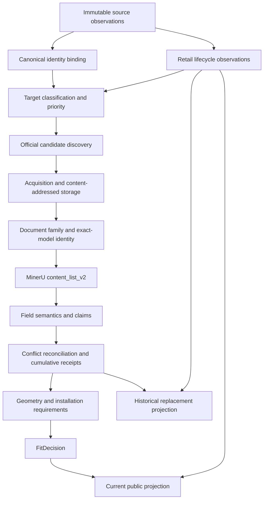
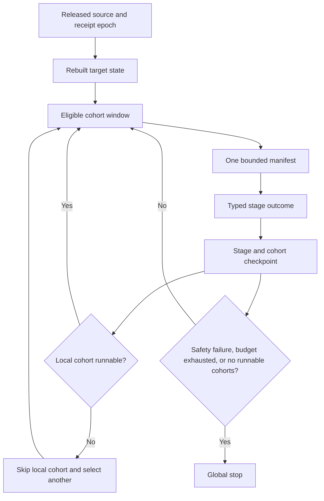

# FitAppliance System-First Repair Control Plan

> **Execution rule:** This is the single active control plan for cross-cutting
> FitAppliance evidence-workflow repairs. Read it before every implementation
> batch. Use `superpowers:executing-plans` for execution and
> `superpowers:test-driven-development` for behavior changes.

- **Status:** BLOCKED - Task 9 lifecycle cutover has unresolved source and
  identity prerequisites; production remains on the pre-cutover release
- **Date:** 2026-07-20
- **Active task:** Task 9 blocked-state closeout and prerequisite recovery
- **Canonical product contract:**
  [`../../product-core-brief.md`](../../product-core-brief.md)
- **Canonical operations guide:**
  [`../../architecture-v2/historical-evidence-recovery-runbook.md`](../../architecture-v2/historical-evidence-recovery-runbook.md)
- **Completed predecessor:**
  [`2026-07-19-historical-evidence-scale-control-plane.md`](2026-07-19-historical-evidence-scale-control-plane.md)
- **User-owned worktree content:** the untracked root file `typescript` must not
  be modified, removed, staged, or committed.

## 1. Purpose

Stop the recurring loop in which a local defect is repaired and unit-tested,
then a later whole-repository audit discovers that the repair violated another
stage's contract.

The governing change is procedural and architectural:

1. establish the current end-to-end contract before editing code;
2. repair upstream state semantics before downstream parsers or schedulers;
3. test every change at producer, consumer, replay, publication, and second-run
   boundaries;
4. rebuild derived artifacts only in dependency order;
5. call work complete only after an adversarial whole-path replay passes.

Esatto dishwasher recovery is a regression witness for this plan. It is not the
scope or organizing principle of the plan.

## 2. Why the Previous Method Looped

The repeated failures were caused by completion criteria that were local while
the behavior was cross-layer:

| Failure pattern | Why a local test missed it | Required correction |
| --- | --- | --- |
| A symptom selected the repair boundary | The visible parser or controller was tested without its upstream inputs | Trace the first incorrect state, not the first visible failure |
| Lifecycle, identity, evidence, and visibility were collapsed | A product URL and `unavailable: false` were treated as current-sale truth | Keep independent state axes and require a dated retailer observation |
| Generated output was treated as source truth | A stale derived classification could feed the next queue and still validate internally | Bind every generated artifact to source hashes and rebuild in one release DAG |
| One stage's metric controlled another stage | Discovery candidate yield and dimensions receipt yield shared one 50% threshold | Use stage-specific outcomes, denominators, and minimum sample sizes |
| A local cohort halt became a programme halt | The planner exposed one manifest and the controller had no alternative | Produce a candidate window and skip only the failed cohort |
| Parser knowledge accumulated as brand-specific exceptions | Positive fixtures passed while other families and negative structures were not replayed | Use category -> brand -> series -> document-family grammar with negative fixtures |
| A green unit test was accepted as completion | No consumer, replay, publication, or repeated-run assertion was required | Apply the five-boundary acceptance matrix in Section 8 |
| Plans accumulated without one authority | Later plans fixed isolated phases while older assumptions stayed active | This file is the sole active cross-cutting repair plan |

The policy is therefore: **no code change may be justified only by the module in
which the symptom appears.** Every repair starts with a contract trace and ends
with a system trace.

## 3. Planning Authority

Documents have the following precedence:

1. `docs/product-core-brief.md` owns product truth, evidence safety, lifecycle
   separation, replacement search, and Fit semantics.
2. This file owns repair order, task state, dependency gates, and whole-system
   completion for the current programme.
3. `docs/architecture-v2/historical-evidence-recovery-runbook.md` owns supported
   operational commands. It must be updated when implementation changes those
   commands.
4. `docs/architecture-v2/repository-architecture-audit.md` is a living current-
   code map, not an execution plan. Task 0 refreshes its stale 2026-07-11
   baseline.
5. Earlier phase and scale plans are implementation history. They cannot
   authorize new work when they conflict with this file.

Read the full file once when starting/resuming a task or when scope changes:

```bash
PLAN=docs/superpowers/plans/2026-07-20-fitappliance-system-first-repair-control-plan.md
cat "$PLAN"
```

Before another implementation or operational batch in the same task, reread
the status, repair-order/protocol/progress sections, and that task's section;
do not reload all 800+ lines merely to prove compliance:

```bash
sed -n '1,19p' "$PLAN"
sed -n '/^## 6\./,/^## 10\./p' "$PLAN"
TASK=0
awk -v heading="### Task ${TASK}:" '
  index($0, heading) == 1 { print_line=1 }
  print_line && /^### Task [0-9]+:/ && index($0, heading) != 1 { exit }
  print_line { print }
' "$PLAN"
```

Then update exactly one task to `IN_PROGRESS`. If execution exposes a plan
defect, mark that task `BLOCKED`, repair this plan first, and do not patch around
the defect in code. This progressive reread rule preserves the control contract
without recreating the prior skill/context token loop.

## 4. Verified Starting State

These values were read on 2026-07-20 from tracked artifacts generated on
2026-07-19. They are a diagnostic baseline, not a success claim.

| Grain | Current result |
| --- | ---: |
| Historical model references classified | 8,089 / 8,089 |
| Models with document links | 1,768 / 8,089 |
| Models with current valid receipts | 401 / 8,089 |
| Models in cumulative recovery acceptance | 382 / 8,089 |
| Replacement auto-fill models | 321 / 8,089 |
| Unique PDF graph nodes | 941 |
| Valid PDF graph nodes | 926 / 941 |
| Proven document-model applicability edges | 548 / 3,761 |
| Current products with receipt-bound W/H/D | 332 / 3,515 |
| Current products with receipt-bound `VERIFIED_FIT` | 0 / 3,515 |
| Public projection rows with at least one legacy retailer link | 1,384 / 3,515 |
| Public projection rows marked unavailable/history-only | 2,131 / 3,515 |
| Retailer-link rows requiring observation migration | 1,614 |
| P0 assigned / eligible targets | 953 / 943 |
| P1 assigned / eligible targets | 3,974 / 3,939 |

Current controller state is `STOP_LOW_YIELD` for
`dishwasher / Esatto / BOUNDED_DISCOVERY` after two one-target zero-yield
batches. That result is not an adequate whole-programme decision.

### 4.1 Confirmed cross-layer defects

1. `scripts/discovery-pipeline/lib/appliances-online-product-api.js` hardcodes
   every API product stub as `unavailable: false`.
2. `src/domain/historical-appliance-reference.mjs` derives `CURRENT_RETAIL` from
   that boolean plus a product-shaped URL. A URL's existence is not a dated
   availability observation.
3. The repository already has the safer three-state contract in
   `src/domain/retailer-observation.mjs`, but the historical reference and AO
   ingestion path do not consistently consume it.
4. The affected Esatto AO listings can explicitly report that a product is not
   available while the current catalogue still routes it as P0 current work.
5. `scripts/pdf-pipeline/esatto-official.js` searches one current sitemap,
   requires an exact SKU in a product URL, and extracts only anchor-tag PDF
   links. It cannot represent archived support/API evidence as typed source
   lanes.
6. Exact Esatto `EDW456S` content is present in a valid MinerU
   `content_list_v2` object, but `src/domain/mineru-document.mjs` does not accept
   its exact-model cover/page scope for the dimensions table.
7. `src/domain/historical-evidence-bounded-batch.mjs` exposes at most one next
   manifest per workstream even when hundreds of other cohorts are eligible.
8. `src/domain/historical-dimensions-scale-control.mjs` applies one yield policy
   to discovery and dimensions stages, permits one-target samples, and turns a
   halted selected cohort into a global stop instead of selecting another
   eligible cohort.

These are evidence that the repair must span state, acquisition, parsing,
publication, and control-plane boundaries. They must not be implemented as
eight unrelated patches.

## 5. End-to-End Contract Map

### 5.1 Independent state axes

Every canonical product must carry these axes independently:

| Axis | Examples | Authority |
| --- | --- | --- |
| Identity | exact model, GTIN, alias bridge | canonical identity + exact official evidence |
| Retail lifecycle | available, unavailable, unknown, stale, relisted | timestamped retailer observation |
| Registry market state | active AU, inactive AU, mixed, no registry | government registry observation |
| Evidence state | candidate, fetched, parsed, identity-proven, receipt, conflict | evidence pipeline |
| Public visibility | current output, historical input-only, quarantine, hidden | publication policy |
| Fit completeness | dimensions-only, conditional, insufficient, verified | receipt-bound Fit engine |

No axis may infer another. In particular:

- registry-active does not mean currently sold;
- a retailer product URL does not mean available;
- a PDF does not mean exact-model evidence;
- W/H/D does not mean installation Fit;
- historical replacement input eligibility does not mean public result
  eligibility.

### 5.2 Data-plane order



### 5.3 Control-plane order



### 5.4 Contract ownership

| Stage | Producer | Primary consumer | Persisted boundary | Failure scope |
| --- | --- | --- | --- | --- |
| Retail observation | retailer adapter / feed collector | lifecycle reducer | immutable observation/snapshot | source + listing |
| Canonical identity | canonical registry | lifecycle, evidence, publication | versioned ID mapping | product identity |
| Lifecycle reduction | latest valid observations + policy | classification and visibility | lifecycle projection with provenance | product + retailer |
| Classification | historical reference + receipts | acquisition queue | immutable generated classification | model target |
| Candidate discovery | versioned resolvers | executable queue | immutable candidate inventory | resolver + target |
| Acquisition | bounded runner | document registry/MinerU | content-addressed raw object | source URL + hash |
| Document identity | document graph | parser and canary gate | document-model edges | document + model |
| MinerU parsing | pinned MinerU object | field claim parser | immutable `content_list_v2` object | document object |
| Reconciliation | all exact official claims | receipt promotion | cumulative append-safe bundle | target + field |
| Geometry/Fit | accepted receipts + site input | public/replacement engines | receipt-bound geometry/decision | product + query |
| Planner | released target state | runners | candidate manifest window | workstream + cohort |
| Circuit breaker | typed checkpoints | planner | append-only checkpoint ledger | stage + cohort |
| Publication | lifecycle + receipts + Fit | static/runtime catalogue | deterministic projection | release epoch |

### 5.5 Current code owners

This is the current-code map used to derive the task order. Task 0 turns it
into a hash-bound executable artifact.

| Contract | Current owner(s) | Direct downstream owner(s) |
| --- | --- | --- |
| Retailer observation schema | `src/domain/retailer-observation.mjs`, `src/domain/retailer-source-adapter.mjs` | `scripts/architecture-v2/build-retailer-ledger.mjs` |
| AO product/API normalization | `scripts/discovery-pipeline/lib/appliances-online-product-api.js` | legacy catalogue seed, historical reference inputs |
| Historical lifecycle reduction | `src/domain/historical-appliance-reference.mjs` | `scripts/architecture-v2/build-historical-appliance-reference.mjs`, catalogue binding, publication |
| Historical catalogue binding | `src/domain/historical-catalog-binding.mjs` | evidence classification and replacement reference |
| Classification and target priority | `src/domain/historical-model-evidence-classification.mjs` | acquisition queue, target state, bounded planner |
| Official candidate inventory | `src/domain/historical-official-candidate-manifest.mjs`, `scripts/pdf-pipeline/architecture-v2-resolver-adapters.mjs` | executable recovery queue |
| Bounded manifest planning | `src/domain/historical-evidence-bounded-batch.mjs` | discovery and recovery runners, scale controller |
| Scale decision | `src/domain/historical-dimensions-scale-control.mjs` | discovery and recovery runner admission |
| Document/MinerU identity and claims | `src/domain/mineru-document.mjs`, `src/domain/dimension-expression-knowledge.mjs` | recovery reconciliation and receipt creation |
| Cumulative receipt contract | `src/domain/historical-evidence-recovery-contract.mjs` | promotion, public projection, historical reference |
| Lifecycle-aware evidence publication | `src/domain/historical-evidence-publication.mjs` | `scripts/architecture-v2/build-public-projection.mjs` |
| Runtime catalogue publication | `scripts/architecture-v2/publish-runtime-projection.js` | static build and browser search |
| Historical replacement publication | historical reference builder/publisher and replacement audit | replacement match engine |
| Installation/Fit evidence | `src/domain/installation-evidence-pipeline.mjs`, `src/domain/fit-v3.mjs` | Fit publication audit and public Fit claims |

### 5.6 Persistence and rebuild semantics

| State or artifact | Current risk | Required semantics after repair |
| --- | --- | --- |
| Raw retailer/API/page payload | May be flattened into a catalogue row | Immutable content-addressed object plus observation pointer |
| Retailer observations | Legacy builder overwrites a projection | Append observations; deterministically rebuild latest-state projection |
| Canonical identity registry | Deterministic generated artifact | Rebuild; collisions quarantine; never fuzzy-merge silently |
| Lifecycle projection | Derived partly from legacy booleans | Rebuild from bound observations and an explicit `asOf` release instant |
| Candidate discovery run | External run plus tracked projection | Append immutable run; merge distinct model/document observations |
| Raw PDF/HTML/JSON evidence | Content-addressed external object | Immutable and never deleted by rollback |
| MinerU `content_list_v2` | Content-addressed derived object | Immutable per PDF/tool/model epoch; replay by hash |
| Document-family graph | Generated inventory | Deterministic rebuild; never receipt authority |
| Target outcomes and checkpoints | Append-only execution history | Append; reopen only on relevant epoch change |
| Acceptance bundle | Cumulative tracked authority | Append-safe merge; reject destructive replacement or weaker receipt |
| Current public projection | Generated release artifact | Deterministic rebuild from lifecycle + receipts; current products only |
| Historical replacement projection | Generated release artifact | Deterministic rebuild; archived/registry inputs allowed, current outputs forbidden |
| Bounded manifest window | Generated next-epoch control artifact | Rebuild only after current release; semantic ordering and hashes |
| Scale-control decision | Generated from manifests + ledger | Rebuild; local cohort states preserved; no hidden wall-clock input |

For freshness, the release uses an explicit `asOf` timestamp stored in the
released observation epoch. Each source adapter must declare
`expectedCadenceHours` and `maximumCurrentAgeHours`. An observation may
authorize current-sale state only when it is the newest successful observation,
is not superseded by a newer unavailable/stale observation, and is no older
than `maximumCurrentAgeHours` relative to that bound `asOf`. A legacy catalogue
row cannot authorize current status by itself. This keeps offline rebuilds
deterministic while allowing source-specific cadences.

## 6. Locked Repair Order

The order is based on dependency, not on which defect is easiest to patch.


Why this order is mandatory:

1. A scheduler cannot make a correct priority decision while current versus
   archived state is wrong.
2. A parser cannot be judged by discovery yield while the resolver cannot
   represent all official source lanes.
3. A receipt cannot be published until model identity and field semantics are
   proven.
4. A circuit breaker cannot use a meaningful denominator until each stage has
   typed outcomes.
5. A release cannot rebuild queues until the acceptance and lifecycle
   projections for the current epoch are complete.

### 6.1 Execution-order correction found during Task 3

The first Task 3 draft required all 1,384 legacy-current products to be
revalidated and production-cut over before Task 4 could begin. That was a
circular dependency: bounded source completion and safe programme control are
implemented by Tasks 4-8. Forcing the old order would either keep false legacy
current state, invent unavailable observations, or block all later repairs.

The corrected gate is:

1. Task 3 completes the exhaustive shadow, scoped refresh inventory, consumer
   contract matrix, and fail-closed atomic-cutover function while production
   remains byte-identical.
2. Tasks 4-8 improve the source, parser, receipt, planner, and controller
   contracts against released inputs and immutable fixtures. They may inspect
   shadow cohorts but may not publish or schedule from a mixed lifecycle epoch.
3. Task 9 completes bounded observation dispositions, requires the cutover
   gate to pass, and promotes lifecycle, current publication, historical
   replacement, audits, classification, target state, and next-epoch queues as
   one release. A blocked Task 9 is an honest release block, not permission for
   a partial overlay.

This preserves the original safety requirement while making every preceding
task independently executable.

## 7. No-Point-Fix Protocol

Every behavior change must create a repair record in the task's execution log
with these fields before code is edited:

```text
Symptom:
First incorrect persisted state:
Upstream producers:
Downstream consumers:
Affected state axes:
Affected tracked/external artifacts:
Current contract:
Target contract:
Migration/rebuild required:
Rollback unit:
Positive real canary:
Negative/adversarial canaries:
```

The implementation sequence is fixed:

1. reproduce the fault at the earliest incorrect boundary;
2. map every producer and consumer of that boundary;
3. add a failing producer test;
4. add a failing producer-consumer contract test;
5. add a failing end-to-end or real-artifact replay test;
6. implement the smallest root-contract change;
7. rebuild derived artifacts in Section 6 order;
8. run the five-boundary acceptance matrix in Section 8;
9. perform one adversarial review for the coherent batch;
10. update this file and commit one root-cause unit.

### 7.1 Prohibited shortcuts

- Do not edit generated JSON to make a queue or audit pass.
- Do not weaken exact-model, official-source, axis, range, receipt, lifecycle,
  or publication guards to improve yield.
- Do not add a brand regex without a category/series/document-family rule and a
  reject fixture.
- Do not use a single successful source when another exact official source is
  unresolved or conflicting.
- Do not use one-target percentage yield as a statistical halt signal.
- Do not convert a local cohort halt to a global stop.
- Do not regenerate next-epoch queues before current-epoch publication and
  historical projections are complete.
- Do not claim task completion from focused tests alone.

## 8. Five-Boundary Acceptance Matrix

Every implementation task must pass all applicable columns. `N/A` requires a
written reason in the task log.

| Boundary | Required proof |
| --- | --- |
| Producer | The earliest incorrect state is now emitted correctly, including unknown/failure states |
| Consumer | Every direct consumer accepts the new contract and rejects the old unsafe state |
| Replay | Immutable input produces the same semantic output after restart/resume |
| Publication | Current, historical, quarantine, replacement, and Fit destinations remain isolated |
| Second run | Rebuilding or rerunning is idempotent and does not duplicate, erase, or reorder semantic outcomes |

Mandatory adversarial traces across the programme:

1. an explicitly unavailable retailer page cannot become `CURRENT_RETAIL`;
2. an unknown or failed retailer collection cannot synthesize unavailable or
   available state;
3. a relisted model can become current only through a newer valid observation;
4. an archived model with valid W/H/D can be a replacement input but never a
   current result;
5. exact-model PDF content with identity in a cover header can scope a later
   table only under the approved document-family rule;
6. a sibling/family manual cannot donate a field without an internal model
   applicability edge;
7. `D`, `D'`, and `D"` cannot be collapsed into closed depth without explicit
   semantics;
8. two official sources with different dimensions remain quarantined;
9. a valid dimensions receipt cannot create `VERIFIED_FIT`;
10. a failed local cohort is skipped while another P0 cohort remains runnable;
11. discovery, acquisition, MinerU, identity, receipt, and Fit yields use their
    own denominators;
12. an interrupted run resumes without repeating completed network or MinerU
    work;
13. promotion is append-safe and a later batch cannot erase prior receipts;
14. normal build succeeds with `FITAPPLIANCE_STORAGE_ROOT` unset;
15. rollback reverts the complete release projection without deleting immutable
    evidence objects.

## 9. Progress Register

| Task | Scope | Depends on | Status | Completion evidence |
| ---: | --- | --- | --- | --- |
| 0 | Freeze baseline and executable system contract | none | COMPLETED | Current contract `historical_evidence_system_a9ebd23cc83b153d9ceda0c3`; 26 stages; 10 epochs; tracked contract replay passed |
| 1 | Lock independent identity/lifecycle/evidence/visibility/Fit axes | 0 | COMPLETED | 13 state-axis fixtures; typed provenance and lifecycle binding; 34 focused and 1,020 Architecture V2 tests passed |
| 2 | Integrate real retailer availability observations | 1 | COMPLETED | 1,614/1,614 links accounted; append-safe schema-v2 ledger; AO/Partnerize typed adapters; policy-aware revalidation audit |
| 3 | Build lifecycle shadow, refresh inventory, and prove destination/cutover isolation | 2 | COMPLETED | Shadow accounts for 3,515 products; all 1,384 legacy-current products have scoped refresh dispositions; real cutover remains safely blocked and production is byte-identical; synthetic atomic cutover passed |
| 4 | Replace one-path discovery with typed official source lanes | 3 | COMPLETED | Schema-v2 five-lane contract; immutable AU/model/host-bound provenance; resume revalidation; exact Esatto canary; 1,059 Architecture V2 and 2,719 repository tests passed |
| 5 | Repair category/series/document-family MinerU grammar | 4 | COMPLETED | Real immutable EDW456S replay yields 448x845x600 mm from page 24; D2 1150 mm remains operation-only; source-derived plus adversarial corpus; 1,063 Architecture V2 and 2,723 repository tests passed; no release/public artifact changed |
| 6 | Prove receipt-to-publication vertical slices | 5 | COMPLETED | Unsupported legacy door semantics removed at receipt/public boundaries; unresolved accepted conflicts and forged verified Fit state fail closed; zero-violation idempotent next-epoch shadow; 1,066 Architecture V2 and 2,726 repository tests passed |
| 7 | Produce deterministic multi-cohort manifest windows | 3, 4 | COMPLETED | Schema/planner v2 exposes 24 manifests across 402 eligible cohorts; 8 P0 slots rotate across all four categories; local exclusion selects another P0 while P1 remains blocked; 1,072 Architecture V2 and 2,732 repository tests passed |
| 8 | Add stage-aware local circuit breakers and global stop rules | 6, 7 | COMPLETED | Schema-v2 typed stage metrics; 10-unit/two-manifest Wilson gate; stable epoch reopening; five legacy entries preserved; real decision RUN_P0; 1,077 Architecture V2 and 2,737 repository tests passed |
| 9 | Full replay, migration, release DAG, and rollback drill | 8 | BLOCKED | Available source runs and replay gates passed, but 81 prior-current products remain unresolved: 58 source-policy blocked, 22 require a new authorised feed epoch, and 1 requires exact-model rediscovery; no cutover or deployment occurred |
| 10 | Refresh canonical docs and close the release | 9 | BLOCKED_BY_9 | Canonical docs record the measured blocked state and recovery order; release closure remains prohibited until Task 9 independently passes |

Only one row may be `IN_PROGRESS`. A task is complete only when its own
acceptance gate is independently satisfied; no gate may rely on a later task.

## 10. Implementation Tasks

### Task 0: Freeze and attest the whole-system baseline

**Goal:** Make drift and mixed-epoch input visible before behavior changes.

**Execution repair record (2026-07-20):**

```text
Symptom: Independently valid generated artifacts can belong to different release epochs while focused tests remain green.
First incorrect persisted state: No tracked artifact recomputes and binds the whole producer/consumer/release contract.
Upstream producers: Architecture V2 policies, observations, registries, acceptance bundles, audits, queues, and control artifacts.
Downstream consumers: public projection, historical replacement projection, bounded runners, scale controller, normal build, and deployment.
Affected state axes: identity, lifecycle, evidence, public visibility, replacement eligibility, and Fit completeness.
Affected tracked/external artifacts: tracked Architecture V2 JSON inputs/outputs; external evidence remains hash-referenced and read-only.
Current contract: Per-artifact validation and partial build-graph ordering without a whole-system epoch attestation.
Target contract: Deterministic, external-drive-free system contract with recomputed hashes, explicit owners/consumers, epochs, transitions, and an acyclic release DAG.
Migration/rebuild required: Register the contract artifact, build it from current tracked inputs, and refresh the repository architecture audit.
Rollback unit: One Task 0 Git commit containing producer, test, path registration, generated contract, package command, plan, and audit update.
Positive real canary: Current tracked 2026-07-19 control-plane artifacts produce one valid contract.
Negative/adversarial canaries: Mixed source hash, missing source, duplicate owner, unknown consumer, release cycle, and next-queue/source epoch inversion.
```

**Files:**

- Create: `src/domain/historical-evidence-system-contract.mjs`
- Create: `scripts/architecture-v2/build-historical-evidence-system-contract.mjs`
- Create: `tests/architecture-v2/historical-evidence-system-contract.test.mjs`
- Create: `data/architecture-v2/reviews/automated/historical-evidence-system-contract.json`
- Modify: `src/domain/architecture-v2-paths.mjs`
- Modify: `tests/architecture-v2/architecture-v2-paths.test.mjs`
- Modify: `package.json`
- Modify: `docs/architecture-v2/repository-architecture-audit.md`

**Test first:** prove that the contract builder rejects a mixed epoch, missing
source hash, duplicate owner, unknown consumer, cyclic release dependency, or a
tracked queue newer than its released source projection.

**Implementation:** emit an external-drive-free artifact that binds each stage
in Section 5 to its producer, consumers, schema version, semantic SHA, source
artifact SHAs, lifecycle visibility, and next valid transition. Bind the
identity-registry, observation, lifecycle-policy, resolver-contract,
source-authority-policy, MinerU/toolchain, parser, receipt-policy, publication,
and Fit-policy epochs separately. Include the current counts in Section 4 and
the current controller decision.

**Verification:**

```bash
node --test tests/architecture-v2/historical-evidence-system-contract.test.mjs \
  tests/architecture-v2/architecture-v2-paths.test.mjs
npm run build:historical-evidence-system-contract
git diff --check
```

**Acceptance:** two consecutive builds are byte-identical apart from an
explicitly excluded operational timestamp; every current generated control
artifact resolves to a released source hash; the repository audit reflects
current code rather than the 2026-07-11 baseline.

**Stop condition:** the builder merely copies self-reported hashes without
recomputing or cross-checking them.

**Execution result (2026-07-20):**

- Added a deterministic repository-only contract that binds 23 persisted
  stages, 10 independent code/policy/tool epochs, and the contract builder's
  own source files.
- Replayed target state, bounded batches, programme status, and scale control
  from current tracked inputs before allowing output; native classification,
  document graph, queue, candidate, canary, receipt-audit, and controller
  semantic hashes are independently recomputed.
- Recorded three current contract gaps without treating them as released facts:
  retailer observations are not yet lifecycle inputs, target state still stores
  timestamp-only source bindings, and the repository build graph is partial.
- Producer boundary: malformed schemas, missing source hashes, duplicate
  artifact owners, and mixed semantic/content bindings fail closed.
- Consumer boundary: unknown consumers, non-reciprocal dependencies, and
  tampered source bindings fail even when the whole contract is re-signed.
- Replay and second-run boundaries: two consecutive final builds emitted byte
  SHA-256 `0c5fc9cdb8afb2bb11a8b974aadf30cf31e2922c3d513332a1df3e02ecdfb2e6`;
  the tracked contract is also covered by a two-build deep-equality test.
- Publication boundary: the contract binds current publication, historical
  replacement, receipt replay, and Fit audit as separate stages; no external
  storage path appears in the artifact.
- Adversarial review: strengthened the output validator after finding that a
  caller could otherwise tamper with a local source binding and recompute only
  the outer hash.
- Verification: focused contract/path tests passed 15/15; full
  `npm run test:architecture-v2` passed 1,012/1,012; `git diff --check` passed.

### Task 1: Lock independent state-axis contracts

**Goal:** Prevent one state axis from silently authorizing another.

**Execution repair record (2026-07-20):**

```text
Symptom: A legacy catalogue boolean plus a product-shaped retailer URL can authorize CURRENT_RETAIL without a dated availability observation.
First incorrect persisted state: historical-appliance-reference lifecycleState, produced from public-catalog-projection rows rather than the retailer-observation ledger.
Upstream producers: retailer adapters and feeds, build-retailer-ledger, public projection, official registry observations, and cumulative evidence receipts.
Downstream consumers: evidence classification and P0/P1 priority, executable queue, target state, bounded planner, current publication, historical replacement, and scale control.
Affected state axes: retail lifecycle directly; public visibility and scheduler priority indirectly; identity, registry state, evidence, and Fit must remain independent.
Affected tracked/external artifacts: retailer-observations.json, public-catalog-projection.json, historical-appliance-reference.json, all derived queues/audits; immutable raw source objects remain read-only.
Current contract: createObservation preserves a three-state availability value, but historical lifecycle ignores it and isCurrentRetailProduct trusts unavailable:false plus URL shape.
Target contract: one deterministic asOf-bound reducer uses only fresh successful product-bound typed observations for CURRENT_RETAIL, preserves failures/unknowns, and never reads Date.now().
Migration/rebuild required: Task 1 locks the schema and reducer; Task 2 migrates all retailer sources; Task 3 rebuilds lifecycle and downstream projections in release order.
Rollback unit: one Task 1 commit containing adapter/reducer contracts, state-axis fixtures, consumer integration seam, tests, and plan evidence; no generated lifecycle artifact is promoted in this task.
Positive real canary: a fresh exact-product available observation remains CURRENT_RETAIL, including a newer relisted observation after an unavailable observation.
Negative/adversarial canaries: legacy boolean/URL only, explicit unavailable, unknown, stale, redirect, failed collection, registry-only, archived catalogue, same-listing conflict, and conflicting retailers.
```

**Files:**

- Modify: `src/domain/retailer-observation.mjs`
- Modify: `src/domain/retailer-source-adapter.mjs`
- Modify: `src/domain/historical-appliance-reference.mjs`
- Modify: `tests/architecture-v2/retailer-observation.test.mjs`
- Modify: `tests/architecture-v2/retailer-source-adapter.test.mjs`
- Modify: `tests/architecture-v2/historical-appliance-reference.test.mjs`
- Create: `tests/architecture-v2/fixtures/lifecycle-state-axis-cases.json`

**Test first:** add fixtures for available, unavailable, unknown, failed
collection, stale, redirected, relisted, registry-only, archived catalogue, and
conflicting multi-retailer observations. Assert that identity, registry state,
lifecycle, evidence, visibility, and Fit state remain independent.

**Implementation:** define one reducer contract for current-sale eligibility.
`CURRENT_RETAIL` requires at least one sufficiently fresh, successful,
product-bound `available` retailer observation. `unavailable` is not current;
`unknown`, stale, collection failure, and source absence remain unknown or
historical according to explicit policy. A retailer outage cannot demote an
entire catalogue. Add required `expectedCadenceHours` and
`maximumCurrentAgeHours` to the source adapter; compare observations against
the release epoch's explicit `asOf`, never `Date.now()` during an offline
build.

**Acceptance:** no URL-shape or legacy boolean alone can produce
`CURRENT_RETAIL`; no registry state can change public visibility; all
transitions preserve observation URL, retailer, timestamp, raw-source hash, and
policy version.

**Stop condition:** the change introduces a new boolean compatibility field
without preserving the three-state source observation.

**Completion evidence (2026-07-20):**

- Producer boundary: typed retailer observations now require product binding,
  adapter and policy identity, raw-source SHA-256, explicit cadence, maximum
  age, trusted HTTPS, and three-state availability. Successful collection
  attempts without immutable source bytes and duplicate observation IDs fail
  closed.
- Consumer boundary: `CURRENT_RETAIL` now requires a fresh `available`
  observation with `current` or `relisted` state. Legacy `unavailable: false`,
  retailer URL shape, and active registry state cannot authorize lifecycle.
  Historical publication, catalog binding, and offline replay fixtures consume
  the typed decision instead of restoring the old shortcut.
- Replay boundary: 13 state-axis fixtures replay identically in forward and
  reverse observation order. Explicit future observations, same-instant
  conflicts, outages, unknowns, redirects, and stale observations remain
  fail-closed.
- Publication boundary: a fresh available retailer wins over another explicit
  unavailable retailer, while unavailable cannot override another retailer's
  unknown or stale state. The semantic catalog binding now includes lifecycle
  policy, release `asOf`, authorizing URL/timestamp/hash, latest observations,
  conflicts, and reason codes rather than mutable presentation links.
- Second-run boundary: the system contract rebuilt twice with contract ID
  `historical_evidence_system_f01c788b2bbc45dc5a38d6b5` and byte SHA-256
  `a261de4555c4596a02a16a74fc9c179dccb6d909dcdad7727c14013f1bcd3abc`.
- Adversarial review found and fixed a multi-retailer false archive, duplicate
  observation ambiguity, credential-bearing product URLs, missing successful
  source hashes, and the `Array.filter(callback)` index masking an optional
  lifecycle argument.
- Verification: 34 focused state/adapter/reference tests passed; 47 direct
  consumer/publication/replay tests passed; the complete Architecture V2 suite
  passed 1,020/1,020. No lifecycle projection was regenerated or promoted;
  that migration remains gated by Tasks 2 and 3.

### Task 2: Integrate typed observations for every current retailer source

**Goal:** Fix the earliest incorrect persisted lifecycle state rather than
patching P0 classification. Appliances Online is the first real regression
case, not the only source in scope.

**Execution repair record (2026-07-20):**

```text
Symptom: The public projection contains 1,614 retailer-link rows, but the tracked retailer ledger contains only 183 observations; all 183 are unknown and all lack a raw-source hash. AO ingestion hardcodes unavailable:false, while explicit AO available:false and Partnerize Stock values do not survive as authoritative observations.
First incorrect persisted state: legacy retailer rows in manual/discovery/catalog inputs and retailer-observations schema v1, before lifecycle reduction or P0/P1 classification.
Upstream producers: AO product API responses, The Good Guys Partnerize feed, legacy sitemap/web-search discovery, canonical product mappings, retailer source policy, and collection-attempt records.
Downstream consumers: lifecycle reducer, historical reference, catalog binding, publication, replacement eligibility, target classification, executable queue, bounded planner, and scale controller.
Affected state axes: retail lifecycle directly; public visibility and scheduler priority only after Task 3. Identity, registry state, evidence receipts, and Fit remain independent.
Affected tracked/external artifacts: retailer-source-policy.json, retailer-observations.json, public-catalog-projection.json as a legacy migration input, a new exhaustive coverage/revalidation audit, and later lifecycle-derived artifacts. Raw feed/API/page objects are immutable and never synthesized from the projection.
Current contract: 1,204 AO API links have no stored AO availability evidence; 152 Partnerize links carry Stock=Yes in the projection but lose that signal and source hash in the ledger; 258 sitemap/web-search links are URLs rather than availability observations. Existing source policy forbids or defers automated page crawling for every legacy retailer lane.
Target contract: source-policy-v2 adapters emit product-bound three-state observations only from hash-bound raw source objects; complete Partnerize feed presence may authorize available, explicit AO available true/false maps to available/unavailable, missing status maps to unknown, failed/incomplete collection cannot demote, and legacy links become explicit policy-aware revalidation items.
Migration/rebuild required: inventory all 1,614 baseline rows; migrate the ledger append-safely to schema v2; add AO and Partnerize snapshot producers; preserve every legacy link as non-authoritative observation plus a terminal or runnable revalidation state; emit an exhaustive coverage audit. Do not rebuild lifecycle/public/P0 projections until Task 3.
Rollback unit: one Task 2 commit containing source policy, producers, append-safe ledger, coverage audit, fixtures, tests, build scripts, and control-plan evidence. Rollback restores the prior ledger/artifact without deleting raw source objects.
Positive real canaries: AO SMS6HCI02A response with available:true and a complete in-stock Partnerize row produce fresh available observations with raw hashes; an available observation remains current through a later failed collection attempt.
Negative/adversarial canaries: AO DW42CS and EDW6SL responses with available:false; an AO payload with no available field; failed API collection; incomplete or ambiguous Partnerize feed; Stock=No/unknown; duplicate model bindings; legacy sitemap/search URLs; redirects; policy-blocked hosts; duplicate replay; and a conflicting observation ID.
```

**Files:**

- Modify: `data/architecture-v2/policies/retailer-source-policy.json`
- Modify: `src/domain/architecture-v2-paths.mjs`
- Create: `src/domain/retailer-observation-ledger.mjs`
- Create: `src/domain/retailer-observation-coverage.mjs`
- Modify: `scripts/discovery-pipeline/lib/appliances-online-product-api.js`
- Modify: `tests/discovery-evidence-seed.test.mjs`
- Modify: `scripts/affiliate/partnerize-tgg.js`
- Modify: `tests/partnerize-tgg.test.mjs`
- Modify as needed: retailer-specific modules under
  `scripts/discovery-pipeline/adapters/`
- Modify: `tests/discovery-pipeline.test.mjs`
- Modify: `scripts/architecture-v2/build-retailer-ledger.mjs`
- Modify: `tests/architecture-v2/retailer-observation.test.mjs`
- Modify: `src/domain/historical-appliance-reference.mjs`
- Modify: `tests/architecture-v2/historical-appliance-reference.test.mjs`
- Create: `scripts/architecture-v2/build-retailer-observation-coverage.mjs`
- Create: `tests/architecture-v2/retailer-observation-coverage.test.mjs`
- Create:
  `data/architecture-v2/reviews/automated/retailer-observation-coverage.json`
- Add immutable AO and retailer-source fixtures under the existing
  `tests/fixtures/architecture-v2/` hierarchy.

**Current source inventory:** the tracked public projection contains 1,614
retailer-link rows: 1,204 AO API, 152 The Good Guys Partnerize feed, and 258
legacy web-search/sitemap rows across AO, The Good Guys, JB Hi-Fi, Bing Lee, and
Harvey Norman. URL discovery is not an availability observation.

**Test first:**

1. Capture immutable AO fixtures for an available product, explicit unavailable
   `DW42CS` and `EDW6SL` products, an API response with no authoritative status,
   and a failed/incomplete collection.
2. Prove that presence in a successful, explicitly complete Partnerize feed is
   an `available` observation for that feed epoch; absence from an incomplete
   feed is not `unavailable`.
3. Prove that web-search/sitemap URLs enter a revalidation queue and cannot
   authorize current status until a bounded retailer-page observation succeeds.
4. Prove each retailer's host, product-page identity, explicit availability
   signal, redirected/unavailable signal, raw object hash, and unknown fallback.

**Implementation:** remove the hardcoded `unavailable: false`; normalize AO
status into the existing retailer observation contract; store immutable source
provenance; adapt complete Partnerize feed rows; route legacy search/sitemap
links through bounded page revalidation; reduce lifecycle from observations.
Legacy output may be projected only after the typed observation is resolved,
and unknown must remain unknown. The coverage artifact must account for all
1,614 starting retailer-link rows by source and terminal observation state.

**Substep order:**

1. `2A` build the source/coverage inventory and fail on unclassified sources;
2. `2B` migrate AO API/page observations;
3. `2C` migrate the complete Partnerize feed contract;
4. `2D` add bounded raw-page revalidation for legacy URL sources;
5. `2E` replay all observations into one append-safe ledger and coverage audit.

**Acceptance:** the unavailable Esatto canaries normalize to explicit
`unavailable` observations and the lifecycle reducer does not classify them as
current; available fixtures remain current; failed collection changes neither
state; every one of the 1,614 baseline links is a typed observation or a
specific revalidation item; the observation ledger is append-only and
idempotent. Actual P0 and public-projection changes are intentionally deferred
to Task 3.

**Stop condition:** page marketing text is parsed without a raw source object,
timestamp, or explicit unknown fallback.

**Execution result (2026-07-20):**

- Migrated the tracked ledger from schema v1 to append-safe schema v2. It now
  preserves 1,614 current baseline link observations plus 38 removed historical
  observations, for 1,652 total; every migrated legacy row remains explicitly
  `unknown` and carries a row/projection binding rather than fabricated raw
  evidence.
- Added hash-bound typed producers for the bounded Appliances Online exact
  product API and the authorised The Good Guys Partnerize feed. Real AO
  fixtures prove `available:true`, `available:false`, missing status, exact
  model/URI mismatch, and failed collection behavior. Partnerize tests prove
  `Stock=Yes`, `Stock=No`, unknown stock, incomplete-feed absence, ambiguous
  identity, and conflicting duplicate rows.
- Emitted exhaustive coverage for all 1,614 current links: 1,270 route to AO
  bounded canary revalidation, 172 route to the authorised Partnerize feed,
  and 172 retailer-page links remain blocked by source policy. The tracked
  production ledger intentionally has zero typed observations until source runs
  are executed; capability is not reported as completed collection.
- Producer boundary: AO no longer hardcodes `unavailable:false`; collection
  dates and verification dates are explicit inputs; feed/API evidence requires
  exact product binding, raw bytes, timestamp, source policy, and SHA-256.
- Consumer boundary: typed available/unavailable observations drive the shared
  lifecycle reducer in integration tests; legacy URL/stock rows remain
  non-authoritative. Actual lifecycle/public/P0 cutover remains isolated for
  Task 3.
- Replay and second-run boundaries: two consecutive builds produced byte
  SHA-256 `3f06dbe18744c1d09abd514a693a8a3dc4d932b9450c8ee9932e289f6e51c94c`
  for the ledger and
  `0c064022acd0204e25eea9d2beb39d8d4592cd3f2e609fb7fe77981c7f8b6e12`
  for coverage, without network or external-drive access.
- Whole-system boundary: ledger and coverage are distinct released stages in a
  24-stage system contract. The current semantic contract is
  `historical_evidence_system_3d41ac037450ec69977b7e13`; the outstanding
  lifecycle-binding gap now correctly belongs to Task 3. A prior system count
  bug reading `retailer.name` instead of `retailer.n` was fixed, so pending
  migration is now correctly zero.
- Adversarial review added validation that survives re-signing: summary,
  collection-attempt, source-binding, redirect-target, opaque affiliate source
  reference, sorted-ID, and typed-raw-hash invariants all fail closed.
- Verification: 53 affected producer/consumer tests passed; full
  `npm run test:architecture-v2` passed 1,036/1,036; full `npm test` passed
  2,693/2,693; generated artifacts replay byte-for-byte.

### Task 3: Rebuild downstream state and prove visibility isolation

**Goal:** Build the complete downstream shadow and prove every consumer and
atomic-cutover boundary before repairing discovery or parsing. Actual
production promotion occurs only in Task 9 after observation completion.

**Execution repair record (2026-07-20):**

```text
Symptom: The typed retailer ledger is complete as a migration inventory but has zero authoritative observations, while the released historical reference, P0/P1 classification, public visibility, replacement eligibility, and Fit publication still derive lifecycle from legacy catalogue flags. A direct cutover would silently turn nearly every legacy-current product into unknown; retaining the old result per row would mix two lifecycle epochs.
First incorrect persisted state: historical-appliance-reference lifecycleState. Its domain builder accepts retailer observations, but the repository CLI never reads the released retailer ledger and instead rebuilds from public-catalog-projection/catalog-final unavailable flags.
Upstream producers: frozen legacy migration baseline, canonical product mappings, retailer-observations schema v2, retailer source policy, typed AO/Partnerize collectors, collection attempts, and the deterministic lifecycle reducer.
Downstream consumers: historical model classification, PDF acquisition and executable queues, target state, bounded batches, current runtime/search visibility, historical replacement projection, Fit publication audit, programme status, and scale control.
Affected state axes: retail lifecycle directly; P0/P1 priority, public visibility, replacement eligibility, and Fit destination indirectly. Identity, registry state, evidence receipts, and geometry remain independent and must not be rewritten by lifecycle migration.
Affected tracked/external artifacts: retailer-observations.json; a new deterministic lifecycle shadow/cutover report; historical-appliance-reference.json and all lifecycle-derived generated queues/audits after cutover; public runtime/replacement files. Immutable raw source objects and receipt bundles remain read-only.
Current contract: retailer-observations binds public projection as a one-time LEGACY_MIGRATION_INPUT, but current publication is also the eventual lifecycle consumer. The historical-reference CLI omits the ledger, and no full-catalogue shadow diff or atomic cutover proof exists.
Target contract: freeze the legacy projection binding as migration provenance only; reduce every canonical product into an asOf-bound shadow lifecycle artifact; account for every legacy-current ID as fresh available, explicitly unavailable/archived, unknown/stale, relisted, or conflict; reject production cutover until unresolved prior-current IDs are zero; then atomically rebuild every downstream artifact from one policy/source epoch.
Migration/rebuild required: add producer, producer-consumer, and full-catalogue shadow tests; generate the shadow without changing runtime files; run bounded typed refreshes for unresolved products; prove the cutover gate; attach lifecycle decisions to the public/reference inputs; rebuild classification, target state, executable queue, bounded batches, replacement publication, public projection, Fit audit, programme status, scale control, and system contract in release order.
Rollback unit: the pre-cutover release remains byte-identical while shadow status is BLOCKED. A passing cutover is one commit/release epoch containing the lifecycle projection and every downstream rebuild; rollback restores that entire epoch, never individual product rows.
Positive real canary: a fresh exact-product available observation keeps a legacy-current product current; an explicit unavailable product is removed; a later fresh relisted observation restores it; an archived receipt remains searchable only in historical replacement.
Negative/adversarial canaries: zero-typed mass unknown, stale observation, failed or incomplete collection, same-listing conflict, mixed retailer availability/unknown, redirected listing, registry-active without retailer evidence, partial overlay, source/policy epoch mismatch, and a shadow diff that omits or duplicates any prior public ID.
```

**Files:**

- Modify as required by failing tests only:
  `src/domain/historical-catalog-binding.mjs`
- Modify as required by failing tests only:
  `src/domain/historical-evidence-publication.mjs`
- Modify: `tests/architecture-v2/historical-catalog-binding.test.mjs`
- Modify: `tests/architecture-v2/historical-evidence-publication.test.mjs`
- Modify: `tests/architecture-v2/historical-evidence-bounded-batch.test.mjs`
- Rebuild tracked historical reference, classification, target state,
  executable queue, bounded batches, replacement audit, public projection, and
  Fit publication audit in release order.

**Test first:** verify current -> unavailable, unavailable -> relisted,
current -> unknown, and archived-with-receipt traces. Assert each trace's P0/P1
classification, public visibility, replacement eligibility, and Fit
destination. Add a full-catalogue shadow-diff fixture that proves a cutover
cannot silently remove or retain a large unknown population.

**Migration sequence:**

1. Build the new lifecycle and visibility projections in shadow without
   changing runtime catalogue files.
2. Emit counts and exact IDs for `fresh_available`, `explicit_unavailable`,
   `unknown_or_stale`, `relisted`, and multi-retailer conflicts.
3. Emit an executable, product-scoped refresh inventory for every
   `unknown_or_stale` product among the 1,384 legacy-current products. Bounded
   typed runs may append observations now, but unresolved work remains an
   explicit Task 9 release prerequisite; missing rows never become unavailable.
4. A product is current when at least one retailer has a fresh available
   observation. It is unavailable only when every authoritative retailer's
   latest complete observation is unavailable. Mixed or incomplete sources
   remain unknown.
5. The cutover function must permit production promotion only when every one
   of the 1,384 legacy-current
   products that would remain a current search or replacement result has a
   fresh available observation and every removed product has an explicit
   unavailable/archived reason. The unresolved unknown count for either output
   must be zero.
6. Until Task 9 proves that gate, keep the existing production projection intact and
   forbid any next-epoch queue from mixing shadow lifecycle state with legacy
   publication state.

**Acceptance:** the shadow report accounts for every prior public product;
collection attempts are scoped to canonical products; transition fixtures
prove classification, public visibility, historical replacement, and Fit
destination isolation; blocked/partial overlays cannot change production; and
a synthetic fully resolved fixture proves an atomic cutover, including relist
retailer publication. The tracked production projection is expected to remain
byte-identical and the real shadow may remain `BLOCKED`; zero unresolved
products and the downstream release rebuild are Task 9's migration gate.

**Completion evidence (2026-07-20):**

- Generated shadow `retail_lifecycle_shadow_d0d9ae53f4abd60c72dbef5b`
  accounts for all 3,515 products and keeps the real cutover `BLOCKED` with all
  1,384 legacy-current products explicitly unresolved instead of silently
  removed.
- Generated refresh inventory
  `retail_lifecycle_refresh_4e19ef3b5cbf82de2e560b1f` gives every unresolved
  product a product-scoped disposition: 172 authorised, 1,172 bounded-canary,
  and 40 blocked by source policy.
- The shadow validator independently recomputes every lifecycle transition,
  destination, cohort, cutover member, source-policy authorization, and source
  binding. Re-signed omissions, stale policy, adapter conflicts, semantic/raw
  source drift, and partial overlays fail closed.
- Synthetic tests prove current, explicit unavailable, unknown, relisted, and
  archived-with-receipt behavior through public, historical replacement, and
  Fit destinations. A status-only observation without a price preserves prior
  same-listing commercial metadata.
- The tracked production public projection has no diff. Current system contract
  `historical_evidence_system_5d09d499d8f7d4ee0d5c7af6` has 26 stages and 10
  epochs. Full `npm run test:architecture-v2` passed 1,052/1,052 before task
  transition; Task 9 remains the only production cutover authority.

**Stop condition:** any generated file is manually edited or next-epoch queues
are built before current-epoch projections finish.

### Task 4: Introduce typed official source-lane discovery

**Goal:** Make discovery completeness measurable without treating one website
shape as a brand's complete official inventory.

**Execution repair record (2026-07-20):**

```text
Symptom: A resolver can report completion=complete after checking one website shape. The manifest then emits terminal NO_CANDIDATE_COMPLETE even though current catalogue, discontinued/archive, support/search, product-detail, or document-link lanes were never represented.
First incorrect persisted state: evidence-source resolver result schema v1. It stores one aggregate completion value and has no lane contract or immutable zero-result provenance.
Upstream producers: brand finder implementations; resolver adapter descriptors; bounded online discovery runner; immutable discovery object store.
Downstream consumers: historical official candidate manifest; materialized candidate graph; executable queue; target state; bounded batches; stage yield and circuit-breaker inputs.
Affected state axes: source-discovery completeness directly. Product identity, retailer lifecycle, registry state, receipt validity, public visibility, and Fit remain independent and cannot be inferred from a discovery lane.
Affected tracked/external artifacts: resolver source and tests; immutable discovery run objects on external storage; historical-official-candidate-manifest on the next release replay. Existing PDF, MinerU, receipt, and public projection objects remain read-only.
Current contract: schema-v1 resolver completion may authorize terminal zero-source; candidate provenance exists only when a candidate is found; distinct page/document observations may be collapsed before the manifest records them.
Target contract: schema-v2 resolver descriptors declare standard official lanes and whether each is required and supported. Every lane reports complete, retryable, or unsupported. A supported complete zero-result lane carries hash-bound raw discovery provenance; unsupported is explicit and cannot masquerade as a completed query. Only current schema-v2 results with every required supported lane complete can authorize terminal zero-candidate.
Migration/rebuild required: preserve schema-v1 run replay and candidate discoveries, but remove its authority to create a new terminal zero-source result. Add lane-aware Esatto discovery first, keep other brands on explicit legacy/non-terminal contracts until their lane maps are versioned, then rebuild the candidate manifest and downstream release DAG only in Task 9.
Rollback unit: resolver schema/adapter/manifest policy plus its tests and knowledge-base entry. Immutable discovery runs are append-only and are never deleted during rollback.
Positive real canary: Esatto EDW456S is discoverable through the official discontinued/product-detail path and its official PDF link remains a historical candidate without implying CURRENT_RETAIL.
Negative/adversarial canaries: current sitemap empty while archive contains the model; archive timeout after current completes; a candidate with no raw lane provenance; unsupported support API; mirror/retailer PDF; duplicate URL observed through distinct lanes; filename-only exact-model signal; and a legacy schema-v1 complete empty result.
```

**Files:**

- Modify: `scripts/pdf-pipeline/architecture-v2-resolver-adapters.mjs`
- Modify: `src/domain/historical-official-candidate-manifest.mjs`
- Modify: `tests/architecture-v2/architecture-v2-resolver-adapters.test.mjs`
- Modify: `tests/architecture-v2/historical-official-candidate-manifest.test.mjs`
- Modify: `scripts/pdf-pipeline/esatto-official.js`
- Modify: `tests/pdf-pipeline/esatto-parser.test.mjs`
- Update: `docs/architecture-v2/appliance-dimension-expression-knowledge-base.md`

**Test first:** require resolver outcomes per official lane: current product,
discontinued/archive, support/search API, official document/CDN link, and
official HTML/JSON product detail. Each lane reports `complete`, `retryable`,
or `unsupported`, with immutable discovery provenance. Retailer and mirror
sources remain reference-only.

**Implementation:** version the Esatto resolver contract and then apply the
same interface to other brands as they are touched. Do not require every brand
to implement every lane; require explicit lane support and completion truth.
Preserve distinct model/document observations before URL or hash
deduplication.

**Acceptance:** a zero-candidate result is terminal only when all required
supported lanes complete; an archived exact-model official page can remain a
historical candidate without becoming current; incomplete lanes remain
retryable; normal builds remain network-free.

**Completion evidence (2026-07-20):**

- Resolver schema v2 declares current, archive, support/search, document/CDN,
  and product-detail lanes. Required supported lanes must all complete before
  either candidate-ready or terminal zero-source can be emitted. Schema-v1
  results still replay candidate observations but have no terminal-zero
  authority.
- Every completed lane binds immutable raw bytes to the requested model, `AU`
  market, and official host. The online runner reads and re-hashes both lane
  and candidate-provenance objects before first persistence and again on
  resume; a missing or changed object fails before manifest publication.
- Candidate identity now preserves the same PDF observed through different
  product pages. Exact URL matching rejects sibling suffixes, fetched page
  identity is independently checked, and Squarespace extraction is scoped to
  the exact product's structured context rather than site-wide embedded data.
- The live EDW456S canary initially exposed 18 document links, including
  sibling models. After the scope repair it yields exactly the official
  EDW456S manual, product card, quick-start guide, and product page. On
  2026-07-20 that page resolves under Esatto's current catalogue path, not its
  archive path. This official-catalogue observation remains independent of
  retailer lifecycle and cannot mark the product `CURRENT_RETAIL`.
- The candidate manifest and downstream release queues were intentionally not
  rebuilt; Task 9 owns the atomic release DAG. The tracked public projection is
  byte-identical. Current system contract is
  `historical_evidence_system_ee4133065c59780d595724fa` (26 stages, 10 epochs).
  `npm run test:architecture-v2` passed 1,059/1,059 and `npm test` passed
  2,719/2,719.

**Stop condition:** a mirror PDF, retailer manual, filename, or URL substring
is promoted as official exact-model field evidence.

### Task 5: Repair document-family and MinerU scope grammar

**Goal:** Convert recurring PDF layouts into reusable, fail-closed knowledge
instead of brand-specific regex accumulation.

**Execution repair record (2026-07-20):**

```text
Symptom: The immutable EDW456S MinerU content_list_v2 contains an exact-model
  identity and an explicit H/W/D1/D2 table on page 24, but the evidence
  pipeline persists `claims_incomplete` with no dimensions.
First incorrect persisted state: parseMineruContentListV2 produces no claims
  because a same-page paragraph model signal makes `pageScoped` true while
  table admission accepts only header/body-repeat/model-table scope. The table
  is therefore skipped, and the true document scope is simultaneously disabled.
Upstream producers: MinerU 3.4.4 content_list_v2, exact official Esatto manual
  discovery, immutable PDF and derived-object storage.
Downstream consumers: evidence-artifact-pipeline, receipt reconciliation,
  geometry projection, replacement matching, publication audit, scale control,
  and the dimension-expression knowledge generator.
Affected state axes: evidence applicability and geometry semantics only.
  Lifecycle, retail availability, public visibility, and Fit completeness must
  not change in this task.
Affected artifacts: PDF b326268b2ca19065d915e05100dac8ada4e9bbd54a97da0ff671dbb02ffc1c93;
  MinerU JSON f1fde39866440cb6b3c6cd420437355e3fab7ed1b89182238c9030c41fc9631b;
  page-24 table e1367605f353e447530019f66a022eb79951ead6bc96708ceb5f5e826663c365;
  page-24 exact-model paragraph 844fca4c64fdd919777bcb27195d7e0a7884ac6b273b189712293f62409bf03f.
Current contract: generic fragment admission treats model signals and dimension
  tables independently and cannot prove this recurring Technical Information
  document family. The legacy Esatto flat-text parser is not receipt authority.
Target contract: one category/brand/document-family grammar must bind an exact
  EDW model on the cover and technical page, require explicit Height (H),
  Width (W), Depth (D1) with `door closed`, and Depth (D2) with `door opened
  90 degrees`, preserve D1 and D2 as different semantics, and emit only closed
  W/H/D claims with page, bbox, fragment hash, quote, unit, axis order, and
  parser-profile provenance.
Migration/rebuild: add immutable source-derived and adversarial fixtures first;
  add the narrow grammar and knowledge classification; do not regenerate
  candidate manifests, receipts, public projection, or release artifacts until
  Task 9 executes the atomic dependency DAG.
Rollback: revert the grammar/profile/fixture batch. Existing immutable PDF and
  MinerU objects remain untouched, and no release projection requires reversal.
Positive canary: exact EDW456S cover plus page-24 model and table yields
  width 448, height 845, closed depth 600, and no D2 closed-depth claim.
Adversarial canaries: sibling EDW456S2 page identity, cover/page mismatch,
  absent same-page exact model, D1 without explicit closed qualifier, D2 without
  explicit open qualifier, swapped D1/D2 qualifiers, duplicate conflicting
  closed depths, missing units, malformed bbox, and non-Esatto/non-dishwasher
  identities all fail closed or remain outside this grammar.
```

**Files:**

- Modify: `src/domain/mineru-document.mjs`
- Modify: `src/domain/dimension-expression-knowledge.mjs`
- Modify: `tests/architecture-v2/mineru-document.test.mjs`
- Modify: `tests/architecture-v2/historical-parser-fixture-corpus.test.mjs`
- Modify: `tests/architecture-v2/dimension-expression-knowledge.test.mjs`
- Update: `docs/architecture-v2/appliance-dimension-expression-knowledge-base.md`
- Add immutable positive and negative MinerU fixtures under the existing
  `tests/fixtures/architecture-v2/` hierarchy.

**Test first:** add exact-model positive and sibling/family negative fixtures
for the affected category -> brand -> series -> document family. For Esatto
`EDW456S`, prove that page 24 binds the exact model and `Dimension (mm)` table
in an approved scope: height `845 mm`, width `448 mm`, closed depth `D1 =
600 mm`, and door-open depth `D2 = 1150 mm`. `D1` and `D2` must remain distinct
semantics rather than positional guesses.

**Implementation:** add grammar at the smallest reusable document-family
boundary. A cover `page_header` may contribute exact document scope only when
source identity, document model set, and internal layout rules exclude sibling
donation. Keep page, bbox, item type, quote, axis order, unit, fragment hash,
and parser profile in every observation.

**Acceptance:** the real positive canary yields correct W/H/D; all negative
siblings and ambiguous depth diagrams fail closed; the complete parser fixture
corpus and dimension-expression corpus pass; no generic fallback weakens older
families.

**Execution evidence (2026-07-20):** the immutable MinerU object
`f1fde39866440cb6b3c6cd420437355e3fab7ed1b89182238c9030c41fc9631b`
for PDF `b326268b2ca19065d915e05100dac8ada4e9bbd54a97da0ff671dbb02ffc1c93`
replayed width `448`, height `845`, and closed depth `600` from page 24 table
`e1367605f353e447530019f66a022eb79951ead6bc96708ceb5f5e826663c365`.
The parser retained D2 `1150 mm` only as a rejected operation-envelope
knowledge observation. Source-derived positive and sibling/qualifier/unit/
conflict/category/bbox adversarial cases pass. Existing composed-layout grammar
observations remain explicit `derived_layout_scope` records and carry their sole
parser profile. The focused 152-test corpus, all 1,063 Architecture V2 tests,
and all 2,723 repository tests passed. The system contract was re-attested as
`historical_evidence_system_26c7aa781210a2fa888ccd35`; candidate manifests,
receipts, publication artifacts, and public projection were deliberately not
rebuilt or changed.

**Stop condition:** the patch is an Esatto-only text match with no family rule
or negative corpus.

### Task 6: Prove receipt-to-publication vertical slices

#### Task 6 execution repair record (written before implementation)

```text
Symptom: current and historical W/H/D routing passes isolated tests, but a
  dimensions-only receipt can still expose unrelated legacy door semantics in
  the public row. A crafted cumulative bundle can also label unresolved
  official conflicts as accepted, and the public Fit audit does not inspect the
  provenance outcome/eligibility bits unless another verified label is present.
First incorrect persisted state: applyReceiptBoundAcceptance spreads the legacy
  product before replacing only selected aliases, retaining
  inferred_door_swing and flags.reversible_door. normalizePublicProduct then
  derives door_swing_mm from door-open total depth minus closed depth even when
  the two receipt-bound fields do not prove hinge-side clearance. The resulting
  public projection is internally dimension-bound but semantically overclaims a
  different operation field.
Upstream producers: exact-model evidence reconciliation, verification receipts,
  cumulative acceptance bundle, lifecycle shadow, and geometry projection.
Downstream consumers: public projection, browser/UI legacy door warnings,
  historical replacement projection, Fit publication audit, sitemap/product
  pages, and release/status guards.
Affected state axes: evidence applicability, public visibility payload, and Fit
  outcome only. Identity, registry membership, retail lifecycle, retailer rows,
  and immutable evidence objects must not change.
Affected artifacts: cumulative acceptance bundle (validation only), public
  catalog projection, historical evidence projection, Fit publication audit,
  and system contract. Candidate/discovery artifacts are unaffected.
Current contract: accepted geometry overwrites W/H/D and selected installation
  aliases but does not own every legacy door flag; public normalization treats a
  calculated depth delta as door swing; acceptance-bundle validation validates
  reconciliation shape but not unresolved-conflict emptiness; Fit audit checks
  visible trust labels but not successfulFitOutcome or verifiedFitEligible.
Target contract: a dimensions receipt publishes only fields carried by its
  receipt-bound geometry/provenance. Unsupported legacy inferred door and
  reversible-door fields are removed or set unknown. Receipt-bound door swing
  can be public only from explicit operation.hingeSideSpaceMm field evidence,
  never from depth subtraction. Accepted bundle entries cannot retain unresolved
  conflicting fields, conflict reasons, or supersession violations. Any
  VERIFIED_FIT outcome or eligibility bit without a fully verified receipt-bound
  geometry is an audit violation.
Migration/rebuild: add vertical canaries first; repair the acceptance boundary,
  public normalization, bundle validator, and audit. The repaired audit exposes
  35 migration violations in the tracked public projection (33 unsupported
  legacy door capability markers and 3 unsupported swing values). A direct
  rebuild is correctly blocked because Task 3's lifecycle cutover remains
  SHADOW_ONLY. Task 6 therefore proves a zero-violation, byte-stable in-memory
  next-epoch projection while keeping production bytes intact. Cumulative
  receipts, historical reference, public/Fit artifacts, candidates, discovery,
  PDF/MinerU outputs, and the release DAG remain deferred to Task 9.
Rollback: revert the validator/publication/audit batch and its tests. No
  immutable objects or cumulative receipt lineage are deleted. If Task 9 has
  already released it, restore the complete previous release projection rather
  than mixing old public rows with the new contract.
Positive canaries: current exact dimensions route to current plus historical;
  archived exact dimensions route historical-only; a second application is a
  semantic no-op; a complete adjustable range remains non-scalar; incomplete
  installation evidence remains INSUFFICIENT_DATA or CONDITIONAL_FIT.
Adversarial canaries: unresolved exact-official conflict cannot enter an
  accepted bundle; stale clearance/plumbing/ventilation/reversible-door/inferred
  door fields cannot ride a W/H/D receipt; door-open depth cannot synthesize
  hinge-side swing; forged VERIFIED_FIT outcome or eligibility is audited.
```

**Goal:** Verify that upstream corrections survive reconciliation, receipts,
geometry, replacement, and public publication.

**Files:**

- Modify only when failing contracts require it:
  `src/domain/historical-evidence-recovery-contract.mjs`
- Modify only when failing contracts require it:
  `src/domain/historical-evidence-publication.mjs`
- Modify only when failing contracts require it:
  `src/domain/installation-evidence-pipeline.mjs`
- Modify when the vertical slice proves post-acceptance semantic leakage:
  `src/domain/accepted-evidence-publication.mjs`
- Modify when public normalization invents unsupported operation semantics:
  `src/domain/public-projection.mjs`
- Modify when publication audit misses provenance or legacy-fit drift:
  `src/domain/geometry-publication.mjs`
- Modify: `tests/architecture-v2/historical-evidence-recovery-contract.test.mjs`
- Modify: `tests/architecture-v2/accepted-evidence-publication.test.mjs`
- Modify: `tests/architecture-v2/fit-publication-audit.test.mjs`
- Modify: `tests/architecture-v2/public-projection.test.mjs`

**Canary matrix:**

1. current available exact-model dimensions receipt -> current + historical
   dimensions, never automatic `VERIFIED_FIT`;
2. archived exact-model dimensions receipt -> historical replacement only;
3. exact official conflict -> quarantine only;
4. partial/range evidence -> preserved non-scalar receipt, no scalar auto-fill;
5. dimensions plus incomplete installation fields -> conditional or
   insufficient, never verified.

**Acceptance:** every accepted field replays from immutable source and MinerU
objects; cumulative promotion is append-safe; public and historical projections
are deterministic; zero Fit publication violations; a second promotion is a
semantic no-op.

**Execution evidence (2026-07-20):** focused receipt, projection, contract, and
Fit-audit canaries passed, including current, archived, conflict, range, and
partial-installation routes. Receipt-bound publication now removes unsupported
legacy inferred/reversible-door state, derives hinge-side space only from its
own receipt-bound field, rejects accepted reconciliation rows with unresolved
conflicts, and audits forged verified outcomes. The stricter audit identifies
35 migration violations in the tracked production projection; the same input
normalized as a next-epoch in-memory shadow has zero violations and a second
normalization is byte-stable. A direct public rebuild stopped before writing
because the required current retail lifecycle decision is not yet available,
which proves the Task 3 shadow-only gate prevents a mixed-epoch release. The 35
focused tests, 135 vertical-slice tests, all 1,066 Architecture V2 tests, and all
2,726 repository tests passed. Production public, Fit-audit, and historical
reference artifacts remain unchanged. The system contract was re-attested as
`historical_evidence_system_f0e68a94d9f1bc2e391f0942`.

**Stop condition:** a correct W/H/D receipt carries unrelated stale retailer,
clearance, plumbing, power, or door fields into public output.

### Task 7: Produce a deterministic multi-cohort manifest window

#### Task 7 execution repair record (written before implementation)

```text
Symptom: the planner counts thousands of eligible targets but persists at most
  one nextManifestId per workstream. When the scale controller locally halts
  that manifest's cohort, no alternative current-priority cohort is visible and
  the local halt becomes a programme-wide STOP_LOW_YIELD.
First incorrect persisted state: buildHistoricalEvidenceBoundedBatches groups
  every eligible target, sorts the groups, then serializes only groups[0]. The
  discarded groups have no manifest ID or stable cohort key in the generated
  next-batches artifact, so downstream code cannot distinguish "no work" from
  "more work hidden by the planner".
Upstream producers: released executable queue, released target state, family
  canary decisions, and their semantic source bindings.
Downstream consumers: dimensions scale controller, discovery and acquisition
  runners, checkpoint recorder, system-contract replay, and the operator
  runbook.
Affected state axes: scheduling/control only. Product identity, lifecycle,
  evidence acceptance, publication visibility, Fit outcomes, receipts, and
  immutable source/MinerU objects must not change.
Affected artifacts: historical-evidence-next-batches, its scale-control source
  binding, and the executable system contract. No public, historical-reference,
  candidate, receipt, PDF, or MinerU artifact is in scope.
Current contract: bounded-batch schema/planner v1 exposes nextManifestId and
  cannot name alternative cohorts; singleton grouping identity is target-local
  and is unsuitable as the local circuit-breaker cohort identity.
Target contract: schema/planner v2 exposes an explicitly versioned ordered
  manifest window, a bounded maximum per workstream, stable cohort keys that do
  not contain timestamps, and one homogeneous manifest per distinct cohort.
  Every manifest remains exact on priority, lifecycle, category, canonical
  brand, family, execution lane, and mode. Workstreams publish ordered
  manifestIds rather than one nextManifestId. P0 and P1 remain distinguishable;
  conflict closure remains an exclusive workstream.
Migration/rebuild: write multi-P0/P1/conflict fixtures first; upgrade the
  planner and validator; update the scale controller only for schema-v2 window
  consumption so the direct consumer cannot drift; rebuild bounded batches,
  scale control, then the system contract from the same released inputs. Task 8
  owns halted-cohort filtering and stage-aware policy. Task 9 alone may combine
  this control format with lifecycle/publication cutover.
Rollback: revert schema-v2 producer, direct-consumer compatibility, generated
  control artifacts, tests, and runbook together. Do not delete ledger entries,
  receipts, or external objects.
Positive canaries: multiple P0 brands/categories/families and both execution
  lanes produce deterministic alternatives; excluding one cohort leaves the
  next P0 cohort visible; source row reversal is byte-stable; P1 is not selected
  while an unblocked P0 candidate is visible.
Adversarial canaries: duplicated target across manifests, duplicated cohort,
  mixed constraints, operational timestamp ordering, window overflow, missing
  references, P1 priority inversion, and conflict targets leaking into a
  dimensions manifest all fail closed.
Dependency correction: add historical-dimensions-scale-control.mjs and the
  system-contract native semantic projection with their focused tests to Task 7
  as direct schema consumers only. The statistical and stage-aware behavior
  remains in Task 8.
```

**Goal:** Give the controller safe alternatives when one cohort is exhausted or
blocked.

**Files:**

- Modify: `src/domain/historical-evidence-bounded-batch.mjs`
- Modify: `tests/architecture-v2/historical-evidence-bounded-batch.test.mjs`
- Modify: `scripts/architecture-v2/build-historical-evidence-bounded-batches.mjs`
- Modify for direct schema-v2 consumption only:
  `src/domain/historical-dimensions-scale-control.mjs`
- Modify: `tests/architecture-v2/historical-dimensions-scale-control.test.mjs`
- Modify for native semantic projection:
  `scripts/architecture-v2/build-historical-evidence-system-contract.mjs`
- Modify: `tests/architecture-v2/historical-evidence-system-contract.test.mjs`
- Modify: `docs/architecture-v2/historical-evidence-recovery-runbook.md`

**Test first:** build fixtures with multiple P0 brands/categories/families,
local blocks, discovery/acquisition lanes, and P1 work. Assert a deterministic
ordered manifest window rather than one manifest per workstream.

**Implementation:** expose a bounded candidate window with one manifest per
distinct cohort up to a versioned maximum. Preserve one exact lifecycle,
priority, category, brand, family, and lane per manifest. Selection order must
be semantic and deterministic; operational timestamps cannot reorder work.

**Acceptance:** two builds produce the same window and hashes; blocking one
cohort leaves another P0 manifest selectable; P1 stays blocked while runnable
P0 exists; conflict closure remains a separate lane.

**Execution evidence (2026-07-20):** bounded-batch schema/planner v2 replaces
one `nextManifestId` with an ordered, hash-bound `manifestIds` window and stable
cohort identity. The real released inputs contain 4,944 eligible targets in 402
cohorts; the bounded artifact exposes 24 manifests, eight each for current,
historical, and conflict workstreams. Current P0 rotation gives two slots each
to dishwasher, dryer, fridge, and washing machine instead of allowing the first
category to consume the window. Reversed input rows produce the identical
artifact and hashes, while changed operational timestamps preserve cohort and
target order. Duplicate targets/cohorts, mixed constraints, priority-map drift,
window overflow/reordering, and unsupported cohort schema fail closed. A real
selection shadow that excludes the first Esatto dishwasher cohort selects the
next P0 Esatto dryer cohort with P1 still blocked. The tracked legacy Esatto
`STOP_LOW_YIELD` decision remains intact until Task 8 migrates its local halt;
no ledger history was discarded. All 1,072 Architecture V2 tests and all 2,732
repository tests passed. The system contract was re-attested as
`historical_evidence_system_f57e90a14876fd0d7477d9e4`; public, historical
reference, receipt, PDF, and MinerU artifacts remain unchanged.

**Stop condition:** the planner hides alternative cohorts behind one
`nextManifestId` or mixes targets to manufacture batch yield.

### Task 8: Add stage-aware local circuit breakers

**Goal:** Stop wasting work locally without stopping the entire programme on a
small or wrongly classified sample.

**Execution repair record (2026-07-20):**

```text
Symptom: Two one-target Esatto discovery misses stop the entire P0 programme, while acquisition, MinerU, identity, dimensions receipt, and Fit outcomes are collapsed into one target-level percentage.
First incorrect persisted state: Schema-v1 scale checkpoints store one DISCOVERY or DIMENSIONS funnel and a legacy family/brand key without a stage-specific denominator or stable processor/policy epoch.
Upstream producers: bounded manifest window, immutable discovery run, recovery results and audit, cumulative coverage counters, and stable lifecycle/resolver/source/parser/MinerU/receipt/Fit epoch definitions.
Downstream consumers: discovery and recovery runner admission, checkpoint ledger, bounded-window selection, programme projection, system contract, and Task 9 release replay.
Affected state axes: scheduling and retry state only; identity, lifecycle, evidence acceptance, publication visibility, and Fit truth remain independent and cannot be changed by a yield decision.
Affected tracked/external artifacts: append-preserved scale ledger, derived scale control, bounded manifests, and system contract; immutable discovery/PDF/MinerU/receipt objects remain read-only.
Current contract: two consecutive same-cohort batches below one 50% floor produce STOP_LOW_YIELD before an alternative manifest is considered.
Target contract: one run emits typed stage samples at their native grain; retryable units are excluded from conclusive halt samples; structural outcomes close only their target; a Wilson-qualified halt blocks only the same stage/cohort/epoch and selection skips it for another P0.
Statistical correction: the prior five-unit rule was mathematically inconsistent. At the 50%, 80%, and 90% floors, 0/5 has a one-sided 95% Wilson upper bound below the floor. The minimum is therefore ten conclusive units across at least two completed manifests, after which the Wilson test still decides. Five misses can never halt.
Epoch correction: queue, target, and manifest hashes are batch state, not processor epochs. Reopening binds only the relevant stable lifecycle, resolver, source-authority, parser, MinerU/toolchain, receipt-policy, and Fit-policy definitions shared with the system contract.
Migration/rebuild: upgrade the ledger envelope without rewriting its five historical entries; expose those entries as legacy diagnostics ineligible for new statistical halts; rebuild the control and system contract from the same stable epoch definitions.
Rollback: revert schema/policy producer, direct consumers, migrated ledger envelope, generated controls, tests, runbook, and shared epoch definitions together. Never delete historical ledger entries or external evidence objects.
Positive canaries: five misses remain runnable; a sufficiently large conclusive low-yield cohort is locally halted; another P0 is selected; a relevant epoch change reports the old halt as reopened; P1 remains blocked while any P0 is runnable.
Adversarial canaries: retryable failures, mixed stage denominators, forged epoch bindings, one manifest repeated under two IDs, unrelated epoch changes, all visible P0 cohorts blocked with deferred P0 work, budget exhaustion, safety failure, and missing online external state fail closed with explicit reasons.
```

**Files:**

- Modify: `src/domain/historical-dimensions-scale-control.mjs`
- Modify: `tests/architecture-v2/historical-dimensions-scale-control.test.mjs`
- Modify: `scripts/architecture-v2/record-historical-dimensions-scale-checkpoint.mjs`
- Modify: `scripts/architecture-v2/build-historical-dimensions-scale-control.mjs`
- Modify: recovery/discovery runner assertions that consume the control
  artifact.
- Create: `src/domain/historical-evidence-epoch-definitions.mjs`
- Modify: `scripts/architecture-v2/build-historical-evidence-system-contract.mjs`
- Modify: focused system-contract tests so the controller and release contract
  cannot drift onto different epoch definitions.

**Test first:** separate discovery, acquisition, MinerU, identity, receipt, and
Fit checkpoints. Test one-target misses, structural terminal outcomes,
retryable failures, sufficient low-yield windows, local halt with alternative
P0, all-P0 exhausted, budget stop, safety stop, and policy/processor epoch
reopening.

**Implementation:**

- Use a versioned policy per stage and explicit denominator:

  | Stage | Numerator / denominator | Initial floor |
  | --- | --- | ---: |
  | Discovery | targets with at least one authority-eligible candidate / selected targets | 20% |
  | Acquisition | valid authority-bound immutable objects / attempted candidate jobs | 80% |
  | MinerU | valid `content_list_v2` objects / eligible fetched PDFs | 90% |
  | Identity | exact or internal model-list proofs / valid parsed documents | 50% |
  | Dimensions receipt | targets with accepted W/H/D receipt / identity-proven targets | 50% |
  | Installation/Fit | complete applicable hard-field sets / selected model-field sets | diagnostic only |

- A percentage-based low-yield halt requires at least ten **conclusive** units
  in the same stage/cohort/epoch over at least two completed manifests **and**
  the one-sided 95% Wilson upper confidence bound must fall below that stage's
  floor. Retryable/incomplete units remain visible in raw throughput but are
  excluded from the conclusive denominator. Thus five misses can never halt a
  cohort; reaching ten units is necessary but the Wilson test remains decisive.
- Deterministic structural terminal outcomes may close individual targets
  immediately without waiting for a sample threshold.
- A local halt removes only that cohort from the candidate window.
- Global stop is legal only for a safety/audit failure, explicit resource
  budget exhaustion, missing required external state for an online operation,
  or zero runnable manifests across all allowed workstreams.
- Reopen only when the relevant lifecycle, resolver, source-policy, parser,
  MinerU/toolchain, or receipt-policy epoch changes.

**Acceptance:** the two historical one-target Esatto misses no longer stop all
P0 work; stale terminal history is not silently discarded; the control report
shows why every cohort is runnable, halted, deferred, complete, or reopened;
stage KPIs are never combined into one percentage.

**Stop condition:** thresholds are tuned until the current batch runs without
fixing state classification and outcome semantics first.

**Execution evidence (2026-07-20):** ledger schema v2 preserves all five prior
checkpoint objects byte-semantically (`entries` SHA-256 remains
`f11c62962ad8f37839863d3d574daa2e9d8e5198021fa7fb7defec2d098f1ea6`)
and exposes them as legacy diagnostics rather than silently deleting or
statistically reinterpreting them. New checkpoints record six independent
stage metrics at target, candidate-job, PDF-document, parsed-document,
identity-proven-target, and selected-field-set grain. Retryable units are not
conclusive misses; a halt requires 10 conclusive units, two distinct manifests,
and a one-sided 95% Wilson upper bound below the stage floor. Shared epoch
definitions prevent the controller and system contract from drifting, and
checkpoint admission rejects an epoch change during a run. A qualifying halt
skips only its stable cohort; deferred P0 work never opens P1. The real tracked
decision changed from the invalid global `STOP_LOW_YIELD` to `RUN_P0`, with 943
eligible P0 targets and P1 still blocked. Focused tests passed 28/28,
Architecture V2 passed 1,077/1,077, the full repository passed 2,737/2,737,
lint passed, and no public, receipt, PDF, MinerU, or Fit truth artifact changed.

### Task 9: Observation completion, atomic migration, full replay, and rollback drill

**Goal:** Complete every prior-current observation disposition and prove the
repaired system as one acyclic release rather than a set of green modules.

**Lifecycle migration prerequisite:** run the Task 3 refresh inventory through
the Task 4-8 source and control contracts. The lifecycle shadow must be
`READY`, with zero unresolved or unsafe prior-current IDs, before any production
file changes. If policy or external authorization prevents that state, Task 9
is `BLOCKED` and the existing production epoch remains intact.

**Execution contract correction (2026-07-20):** the first reviewed AO scale
batch exposed a missing dependency contract before publication. Refresh work is
listing-scoped, not merely product-scoped: one canonical product may own more
than one `baselineLinkId`, every link requires an independent request/outcome,
and the policy request ceiling applies to source tasks rather than product
rows. A response whose exact SKU or canonical URI differs from the frozen task
must bind and retain the raw response, emit a terminal
`QUARANTINED_IDENTITY_MISMATCH` disposition for that link, and contribute no
availability observation. One isolated stale link does not halt unrelated
work; HTTP 403/429 still stop immediately, while repeated identity/transport
failures use the persisted consecutive-failure breaker. Schema-v1 completed
runs remain replayable, but all new AO runs account for every selected
`baselineLinkId` exactly once. Coverage consumes the quarantine so a rebuild
does not retry the same invalid binding; the product itself remains unknown
unless a separate exact-model source resolves its lifecycle.

**Safety-release correction (2026-07-20):** full DAG replay exposed 35 legacy
door-capability/door-swing claims that the receipt-bound Fit audit now correctly
rejects. Keeping those claims merely to preserve pre-cutover bytes would retain
known unsafe Fit semantics, while publishing the complete regenerated candidate
would also release unrelated form-factor changes and create a mixed review
scope. Task 9 therefore permits one lifecycle-neutral safety sub-release before
the observation cutover. Its whitelist is closed: `door_swing_mm` may only move
to `null`, `inferred_door_swing` may only be removed, and
`flags.reversible_door` may only move to `null`. Product identity/order,
availability, retailer rows, dimensions, geometry, provenance, receipts,
clearance, Fit level, and every other field must remain byte-equivalent. The
sub-release must reduce the Fit publication violations to zero, then rebuild the
historical reference binding, lifecycle shadow/refresh inventory, audits, scale
control, and system contract before a second normal build. It does not satisfy
the lifecycle migration prerequisite and cannot make a blocked cutover READY.

**Task 9 execution and blocker record (2026-07-20):**

- A complete authorised Partnerize snapshot produced 233 exact observations
  (229 available, four unavailable) and three identity quarantines. Bounded AO
  execution accounted for all 1,169 selected retailer links: 1,153 succeeded
  and 16 exact-identity mismatches were raw-bound and quarantined.
- The cumulative retailer ledger contains 3,058 observations, including 1,406
  authoritative typed observations, across 1,190 immutable collection attempts.
  Failed AO response contracts now retain their exact response bytes without
  publishing availability, and completed-run replay verifies every raw-bound
  record, including failure and quarantine records.
- Reusing identical Partnerize bytes under a later `observedAt` is rejected.
  Content-equivalent feed snapshots may advance freshness only after a future
  acquisition-receipt contract can independently prove a new source retrieval.
- The lifecycle shadow accounts for all 3,515 catalogue products: 345
  `CURRENT_RETAIL`, 3,089 `CATALOG_ARCHIVED`, and 81 `UNKNOWN_RETAIL`. Its
  cutover is `BLOCKED`, with zero unsafe removals.
- The 81 unresolved products split into 58 blocked by collection policy (89
  links: Bing Lee 57, Harvey Norman 9, JB Hi-Fi 23), 22 waiting for a genuinely
  new authorised The Good Guys feed epoch, and one AO model requiring exact
  rediscovery. At least three of the 22 also expose canonical identity defects:
  LG `1910FGX`/`1910BX` are sold as `WWT-1910FGX`/`WWT-1910BX`, and CHiQ
  `CTM202NW` is linked as `CTM202NW3`. These are identity-repair cases, not
  availability aliases.
- The lifecycle-neutral safety projection changed 36 product rows only within
  the closed door-field whitelist and reduced 35 known Fit publication
  violations to zero. It did not change product count, lifecycle, availability,
  retailer rows, dimensions, receipts, clearances, or Fit level.
- Full external replay verified 803 historical evidence objects. Two complete
  DAG builds were semantically identical; normal builds passed with
  `FITAPPLIANCE_STORAGE_ROOT` unset. The external inventory digest remained
  `7b2f3612c90901e0806546ab01ec0324f48aceee9e200fb31f9b7313920e42c5`
  across the rollback build.
- Final verification passed lint, 1,118/1,118 Architecture V2 tests,
  2,778/2,778 full-repository tests, 21/21 installation receipt replays,
  historical replacement audit with zero issues, and both geometry and
  installation publication audits with zero violations.
- Intermediate Task 8 commit `4ced49876` is not a standalone rollback target
  because it expects later generated contracts. The remote feature baseline
  `3f6a28650` and production `origin/main` baseline `c2c7bfc4c` both rebuild
  offline. A future cutover and all derived artifacts must therefore be one Git
  release unit; rollback restores the complete pre-cutover commit and never
  deletes immutable external evidence.
- No lifecycle cutover, production deployment, or legacy-runtime deletion was
  attempted. This is the required fail-closed outcome, not a partial release
  labelled complete.

**Deterministic unblocking order:**

1. capture a new authorised Partnerize feed with independently bound source
   acquisition time, then replay it without reusing the prior content epoch;
2. repair the three known canonical model identities through exact official AU
   evidence and rebuild their retailer-link bindings without aliasing
   availability;
3. obtain authorised feeds or explicit automation permission for Bing Lee,
   Harvey Norman, and JB Hi-Fi; until then their 58 products remain unknown and
   hidden from current-result output;
4. rediscover the exact LG `GS-B655PL` source instead of accepting its sibling
   response;
5. rerun the entire release DAG, require zero unresolved prior-current IDs,
   repeat the deterministic build, perform the rollback drill, and only then
   authorize cutover and Task 10 release closure.

**Required traces:** happy path, process crash/resume, repeated batch, duplicate
target, cross-source conflict, archived publication, schema upgrade, rollback,
and external-drive-disconnected normal build. The happy/resume traces must also
cover a multi-link product and an isolated exact-identity mismatch followed by
a successful unrelated task.

**Execution order:**

```text
released observations and receipts[n]
  -> lifecycle/reference projection[n]
  -> current and historical publication[n]
  -> audits[n]
  -> classification/target state[n+1]
  -> candidate window/control decision[n+1]
```

**Verification:** run focused tests first, then:

```bash
npm run lint
npm run test:architecture-v2
npm test
env -u FITAPPLIANCE_STORAGE_ROOT npm run build:architecture-v2
env -u FITAPPLIANCE_STORAGE_ROOT npm run build
npm run audit:historical-replacement
npm run audit:fit-publication
git diff --check
```

Run the online full object/receipt replay only with the verified external
storage marker mounted. Do not make normal build depend on that mount.

**Acceptance:** all mandatory traces pass; generated artifacts are from one
epoch; second build is semantically deterministic; rollback is one Git release
revert and never deletes immutable external objects; an adversarial review finds
no open P0/P1 correctness issue.

**Stop condition:** any release artifact is cherry-picked or rebuilt out of DAG
order to make the working tree green.

### Task 10: Refresh canonical documentation and close the release

**Goal:** Leave one accurate operating model after implementation.

**Files:**

- Modify: `docs/product-core-brief.md`
- Modify: `docs/architecture-v2/repository-architecture-audit.md`
- Modify: `docs/architecture-v2/remediation-master-plan.md`
- Modify: `docs/architecture-v2/historical-evidence-recovery-runbook.md`
- Modify: this plan's status, progress register, execution evidence, and final
  residual-risk section.

**Acceptance:** current counts come from generated artifacts; old plans are
clearly historical; runbook commands match the actual CLI; no open task is
hidden by a completion label; the final commit excludes `typescript`.

## 11. Commit and Review Discipline

Use one conventional commit per completed root-cause task. Do not commit a
generated-artifact update without its producer and tests. Suggested sequence:

1. `test(architecture): lock system contract baseline`
2. `fix(data): derive lifecycle from retailer observations`
3. `fix(evidence): isolate lifecycle publication destinations`
4. `feat(evidence): add typed official discovery lanes`
5. `fix(evidence): scope MinerU claims by document family`
6. `test(evidence): prove receipt publication vertical slices`
7. `feat(evidence): plan multiple bounded cohorts`
8. `fix(evidence): localize stage-aware circuit breakers`
9. `chore(evidence): release system-first workflow repair`

Before each commit:

```bash
git status --short
git diff --check
git diff --stat
```

Review for correctness, data loss, unsafe publication, lifecycle leakage,
receipt drift, missing negative tests, and accidental inclusion of `typescript`.

## 12. Plan-Change Rules

This file is deliberately mutable during execution, but changes are controlled:

1. New findings are first classified as a missing contract, wrong dependency,
   missing test trace, or implementation defect.
2. A missing contract or wrong dependency blocks the active task and changes
   this plan before code.
3. A local implementation defect stays within the active task only when all
   upstream and downstream contracts remain unchanged.
4. New work cannot be appended at the end merely because it was discovered
   late; place it at the correct dependency point and re-audit downstream tasks.
5. After any dependency edit, repeat the preflight in Section 13.

## 13. Architecture Preflight Checklist

The plan may move from `DRAFT` to `READY FOR EXECUTION` only when all are true:

- [x] Current producers, consumers, schemas, persistence, and lifecycle
  assumptions are mapped from current code.
- [x] Identity, lifecycle, registry, evidence, visibility, and Fit axes are
  independent.
- [x] First run, crash/resume, repeated batch, source conflict, archived output,
  schema upgrade, rollback, and missing external storage are traced.
- [x] Every generated artifact has explicit overwrite, merge, append, or
  idempotent-rebuild semantics.
- [x] Source discovery has typed completion and stopping rules.
- [x] Every task depends only on earlier tasks and has an independent gate.
- [x] Online discovery/acquisition/replay is separate from offline build and
  deployment.
- [x] Semantic hashes exclude operational timestamps and include relevant
  lifecycle/resolver/parser/policy epochs.
- [x] No acceptance criterion requires a later task.
- [x] Adversarial review has challenged false current-sale state, sibling field
  donation, axis confusion, source conflict, cumulative loss, mixed epochs, and
  local-to-global stops, including a mass-demotion shadow-cutover failure.
- [x] The plan does not modify or rely on the user-owned `typescript` file.

### 13.1 Preflight verdict

**PASS on 2026-07-20.** The review found and corrected these defects before
implementation:

1. a full-plan reread before every small batch would have recreated the prior
   token/context loop, so the plan now uses one full read per task and compact
   progressive rereads inside the task;
2. AO-only lifecycle work could not support a whole-catalogue cutover, so Task
   2 now accounts for all 1,614 retailer-link rows and every active source lane;
3. Task 2 originally depended on a future P0 rebuild, so that acceptance moved
   to Task 3;
4. a direct lifecycle cutover could mass-demote unknown products, so Task 3 now
   requires an exhaustive shadow diff, bounded revalidation, zero unresolved
   output-state unknowns, and an atomic cutover;
5. historical rows may legally remain in the catalogue projection, so the
   exclusion gate now applies to the current runtime/search result set rather
   than deleting historical reference rows;
6. one universal 50% yield rule was not statistically valid, so Task 8 now has
   typed stage denominators, stage floors, a minimum sample, a Wilson-bound
   test, local halts, and narrow global-stop conditions.

## 14. Definition of Done

This programme is complete only when:

1. the executable system contract is current and deterministic;
2. current-sale state comes from typed, dated observations rather than URL or
   boolean inference;
3. current, archived, registry-only, quarantine, and unknown destinations are
   isolated through queues and publication;
4. discovery records all supported official lanes and truthful completion;
5. PDF/MinerU rules are category-, series-, and document-family-aware with
   positive and negative evidence;
6. every accepted field replays through a cumulative receipt into the correct
   geometry/publication destination;
7. W/H/D remains separate from installation and `VERIFIED_FIT` evidence;
8. the planner can select another eligible cohort after a local halt;
9. circuit breakers use stage-specific denominators and adequate samples;
10. full replay, repeat run, offline build, production build, publication
    audits, rollback, and adversarial review pass as one release;
11. canonical documentation and this progress register match the released
    code and generated artifacts.

Focused tests are necessary but never sufficient for this definition of done.
