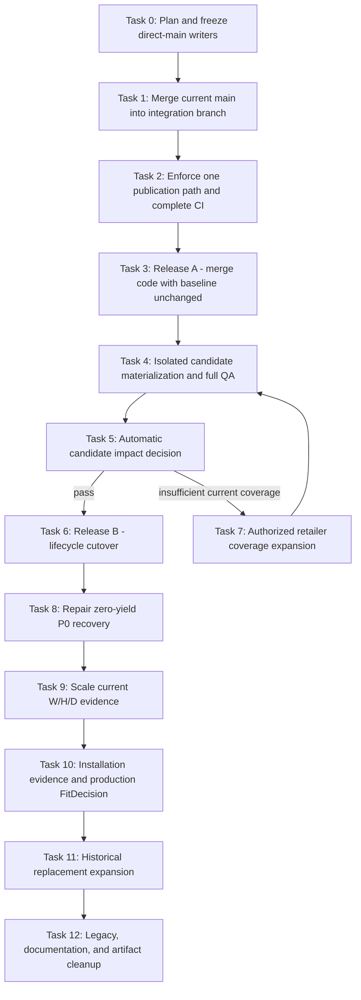

# Production Integration and Evidence Scale Implementation Plan

> **For agentic workers:** REQUIRED SUB-SKILL: Use superpowers:subagent-driven-development (recommended) or superpowers:executing-plans to implement this plan task-by-task. Steps use checkbox (`- [ ]`) syntax for tracking.

**Goal:** Integrate the completed Architecture V2 work into production without bypassing its evidence gates, then scale current-product dimensions, installation evidence, Fit decisions, and historical replacement coverage in that order.

**Architecture:** Use two independent releases. Release A merges code, contracts, and safe automation while preserving the released 3,515-product baseline. Release B materializes the separately authorized 3,513-product lifecycle candidate in an isolated worktree, verifies the complete static site and browser experience, then cuts over only if the measured impact gate passes. All subsequent evidence expansion enters candidate state first and uses bounded batches with existing stop rules.

**Tech Stack:** Node.js 20/22, npm, Git/GitHub Actions, Vercel static deployment, Architecture V2 JSON contracts, MinerU `content_list_v2`, Node test runner, Playwright or the configured browser automation tool.

## Global Constraints

- Accuracy is more important than catalogue size. Unknown remains `null` or an explicit unknown state.
- Identity, retailer availability, field evidence, public visibility, and Fit are independent axes.
- A retailer feed may prove listing availability but cannot prove manufacturer dimensions, clearance, installation, or Fit.
- Historical and registry-only products may power old-appliance lookup but cannot enter current-retail output without fresh retailer evidence.
- Old-appliance replacement compares external W/H/D directly and must not call cavity `FitDecision` or add a fixed clearance buffer.
- Normal tests and builds must pass with `FITAPPLIANCE_STORAGE_ROOT` unset.
- External evidence is immutable under `/Volumes/UGREEN-1TB/FitAppliance`; Git stores only reproducible manifests, receipts, release artifacts, and small control state.
- No scheduled workflow may push generated runtime files directly to `main`.
- `public/data`, generated pages, sitemap, and service worker have one publication owner: `npm run build` from released Architecture V2 state.
- Candidate materialization never occurs in the integration worktree or as a side effect of a normal build.
- Every task starts by rereading this file, confirming predecessor evidence, and marking exactly one task `IN_PROGRESS`.
- Every completed task records commands, hashes/counts, residual risks, and a focused commit before the next task starts.
- Code changes use the smallest existing abstraction that satisfies the contract. Do not add an orchestration framework, database, queue service, or new state machine when an existing npm script and JSON receipt suffice.

## Frozen Baseline: 2026-07-21

| Metric | Baseline |
| --- | ---: |
| Branch divergence from `origin/main` | main-only 3 / branch-only 100 commits |
| Pre-merge generated-file conflicts | 7 |
| Live products | 3,521 |
| Live legacy retailer-backed rows | 1,386 |
| Live lifecycle-bearing rows | 0 |
| Live source metadata date | 2026-05-20 |
| Released Architecture V2 products | 3,515 |
| Authorized lifecycle candidate products | 3,513 |
| Candidate current / archived / market-reference | 349 / 3,087 / 77 |
| Historical references / valid receipts / auto-fill | 8,089 / 401 / 321 |
| Receipt-bound dimensions / `VERIFIED_FIT` | 332 / 0 |
| Current P0 eligible targets | 947 |
| Completed dimensions batches / new receipts | 1 / 0 |

## Execution DAG



## Status Board

| Task | Scope | Depends on | Status |
| ---: | --- | --- | --- |
| 0 | Persist plan and freeze unsafe direct-main workflows | none | COMPLETED |
| 1 | Merge `origin/main` and regenerate conflicts | 0 | COMPLETED |
| 2 | Single publication owner and release-complete CI | 1 | COMPLETED |
| 3 | Release A: merge architecture with baseline unchanged | 2 | COMPLETED |
| 4 | Isolated lifecycle candidate materialization and QA | 3 | COMPLETED |
| 5 | Candidate impact decision | 4 | COMPLETED |
| 6 | Release B: lifecycle cutover and rollback observation | 5 pass | IN_PROGRESS |
| 7 | Conditional authorized retailer coverage expansion | 5 fail | PENDING |
| 8 | Repair P0 zero-yield cohort | 6 | PENDING |
| 9 | Scale current-product W/H/D receipts | 8 | PENDING |
| 10 | Scale installation evidence and cut over FitDecision | 9 | PENDING |
| 11 | Expand historical replacement auto-fill | 10 | PENDING |
| 12 | Remove legacy duplication and control repository growth | 11 | PENDING |

Only one row may be `IN_PROGRESS`. A task is complete only when its acceptance gate is independently satisfied.

---

### Task 0: Persist the plan and freeze unsafe direct-main workflows

**Files:**
- Create: `docs/superpowers/plans/2026-07-21-production-integration-and-evidence-scale.md`

**Interfaces:**
- Consumes: GitHub workflow state and current branch/main divergence.
- Produces: a durable execution contract and a reversible automation freeze.

- [x] Commit this plan before changing repository or GitHub state.
- [x] Record the current workflow state with `gh workflow list --all`.
- [x] Disable only workflows that can push generated files directly to the default branch:

```bash
gh workflow disable data-sync.yml
gh workflow disable weekly-growth.yml
gh workflow disable research-popularity.yml
gh workflow disable validate-reviews.yml
gh workflow disable validate-videos.yml
```

- [x] Leave report-branch and PR-only workflows active, including GSC reports, performance reports, and auto-content PRs.
- [x] Verify the five workflows report `disabled_manually` through the GitHub API.
- [x] Record the disable time and workflow IDs in the execution log below.

**Acceptance gate:** No scheduled workflow capable of writing runtime/generated files directly to `main` remains active. The freeze is reversible with the corresponding `gh workflow enable <file>` command.

### Task 1: Merge current `main` into the integration branch

**Files:**
- Resolve generated conflicts in: `docs/promotion-kit.md`
- Resolve generated conflicts in: `pages/compare/electrolux-vs-lg-dryer.html`
- Resolve generated conflicts in: `public/data/appliances.json`
- Resolve generated conflicts in: `public/data/dishwashers.json`
- Resolve generated conflicts in: `public/data/dryers.json`
- Resolve generated conflicts in: `public/data/fridges.json`
- Resolve generated conflicts in: `public/data/washing-machines.json`

**Interfaces:**
- Consumes: frozen automation and `origin/main`.
- Produces: one integration branch containing all main history without rewriting the published 100-commit branch.

- [x] Fetch `origin/main` and save pre-merge `HEAD`, merge-base, and generated artifact hashes in the execution log.
- [x] Merge with `git merge --no-ff origin/main`; do not rebase or force-push the published branch.
- [x] Preserve automatically merged source/review changes from `main`.
- [x] Resolve the seven derived-file conflicts by regenerating from the merged source state, not by hand-merging generated JSON/HTML.
- [x] Run:

```bash
npm run build
npm run promo-kit
npm test
npm run lint
git diff --check
```

- [x] Confirm `git rev-list --left-right --count origin/main...HEAD` reports zero main-only commits.
- [x] Commit the merge and push without force.

**Acceptance gate:** The branch contains current `main`, has no conflict markers, builds offline, and retains candidate authorization and byte-identical rollback proof.

### Task 2: Enforce one publication owner and release-complete CI

**Files:**
- Create: `scripts/audit-publication-boundary.js`
- Create: `tests/publication-boundary.test.mjs`
- Modify: `package.json`
- Modify: `.github/workflows/pr-validation.yml`
- Modify: `.github/workflows/data-sync.yml`
- Modify: `.github/workflows/weekly-growth.yml`
- Modify: `.github/workflows/research-popularity.yml`
- Modify: `.github/workflows/validate-reviews.yml`
- Modify: `.github/workflows/validate-videos.yml`
- Modify: `docs/architecture-v2/historical-evidence-recovery-runbook.md`

**Interfaces:**
- Consumes: merged branch and existing `npm run build` publication path.
- Produces: `npm run audit:publication-boundary`, which rejects direct default-branch publication and runtime writers outside the canonical build.

- [x] Add a focused failing test proving the current direct pushes and legacy `npm run sync` publication are rejected.
- [x] Implement a small Node audit that scans workflow files and reports exact file/line violations. Keep it text-based and policy-specific; do not add a YAML framework.
- [x] Retire scheduled legacy `data-sync` publication until it writes typed Architecture V2 observations instead of `public/data`.
- [x] Convert growth, popularity, review, and video jobs from direct-main pushes to reviewable bot-branch PRs.
- [x] Require every PR to run, in order:

```bash
npm run lint
npm test
env -u FITAPPLIANCE_STORAGE_ROOT npm run build
npm run audit:publication-boundary
git diff --check
```

- [x] Keep the existing generated-output diff gate; generated bytes must be committed in the same PR as their source changes.
- [x] Run focused tests, all tests, lint, build, and the publication audit.
- [x] Commit and push the workflow boundary as a standalone reviewable commit.

**Acceptance gate:** No active or manually dispatched workflow can update released runtime output without a PR and the canonical build. PR CI exercises the same build path Vercel will run.

### Task 3: Release A - merge architecture code with the baseline unchanged

**Files:**
- No candidate materialization files are changed in this task.
- Update completion evidence in this plan and `docs/product-core-brief.md`.

**Interfaces:**
- Consumes: Task 2 branch and green GitHub checks.
- Produces: default branch with Architecture V2 and safe automation, still serving the released baseline.

- [x] Open a pull request from `codex/historical-evidence-recovery-v2` to `main`.
- [x] Verify GitHub can account for all machine-generated files even if its visual diff is truncated.
- [x] Require green PR validation, portability, tests, lint, canonical build, and publication-boundary audit.
- [x] Merge without force-pushing or materializing the lifecycle candidate.
- [x] Wait for Vercel production deployment and verify:
  - canonical host redirect;
  - `/data/catalog-projection.json` reports the released baseline;
  - homepage, fit checker, replacement mode, one brand page, one product page, and one comparison page load;
  - sitemap and service worker return HTTP 200.
- [x] Re-enable only the converted PR-based workflows. Keep legacy `data-sync` disabled.

**Acceptance gate:** Production runs the integrated code with the released baseline, no candidate cutover, no direct-main writers, and a proven rollback to the pre-merge deployment.

### Task 4: Materialize the lifecycle candidate in an isolated worktree

**Files:**
- Create worktree: `.worktrees/retail-lifecycle-cutover-preview`
<!-- doc-audit: ignore -->
- Create: `scripts/architecture-v2/build-retail-cutover-preview.mjs`
<!-- doc-audit: ignore -->
- Create: `scripts/architecture-v2/audit-retail-cutover-impact.mjs`
<!-- doc-audit: ignore -->
- Create: `tests/architecture-v2/retail-cutover-impact.test.mjs`
- Generate: `data/architecture-v2/reviews/automated/retail-cutover-impact.json`
- Generate: browser screenshots and results under `reports/release-candidate-qa/`

**Interfaces:**
- Consumes: Release A `main` and candidate `retail_lifecycle_release_6c42c754aeb1ff49097b32b4`.
- Produces: a complete candidate site plus a baseline/candidate route, catalogue, CTA, and sitemap impact report.

- [x] Create a child branch and worktree from the Release A commit; never materialize in the integration worktree.
- [x] Save baseline public data, sitemap, generated-route inventory, and release hashes.
- [x] Run `npm run materialize:retail-lifecycle-release-candidate` with the external evidence root explicitly configured.
- [x] Build the preview from the candidate projection and candidate historical reference through an explicit preview-only entry point. The ordinary `npm run build` must continue to read the released projection and must not be treated as a candidate build.
- [x] Run full lint, tests, architecture build, site build, replacement audit, Fit audit, and two deterministic rebuilds.
- [x] Add the smallest audit needed to compare:
  - baseline versus candidate product and current-retail counts;
  - routes added, preserved, redirected, noindexed, or removed;
  - current results by category and brand;
  - retailer CTA counts and URLs;
  - sitemap membership;
  - market-reference commercial leakage;
  - candidate/public/control-plane size boundaries.
- [x] Run browser QA at desktop and mobile widths for cavity search, old-appliance matching, zero-result handling, product details, brand pages, comparison pages, and outbound retailer links.
- [x] Restore the baseline commit in the worktree and prove the released public projection hash is byte-identical.

**Acceptance gate:** The actual materialized candidate, not only its JSON manifest, passes the complete build and browser path with a machine-readable impact report and demonstrated rollback.

### Task 5: Apply the automatic candidate impact decision

**Files:**
- Modify: `data/architecture-v2/reviews/automated/retail-cutover-impact.json`
- Modify: this plan's execution log.

**Interfaces:**
- Consumes: Task 4 impact report.
- Produces: exactly one result, `CUTOVER_ALLOWED` or `RETAIL_COVERAGE_REQUIRED`.

- [x] Return `RETAIL_COVERAGE_REQUIRED` if any condition holds:
  - a category has zero current-retail products;
  - a top measured search cohort loses all results;
  - an indexed route becomes an unexplained 404;
  - a market-reference row exposes price, retailer, offer, sponsorship, or current Fit;
  - any Fit/publication audit reports a violation;
  - browser replacement or cavity workflows fail;
  - rollback is not byte-identical.
- [x] Otherwise return `CUTOVER_ALLOWED`. A lower count alone cannot force unsafe legacy listings back into current output.
- [x] Record category, brand, route, CTA, and high-traffic-query deltas so the decision can be reproduced.

**Acceptance gate:** The decision is data-driven and fail-closed. It does not use a subjective total-product threshold or infer availability from government registration.

### Task 6: Release B - lifecycle cutover and rollback observation

**Files:**
- Commit the complete materialized release unit described in the runbook.
- Update: `docs/product-core-brief.md`
- Update: `docs/architecture-v2/historical-evidence-recovery-runbook.md`
- Update: this plan.

**Interfaces:**
- Consumes: `CUTOVER_ALLOWED` and the tested materialized worktree.
- Produces: production lifecycle release with 349 evidence-backed current rows at the frozen baseline, subject to the Task 5 report.

- [x] Open and merge a dedicated cutover PR containing the complete atomic release unit.
- [x] Deploy and rerun the Task 4 browser paths against production.
- [x] Compare production marker/catalog hashes to the committed release.
- [ ] Monitor application errors, deterministic zero-result behavior, outbound CTA behavior, sitemap health, and top GSC landing routes through the bounded 24-hour observation window. Do not claim a live zero-result rate until result-outcome telemetry exists.
- [ ] Roll back the complete release commit on any severity-1 data, route, Fit, or CTA issue.
- [x] Mark legacy deletion prohibited until the observation window closes.

**Acceptance gate:** Production bytes match the cutover commit, smoke checks pass, and rollback remains immediately deployable.

### Task 7: Expand authorized retailer coverage when required

**Files:**
- Extend existing Architecture V2 retailer adapters, source policy, observation ledger, fixtures, and refresh inventories only.
- Do not modify public projection code to recover counts.

**Interfaces:**
- Consumes: `RETAIL_COVERAGE_REQUIRED` and measured missing cohorts.
- Produces: fresh typed observations and a new lifecycle candidate epoch.

- [ ] Prioritize missing high-traffic category/brand cohorts from the impact report.
- [ ] Use authorized feeds/APIs first: Appliances Online and Partnerize replay before adding another retailer.
- [ ] For every added source, preserve acquisition bytes/hash, observed time, catalogue scope, exact identity, terminal failures, and source policy.
- [ ] Do not accept sibling-model availability or page-render absence as model truth.
- [ ] Rebuild a new candidate epoch and return to Task 4.

**Acceptance gate:** Added current-retail rows are backed by fresh exact listing observations; zero evidence rule is weakened.

### Task 8: Repair the zero-yield current P0 cohort

**Files:**
- Modify only the selected cohort's official-source resolver, document-family grammar, MinerU verifier, or identity binding proven to be the failed stage.
- Update corresponding focused fixtures and the scale-control ledger.

**Interfaces:**
- Consumes: `historical_batch_cd540913d0d888a7ffaa9a0e` and its immutable attempt history.
- Produces: a typed terminal result for every target and at least one valid receipt before broader P0 execution.

- [ ] Replay the selected manifest without broad crawling and classify each target failure by source, identity, document, parser, verifier, or receipt stage.
- [ ] Write one failing fixture for the dominant repairable failure.
- [ ] Implement the minimum brand/category grammar or resolver correction.
- [ ] Re-run the same cohort under a new policy/toolchain epoch.
- [ ] Stop and choose the next P0 cohort if evidence proves the cohort has no official recoverable source; do not loop on zero yield.

**Acceptance gate:** The cohort is terminal and reproducible. Scaling opens only after a positive receipt canary or a deterministic no-source closure.

### Task 9: Scale current-product W/H/D evidence

**Files:**
- Reuse bounded batch, attempt ledger, content-addressed evidence, MinerU, receipt, and publication artifacts.
- Update generated program status and scale-control reports after every batch.

**Interfaces:**
- Consumes: repaired P0 workflow and 947 eligible current targets.
- Produces: cumulative exact-model receipt-bound closed W/H/D without changing Fit status.

- [ ] Run bounded current-category cohorts in priority order.
- [ ] Apply existing low-yield, identity, source, parser, conflict, and resource stop rules after each manifest.
- [ ] Publish dimensions only when exact model, axes, units, product envelope, document hash, and locator are proven.
- [ ] Keep clearance, door, water, power, drainage, ventilation, and Fit unknown unless independently receipted.
- [ ] Report per-category source discovery, PDF processing, parser recognition, accepted W/H/D, quarantine, and throughput separately.

**Acceptance gate:** Current dimension coverage increases with zero axis swaps, sibling transfers, receipt regressions, or false `VERIFIED_FIT`.

### Task 10: Scale installation evidence and cut over production FitDecision

**Files:**
- Extend existing category geometry schemas, installation receipt pipeline, Fit fixtures, UI copy, and browser tests.
- Do not add a weighted score as a physical verdict.

**Interfaces:**
- Consumes: receipt-bound current W/H/D and exact-model installation documents.
- Produces: category-complete hard constraints and production V2 outcomes.

- [ ] Complete category contracts in this order: refrigerators, dishwashers, washing machines, dryers.
- [ ] For each category, capture applicable installation, operation, service, delivery, ventilation, water, power, and drainage fields with independent locators.
- [ ] Expand from one partial exact-model canary to a bounded same-family batch only after replay succeeds.
- [ ] Run V2 and legacy outcomes side by side; classify every disagreement before cutover.
- [ ] Add browser fixtures for `NO_FIT`, `INSUFFICIENT_DATA`, `CONDITIONAL_FIT`, `LIKELY_FIT_ESTIMATED`, and `VERIFIED_FIT`.
- [ ] Release the V2 decision behind a reversible projection only after representative parity and production QA pass.

**Acceptance gate:** Every public Fit result is deterministic, field-evidence-bound, honest about unknowns, and independent of ranking score.

### Task 11: Expand historical replacement auto-fill

**Files:**
- Reuse historical target state, source discovery, document-family graph, receipts, and replacement publication.
- Keep current-retail output independent.

**Interfaces:**
- Consumes: stable current-product and Fit pipelines.
- Produces: more `EXACT_VERIFIED` historical W/H/D inputs for direct old/new comparison.

- [ ] Execute P1 archived and registry-only cohorts only after P0 current work has a measured positive throughput.
- [ ] Preserve `REGISTRY_CANDIDATE`, `IDENTITY_ONLY`, and `CONFLICT_QUARANTINE` semantics.
- [ ] Increase auto-fill only from exact receipt-bound dimensions; otherwise retain confirm/measure prompts.
- [ ] Verify old-appliance mode never changes cavity Fit inputs or current-retail membership.

**Acceptance gate:** Historical auto-fill coverage increases without contaminating current sale state or installation Fit.

### Task 12: Remove legacy duplication and control repository growth

**Files:**
- Update active architecture/product/runbook documents.
- Remove legacy runtime paths only after the cutover observation window.
- Add or update artifact retention policy for generated release snapshots.

**Interfaces:**
- Consumes: successful Release B, V2 Fit cutover, and historical expansion.
- Produces: one active runtime path, current documentation, and bounded Git growth.

- [ ] Remove duplicate legacy calculations and direct-public writers module by module with focused tests.
- [ ] Archive obsolete reports and replace contradictory counters with generated references.
- [ ] Retain one released and one rollback candidate in Git; keep large immutable evidence and older reproducible snapshots on external content-addressed storage.
- [ ] Run full CI, production browser QA, sitemap checks, and rollback one final time.
- [ ] Re-enable or schedule only workflows that use the PR-based canonical publication boundary.

**Acceptance gate:** One source-of-truth path remains, active docs agree with generated metrics, Git growth is bounded, and no required rollback artifact is lost.

---

## Execution Log

### Task 0

- Started: 2026-07-21 Australia/Perth.
- Plan path: `docs/superpowers/plans/2026-07-21-production-integration-and-evidence-scale.md`.
- Plan commit: `938873ad4` (`docs(plan): sequence production integration and evidence scale`).
- Pre-freeze workflow states: all five direct-main workflows reported `active` through the GitHub API.
- Disabled at: `2026-07-21T22:55:56+0800`.
- Disable receipts: `data-sync.yml` (`260705438`), `weekly-growth.yml` (`262738656`), `research-popularity.yml` (`264691478`), `validate-reviews.yml` (`263613288`), and `validate-videos.yml` (`262781065`) each reported `disabled_manually`.
- Preserved active boundaries: GSC reports, performance reports, auto-content PRs, PR validation, portability, and non-publishing monitoring workflows.
- Reversal: `gh workflow enable <file>` for each disabled workflow after its PR-based replacement is released; legacy `data-sync.yml` remains disabled until it emits typed Architecture V2 observations.
- Result: acceptance gate passed; Task 1 started.

### Task 1

- Started: 2026-07-21 Australia/Perth.
- Pre-merge branch HEAD: `bbf614b2e7f6da6acaa1f4e24f062c617a2976ee`.
- Fetched `origin/main`: `5209825f44da9eb93da4e652da53d0952d9b50da`.
- Merge base: `83555ba6a3150489d596a668831dcd7b3c752bfc`; divergence was 3 main-only / 102 branch-only commits.
- Pre-merge generated-artifact SHA-256:
  - `docs/promotion-kit.md`: `20b0b7ef0b5159c2a160793dcd82ceebf34f260dc3dce6050630668bfc0515dd`
  - `pages/compare/electrolux-vs-lg-dryer.html`: `9a2bb16dbc702dcdbb5c127778fbc642dca6d59751a682088fc23062c516eaf6`
  - `public/data/appliances.json`: `fc3cbafd17160a59961802fd4f5e2f50199bf00cf1e526e85a53590a2fd2db5e`
  - `public/data/dishwashers.json`: `15620b02f8121db687d2edf675847984d3a10404cfdd7017a01f242be4358abe`
  - `public/data/dryers.json`: `a2426bb0409694ca6eec4dd5e736d2178919367c51a92490f8f202b648532b46`
  - `public/data/fridges.json`: `b004c09caef5e84de7ebcf1c84c7698402b9364065b931738489eb2a823e367b`
  - `public/data/washing-machines.json`: `1aa5eb3c084a6f49df498dcc4d3c39285b5eae82f1185e409e8d958ca15d9234`
- Merge produced exactly the seven predicted generated-file conflicts and no source conflict. The files were seeded from the released branch, then regenerated from the merged source state.
- The first full test run exposed a stale promotion boundary: three unknown-category records were counted in a four-category claim. A focused test reproduced `6 !== 5`; `buildPromoStats` now filters to the four supported categories, and the two focused test files pass 8/8.
- Verification: two offline builds produced no second-run diff; promotion generation was stable; the full suite passed 2,846/2,846; lint and both worktree/index `git diff --check` passed.
- Safety metrics: released products 3,515; isolated candidate 3,513 with authorization `READY_FOR_CUTOVER`; historical replacement 8,089 with zero audit issues; receipt-bound dimensions 332; receipt-bound `VERIFIED_FIT` 0; Fit publication violations 0.
- Rollback proof: pre-merge and regenerated `public/data/catalog-projection.json` SHA-256 are both `9b7fc3d80a5be8287c9e2f3e5e06150d561b708f4f118fff112bde86ebcd9d6e`.
- Post-regeneration conflict-file hashes match the pre-merge baseline for the comparison page and five public data files. `docs/promotion-kit.md` changed to `c69161896986c901ac8700407165cc9917fb0cea1f0c3fdfad0bcba8279d2431` because the supported-category claim was corrected to 3,512.
- Merge commit: `0be5b3ec5` with parents `686c2d236` and `5209825f4`.
- Ancestry and push: `origin/main...HEAD` reported 0 main-only / 104 branch-only; `origin/main` is an ancestor; normal push advanced the remote branch from `f29b8bd93` to `0be5b3ec5` without force.
- Result: acceptance gate passed; Task 2 started.

### Task 2

- Started: 2026-07-21 Australia/Perth.
- Initial red audit found 20 violations across five workflows: legacy sync, direct-main pushes, missing canonical builds, missing PR creation, and missing PR permissions.
- The legacy sync is now a read-only, manually dispatched retirement notice; its schedule, secrets, checkout, data mutation, and push were removed.
- Weekly growth, popularity research, review validation, and video validation now build through the canonical offline path, push only a run-scoped `automation/*` branch, and open a PR.
- An adversarial trigger review found that a PR opened with `GITHUB_TOKEN` creates an approval-required `pull_request` run. Each publisher now explicitly dispatches `pr-validation.yml` after opening the PR and holds only the additional `actions: write` permission needed for that dispatch.
- The boundary audit now rejects legacy sync, direct default-branch publication, runtime commits without the canonical build or PR, and bot PRs without a post-creation validation dispatch and required permissions.
- Verification: focused workflow/boundary tests passed 9/9; the complete suite passed 2,851/2,851; lint passed; all 19 workflow YAML files parsed; publication audit reported zero violations; portability reported zero violations; offline canonical build passed; sitemap verification reported 1,990 routes; review-content audit reported zero failures; generated outputs remained clean; `git diff --check` passed.
- Implementation commit and push: `a87eb4d98` (`ci: require reviewed canonical publication`) advanced the remote branch normally from `1cbdf9e98` without force.
- Result: acceptance gate passed; Task 3 started.

### Task 3

- Started: 2026-07-21 Australia/Perth.
- Release A pull request: `#188` (`feat: integrate Architecture V2 evidence recovery`).
- GitHub diff completeness after the CI corrections: local and paginated GitHub API listings both contain 874 files and produce sorted-path SHA-256 `70f20b56c59f2b9557f478cb0ada3f5f80e96e7464fc01abb090a0e670365b72`.
- First CI finding: `doc-audit` found 16 missing inline paths. Six were stale `DEVGUIDE.md` UI locations; eight completed-plan references used superseded implementation names; two paths belong to the intentionally unimplemented Task 4 and now carry explicit audit ignores. Focused doc tests pass 4/4 and the repository documentation audit reports zero drift.
- Second CI finding: `copy-lint` treated the checksum-valid legal identifier `ABN 46 168 974 169` as an unsourced acronym lead. The audit now exempts only a fully formatted, checksum-valid Australian ABN; malformed ABNs and unrelated acronym leads remain violations. Focused copy tests pass 11/11 and the full copy audit reports zero violations.
- Third CI finding: Node.js 20 does not provide `Object.groupBy` or `Map.groupBy`. Runtime sources now use Node 20-compatible grouping, and `tests/node-runtime-compatibility.test.mjs` prevents their reintroduction. Commit `4ca08b9f8` passed the full Node 20 build, audits, and 2,854 tests.
- Pull request `#188` passed every required check and merged without force at `ebed3b185a1e796a1e245fcb0c467cf8110cfd1d`. The released public projection remained at 3,515 products; the isolated lifecycle candidate was not materialized.
- Production HTTP verification confirmed the apex-to-`www` 308 redirect, HTTP 200 for the homepage, sitemap, service worker, one brand route, one product route, and one comparison route, and `activeProjection: v2` with `productCount: 3515` in `/data/catalog-projection.json`.
- Production Playwright exposed one standalone fit-checker regression: `replacement-match-engine.js` was not loaded before `search-core.js`. Pull request `#189` added the missing dependency and a regression test in commit `a59f1fd4a`; 2,855 tests, lint, the full build, and publication audit passed before merge.
- Hotfix pull request `#189` passed all required checks and merged at `9c182c64d10d2386fdf6b125e4e0d9506bdad3f8`. The production fit checker then returned 37 matches for a 600 x 850 x 600 mm dishwasher search with zero page errors or same-origin response failures.
- Production replacement mode returned 247 current washing machines for a 600 x 850 x 600 mm old appliance, rendered 200 cards with 200 dimension-delta notes, and did not call the cavity FitDecision path. Desktop routes and a 390 px mobile viewport completed without horizontal overflow.
- `Research Popularity Backfill`, `Weekly Growth Pipeline`, `Validate Review Videos`, and `Validate Brand Videos` are active. `Sync Appliance Data (Retired)` remains manually disabled.
- Result: the acceptance gate passed; production runs the integrated architecture against the unchanged released baseline, and Task 4 started.

### Task 4

- Started and completed: 2026-07-22 Australia/Perth in `.worktrees/retail-lifecycle-cutover-preview` on branch `codex/retail-lifecycle-cutover-preview`, based on Release A commit `4eddde802d2775386a61fab982a989341980de8a`.
- Materialized release `retail_lifecycle_release_6c42c754aeb1ff49097b32b4` with projection SHA-256 `d29bce5366a3467f9aa4887d26268284681184fb4a1f9097e8f2ed477f66da90` and historical-reference SHA-256 `bc71b7af5bd3e68ce388ab7897df726cfae8980dc84db961eac531270aabd882` from `/Volumes/UGREEN-1TB/FitAppliance`.
- The candidate contains 3,513 catalogue rows: 349 `CURRENT_RETAIL`, 3,087 archived, and 77 non-commercial market references. Every supported category retains at least one current result; commercial leakage is zero.
- The preview-only build generated 1,738 product pages, 290 brand pages, 140 comparison pages, 61 cavity pages, 31 doorway pages, and a 1,983-URL sitemap. The normal build remains bound to the released projection.
- Two candidate builds produced byte-identical projection, historical reference, sitemap, generated-page counts, and all 2,401 captured files, including deployed runtime JavaScript. A detached Release A worktree rebuild reproduced the rollback snapshot byte-for-byte.
- Browser QA passed 13 desktop/mobile checks covering cavity and replacement search, zero results, the standalone checker, product/brand/comparison pages, retailer CTAs, and generated cavity/doorway routes. A mobile-only SVG label escape found during adversarial inspection was reproduced in a test and fixed by keeping rotated vertical labels inside each view box.
- Full verification passed 2,875 tests and lint. Candidate historical replacement issues and Fit publication violations are both zero.
- Result: acceptance gate passed; Task 5 started.

### Task 5

- Completed: 2026-07-22 Australia/Perth.
- The impact report records 3,515 baseline products and 3,513 candidate products, with current retail changing from 1,384 unproven legacy-current rows to 349 evidence-backed rows. Count reduction alone is not a blocker.
- All 58 removed generated routes have permanent redirects to candidate routes; six newly noindexed routes are recorded; unexplained removals, invalid retailer URLs, and market-reference commercial leakage are zero.
- The measured GSC cohort manifest covers the ten highest landing routes from 2026-06-22 through 2026-07-19 (259 clicks and 21,904 impressions). Every cohort with baseline results retains results; the Mistral dryer route remains an explicit zero-to-zero `NO_BASELINE_RESULTS` case.
- Cavity cohort decisions now require exact counts captured from generated page indexes. Missing generated results fail closed instead of invoking a second clearance calculation.
- `retail-cutover-impact.json` reports `PASS`, zero issues, byte-identical candidate and rollback checks, and the automatic decision `CUTOVER_ALLOWED` with zero blockers.
- Result: acceptance gate passed; Task 6 started.

### Task 6

- Started: 2026-07-22 Australia/Perth. Cutover commit `ec79f5c4d` opened pull request `#191` with release `retail_lifecycle_release_6c42c754aeb1ff49097b32b4`.
- The first PR build passed tests, the complete canonical build, publication boundaries, sitemap verification, and content gates, then failed generated-output cleanliness. The normal build still published the 3,515-row legacy projection after materializing the approved 3,513-row candidate, so product pages and runtime data were silently regenerated from different catalogues.
- The corrective design adds one checked-in active-release pointer and an immutable release directory containing the exact authorized projection, historical reference, and authorization manifest. All three inputs are SHA-256 and semantic-hash bound to the `READY_FOR_CUTOVER` manifest and its byte-identical rollback proof.
- `publish:catalog`, the compatibility `publish:runtime-catalog` command, and the final build audit now use only `publish-active-retail-release.mjs`. No package or workflow command can invoke the legacy runtime publisher directly. The legacy helper remains private to isolated preview and active-release implementations until Task 12 cleanup.
- Product-page CLI generation now reads the published active runtime catalogue. This prevents quarantined candidate rows from reappearing and keeps product pages, sitemap, runtime JSON, historical replacement, and Fit publication audits on the same release.
- Verification before the corrective commit: two full builds produced the same worktree SHA-256 and each generated 1,738 product pages plus a 1,983-URL sitemap. The active release remained at 3,513 products, 349 current-retail rows, and 8,087 historical-reference records, with zero historical replacement issues and zero Fit publication violations.
- Focused publication, impact, SEO, historical replacement, and Fit tests passed 53/53; the complete suite passed 2,879/2,879; lint, documentation, copy, and portability audits passed with zero violations; the cutover decision remained `CUTOVER_ALLOWED` with zero blockers. Active-release tests also prove that artifact byte drift and out-of-directory paths fail closed.
- Corrective commit `688e67d7b` passed all pull-request checks: `test-and-verify`, documentation, copy, portability, and the Vercel preview deployment. The previously failing generated-output cleanliness step is green. Anonymous preview HTTP requests are blocked by Vercel deployment protection, so public hash and interaction verification remains a post-merge production gate rather than inferred success.
- Explicit remaining boundary: the historical scale-control plane still computes its current-product P0 denominator from the 3,515-row legacy Architecture V2 baseline. Do not claim that priority rebasing is complete; perform it after production observation, before Task 8 scaling.
- Pull request `#191` merged at `e9b4391521dc54795699c5b73153df44b44639e6` and deployed to production. The canonical host redirects with HTTP 308; the production catalogue contains 3,513 products and 349 current-retail rows; all active-release projection, historical-reference, authorization-manifest, split-file, and semantic hashes match the checked-in release.
- Production Playwright passed desktop cavity search, replacement search, zero-result soft fail, standalone checker, product, brand, comparison, mobile cavity, and mobile doorway checks. There were no page errors, same-origin request failures, mobile overflows, or invalid affiliate `rel` attributes. Google Tag Manager remains blocked by the existing CSP on a comparison page; this is recorded as a non-cutover console issue and is not treated as evidence that the user workflows failed.
- An adversarial check of all ten measured GSC landing routes found rank 5, `/compare/hisense-vs-chiq-fridge-clearance`, returning 404 even though the cohort result-count check said `PRESERVED`. The generated destination `/compare/hisense-vs-chiq-fridge` existed; the defect was that measured route reachability was not part of the decision contract.
- Hotfix commit `e58e5ca78` adds the exact permanent redirect and makes every measured route fail closed unless it is a direct candidate route or has a single permanent redirect to one. Missing route evidence now produces `MEASURED_ROUTE_RESOLUTION_MISSING`; an unresolved measured route produces `MEASURED_ROUTE_UNRESOLVED`.
- Candidate and repeat snapshots were recaptured from `e58e5ca78` with 2,330 deployed routes. The refreshed impact report records the configured redirect, reports `PASS` with zero issues, proves candidate and rollback byte identity, and returns `CUTOVER_ALLOWED` with zero blockers. Focused tests passed 26/26; the canonical build remained at 3,513 / 349 / 8,087; the complete suite passed 2,879/2,879; lint and publication, documentation, copy, and portability audits passed.
- Hotfix pull request `#192` passed every required check and merged at `fe3073f6849afb53f185408db0d4e3e1fda67b9e`. Vercel production deployment `dpl_FaxkeaqTXxcLnjMSeS8jWxSNEyLc` reached `Ready` before verification.
- The formerly missing route now returns permanent HTTP 308 to `/compare/hisense-vs-chiq-fridge`, whose response is 200. A production HTTP pass over the complete measured GSC manifest reports 10/10 reachable routes: nine direct 200 responses and this single valid redirect.
- Production `/data/appliances.json` reports 3,513 products and 349 current-retail rows. Its semantic SHA-256 is `77f1a07ef3e62e5b680ea520fce122bf33aaa85ace27d663a29fa0a4c20b9b85`, exactly matching the active immutable release; replacement-reference metadata totals 8,087 records.
- Production Playwright followed the historical route to the expected `Hisense vs CHiQ fridges` page, found the expected title and H1, 1,876 characters of rendered text, no horizontal overflow, and no new page error. The previously recorded GTM CSP error is an observability defect, not a failed comparison workflow.
- Vercel reported no runtime error clusters from deployment readiness through the initial checkpoint. Existing analytics cannot supply a defensible live zero-result rate because the event fires before result calculation and the external analytics script is CSP-blocked. This release uses measured cohort result retention plus tested zero-result UI behavior; future rate thresholds require a separate privacy-safe result-outcome telemetry change.
- Observation window: start `2026-07-22 02:39 AWST`; earliest close `2026-07-23 02:39 AWST`. Initial checkpoint passed. Intermediate and closing checkpoints remain pending, so Task 6 remains `IN_PROGRESS`; Task 8 and all legacy deletion remain prohibited.

## Final Completion Contract

The plan is complete only when Tasks 0-12 are independently accepted. A safe lifecycle cutover does not imply PDF, historical replacement, or Fit evidence completion; those retain separate denominators and acceptance gates.
