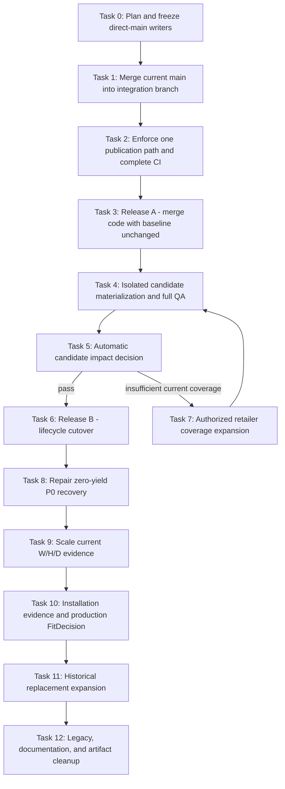

# Production Integration and Evidence Scale Implementation Plan

> **For agentic workers:** REQUIRED SUB-SKILL: Use superpowers:subagent-driven-development (recommended) or superpowers:executing-plans to implement this plan task-by-task. Steps use checkbox (`- [ ]`) syntax for tracking.

**Goal:** Integrate the completed Architecture V2 work into production without bypassing its evidence gates, then scale current-product dimensions, installation evidence, Fit decisions, and historical replacement coverage in that order.

**Architecture:** Use two independent releases. Release A merges code, contracts, and safe automation while preserving the released 3,515-product baseline. Release B materializes the separately authorized 3,513-product lifecycle candidate in an isolated worktree, verifies the complete static site and browser experience, then cuts over only if the measured impact gate passes. All subsequent evidence expansion enters candidate state first and uses bounded batches with existing stop rules.

**Tech Stack:** Node.js 20/22, npm, Git/GitHub Actions, Vercel static deployment, Architecture V2 JSON contracts, MinerU `content_list_v2`, Node test runner, Playwright or the configured browser automation tool.

## Global Constraints

- Accuracy is more important than catalogue size. Unknown remains `null` or an explicit unknown state.
- Identity, retailer availability, field evidence, public visibility, and Fit are independent axes.
- A retailer feed may prove listing availability but cannot prove manufacturer dimensions, clearance, installation, or Fit.
- Historical and registry-only products may power old-appliance lookup but cannot enter current-retail output without fresh retailer evidence.
- Old-appliance replacement compares external W/H/D directly and must not call cavity `FitDecision` or add a fixed clearance buffer.
- Normal tests and builds must pass with `FITAPPLIANCE_STORAGE_ROOT` unset.
- External evidence is immutable under `/Volumes/UGREEN-1TB/FitAppliance`; Git stores only reproducible manifests, receipts, release artifacts, and small control state.
- No scheduled workflow may push generated runtime files directly to `main`.
- `public/data`, generated pages, sitemap, and service worker have one publication owner: `npm run build` from released Architecture V2 state.
- Candidate materialization never occurs in the integration worktree or as a side effect of a normal build.
- Every task starts by rereading this file, confirming predecessor evidence, and marking exactly one task `IN_PROGRESS`.
- Every completed task records commands, hashes/counts, residual risks, and a focused commit before the next task starts.
- Code changes use the smallest existing abstraction that satisfies the contract. Do not add an orchestration framework, database, queue service, or new state machine when an existing npm script and JSON receipt suffice.

## Frozen Baseline: 2026-07-21

| Metric | Baseline |
| --- | ---: |
| Branch divergence from `origin/main` | main-only 3 / branch-only 100 commits |
| Pre-merge generated-file conflicts | 7 |
| Live products | 3,521 |
| Live legacy retailer-backed rows | 1,386 |
| Live lifecycle-bearing rows | 0 |
| Live source metadata date | 2026-05-20 |
| Released Architecture V2 products | 3,515 |
| Authorized lifecycle candidate products | 3,513 |
| Candidate current / archived / market-reference | 349 / 3,087 / 77 |
| Historical references / valid receipts / auto-fill | 8,089 / 401 / 321 |
| Receipt-bound dimensions / `VERIFIED_FIT` | 332 / 0 |
| Current P0 eligible targets | 947 |
| Completed dimensions batches / new receipts | 1 / 0 |

## Execution DAG



## Status Board

| Task | Scope | Depends on | Status |
| ---: | --- | --- | --- |
| 0 | Persist plan and freeze unsafe direct-main workflows | none | COMPLETED |
| 1 | Merge `origin/main` and regenerate conflicts | 0 | IN_PROGRESS |
| 2 | Single publication owner and release-complete CI | 1 | PENDING |
| 3 | Release A: merge architecture with baseline unchanged | 2 | PENDING |
| 4 | Isolated lifecycle candidate materialization and QA | 3 | PENDING |
| 5 | Candidate impact decision | 4 | PENDING |
| 6 | Release B: lifecycle cutover and rollback observation | 5 pass | PENDING |
| 7 | Conditional authorized retailer coverage expansion | 5 fail | PENDING |
| 8 | Repair P0 zero-yield cohort | 6 | PENDING |
| 9 | Scale current-product W/H/D receipts | 8 | PENDING |
| 10 | Scale installation evidence and cut over FitDecision | 9 | PENDING |
| 11 | Expand historical replacement auto-fill | 10 | PENDING |
| 12 | Remove legacy duplication and control repository growth | 11 | PENDING |

Only one row may be `IN_PROGRESS`. A task is complete only when its acceptance gate is independently satisfied.

---

### Task 0: Persist the plan and freeze unsafe direct-main workflows

**Files:**
- Create: `docs/superpowers/plans/2026-07-21-production-integration-and-evidence-scale.md`

**Interfaces:**
- Consumes: GitHub workflow state and current branch/main divergence.
- Produces: a durable execution contract and a reversible automation freeze.

- [x] Commit this plan before changing repository or GitHub state.
- [x] Record the current workflow state with `gh workflow list --all`.
- [x] Disable only workflows that can push generated files directly to the default branch:

```bash
gh workflow disable data-sync.yml
gh workflow disable weekly-growth.yml
gh workflow disable research-popularity.yml
gh workflow disable validate-reviews.yml
gh workflow disable validate-videos.yml
```

- [x] Leave report-branch and PR-only workflows active, including GSC reports, performance reports, and auto-content PRs.
- [x] Verify the five workflows report `disabled_manually` through the GitHub API.
- [x] Record the disable time and workflow IDs in the execution log below.

**Acceptance gate:** No scheduled workflow capable of writing runtime/generated files directly to `main` remains active. The freeze is reversible with the corresponding `gh workflow enable <file>` command.

### Task 1: Merge current `main` into the integration branch

**Files:**
- Resolve generated conflicts in: `docs/promotion-kit.md`
- Resolve generated conflicts in: `pages/compare/electrolux-vs-lg-dryer.html`
- Resolve generated conflicts in: `public/data/appliances.json`
- Resolve generated conflicts in: `public/data/dishwashers.json`
- Resolve generated conflicts in: `public/data/dryers.json`
- Resolve generated conflicts in: `public/data/fridges.json`
- Resolve generated conflicts in: `public/data/washing-machines.json`

**Interfaces:**
- Consumes: frozen automation and `origin/main`.
- Produces: one integration branch containing all main history without rewriting the published 100-commit branch.

- [ ] Fetch `origin/main` and save pre-merge `HEAD`, merge-base, and generated artifact hashes in the execution log.
- [ ] Merge with `git merge --no-ff origin/main`; do not rebase or force-push the published branch.
- [ ] Preserve automatically merged source/review changes from `main`.
- [ ] Resolve the seven derived-file conflicts by regenerating from the merged source state, not by hand-merging generated JSON/HTML.
- [ ] Run:

```bash
npm run build
npm run promo-kit
npm test
npm run lint
git diff --check
```

- [ ] Confirm `git rev-list --left-right --count origin/main...HEAD` reports zero main-only commits.
- [ ] Commit the merge and push without force.

**Acceptance gate:** The branch contains current `main`, has no conflict markers, builds offline, and retains candidate authorization and byte-identical rollback proof.

### Task 2: Enforce one publication owner and release-complete CI

**Files:**
- Create: `scripts/audit-publication-boundary.js`
- Create: `tests/publication-boundary.test.mjs`
- Modify: `package.json`
- Modify: `.github/workflows/pr-validation.yml`
- Modify: `.github/workflows/data-sync.yml`
- Modify: `.github/workflows/weekly-growth.yml`
- Modify: `.github/workflows/research-popularity.yml`
- Modify: `.github/workflows/validate-reviews.yml`
- Modify: `.github/workflows/validate-videos.yml`
- Modify: `docs/architecture-v2/historical-evidence-recovery-runbook.md`

**Interfaces:**
- Consumes: merged branch and existing `npm run build` publication path.
- Produces: `npm run audit:publication-boundary`, which rejects direct default-branch publication and runtime writers outside the canonical build.

- [ ] Add a focused failing test proving the current direct pushes and legacy `npm run sync` publication are rejected.
- [ ] Implement a small Node audit that scans workflow files and reports exact file/line violations. Keep it text-based and policy-specific; do not add a YAML framework.
- [ ] Retire scheduled legacy `data-sync` publication until it writes typed Architecture V2 observations instead of `public/data`.
- [ ] Convert growth, popularity, review, and video jobs from direct-main pushes to reviewable bot-branch PRs.
- [ ] Require every PR to run, in order:

```bash
npm run lint
npm test
env -u FITAPPLIANCE_STORAGE_ROOT npm run build
npm run audit:publication-boundary
git diff --check
```

- [ ] Keep the existing generated-output diff gate; generated bytes must be committed in the same PR as their source changes.
- [ ] Run focused tests, all tests, lint, build, and the publication audit.
- [ ] Commit and push the workflow boundary as a standalone reviewable commit.

**Acceptance gate:** No active or manually dispatched workflow can update released runtime output without a PR and the canonical build. PR CI exercises the same build path Vercel will run.

### Task 3: Release A - merge architecture code with the baseline unchanged

**Files:**
- No candidate materialization files are changed in this task.
- Update completion evidence in this plan and `docs/product-core-brief.md`.

**Interfaces:**
- Consumes: Task 2 branch and green GitHub checks.
- Produces: default branch with Architecture V2 and safe automation, still serving the released baseline.

- [ ] Open a pull request from `codex/historical-evidence-recovery-v2` to `main`.
- [ ] Verify GitHub can account for all machine-generated files even if its visual diff is truncated.
- [ ] Require green PR validation, portability, tests, lint, canonical build, and publication-boundary audit.
- [ ] Merge without force-pushing or materializing the lifecycle candidate.
- [ ] Wait for Vercel production deployment and verify:
  - canonical host redirect;
  - `/data/catalog-projection.json` reports the released baseline;
  - homepage, fit checker, replacement mode, one brand page, one product page, and one comparison page load;
  - sitemap and service worker return HTTP 200.
- [ ] Re-enable only the converted PR-based workflows. Keep legacy `data-sync` disabled.

**Acceptance gate:** Production runs the integrated code with the released baseline, no candidate cutover, no direct-main writers, and a proven rollback to the pre-merge deployment.

### Task 4: Materialize the lifecycle candidate in an isolated worktree

**Files:**
- Create worktree: `.worktrees/retail-lifecycle-cutover-preview`
- Create: `scripts/architecture-v2/audit-retail-cutover-impact.mjs`
- Create: `tests/architecture-v2/retail-cutover-impact.test.mjs`
- Generate: `data/architecture-v2/reviews/automated/retail-cutover-impact.json`
- Generate: browser screenshots and results under `reports/release-candidate-qa/`

**Interfaces:**
- Consumes: Release A `main` and candidate `retail_lifecycle_release_6c42c754aeb1ff49097b32b4`.
- Produces: a complete candidate site plus a baseline/candidate route, catalogue, CTA, and sitemap impact report.

- [ ] Create a child branch and worktree from the Release A commit; never materialize in the integration worktree.
- [ ] Save baseline public data, sitemap, generated-route inventory, and release hashes.
- [ ] Run `npm run materialize:retail-lifecycle-release-candidate` with the external evidence root explicitly configured.
- [ ] Run full lint, tests, architecture build, site build, replacement audit, Fit audit, and two deterministic rebuilds.
- [ ] Add the smallest audit needed to compare:
  - baseline versus candidate product and current-retail counts;
  - routes added, preserved, redirected, noindexed, or removed;
  - current results by category and brand;
  - retailer CTA counts and URLs;
  - sitemap membership;
  - market-reference commercial leakage;
  - candidate/public/control-plane size boundaries.
- [ ] Run browser QA at desktop and mobile widths for cavity search, old-appliance matching, zero-result handling, product details, brand pages, comparison pages, and outbound retailer links.
- [ ] Restore the baseline commit in the worktree and prove the released public projection hash is byte-identical.

**Acceptance gate:** The actual materialized candidate, not only its JSON manifest, passes the complete build and browser path with a machine-readable impact report and demonstrated rollback.

### Task 5: Apply the automatic candidate impact decision

**Files:**
- Modify: `data/architecture-v2/reviews/automated/retail-cutover-impact.json`
- Modify: this plan's execution log.

**Interfaces:**
- Consumes: Task 4 impact report.
- Produces: exactly one result, `CUTOVER_ALLOWED` or `RETAIL_COVERAGE_REQUIRED`.

- [ ] Return `RETAIL_COVERAGE_REQUIRED` if any condition holds:
  - a category has zero current-retail products;
  - a top measured search cohort loses all results;
  - an indexed route becomes an unexplained 404;
  - a market-reference row exposes price, retailer, offer, sponsorship, or current Fit;
  - any Fit/publication audit reports a violation;
  - browser replacement or cavity workflows fail;
  - rollback is not byte-identical.
- [ ] Otherwise return `CUTOVER_ALLOWED`. A lower count alone cannot force unsafe legacy listings back into current output.
- [ ] Record category, brand, route, CTA, and high-traffic-query deltas so the decision can be reproduced.

**Acceptance gate:** The decision is data-driven and fail-closed. It does not use a subjective total-product threshold or infer availability from government registration.

### Task 6: Release B - lifecycle cutover and rollback observation

**Files:**
- Commit the complete materialized release unit described in the runbook.
- Update: `docs/product-core-brief.md`
- Update: `docs/architecture-v2/historical-evidence-recovery-runbook.md`
- Update: this plan.

**Interfaces:**
- Consumes: `CUTOVER_ALLOWED` and the tested materialized worktree.
- Produces: production lifecycle release with 349 evidence-backed current rows at the frozen baseline, subject to the Task 5 report.

- [ ] Open and merge a dedicated cutover PR containing the complete atomic release unit.
- [ ] Deploy and rerun the Task 4 browser paths against production.
- [ ] Compare production marker/catalog hashes to the committed release.
- [ ] Monitor application errors, zero-result rate, outbound CTA behavior, sitemap health, and top GSC landing routes through one full observation window.
- [ ] Roll back the complete release commit on any severity-1 data, route, Fit, or CTA issue.
- [ ] Mark legacy deletion prohibited until the observation window closes.

**Acceptance gate:** Production bytes match the cutover commit, smoke checks pass, and rollback remains immediately deployable.

### Task 7: Expand authorized retailer coverage when required

**Files:**
- Extend existing Architecture V2 retailer adapters, source policy, observation ledger, fixtures, and refresh inventories only.
- Do not modify public projection code to recover counts.

**Interfaces:**
- Consumes: `RETAIL_COVERAGE_REQUIRED` and measured missing cohorts.
- Produces: fresh typed observations and a new lifecycle candidate epoch.

- [ ] Prioritize missing high-traffic category/brand cohorts from the impact report.
- [ ] Use authorized feeds/APIs first: Appliances Online and Partnerize replay before adding another retailer.
- [ ] For every added source, preserve acquisition bytes/hash, observed time, catalogue scope, exact identity, terminal failures, and source policy.
- [ ] Do not accept sibling-model availability or page-render absence as model truth.
- [ ] Rebuild a new candidate epoch and return to Task 4.

**Acceptance gate:** Added current-retail rows are backed by fresh exact listing observations; zero evidence rule is weakened.

### Task 8: Repair the zero-yield current P0 cohort

**Files:**
- Modify only the selected cohort's official-source resolver, document-family grammar, MinerU verifier, or identity binding proven to be the failed stage.
- Update corresponding focused fixtures and the scale-control ledger.

**Interfaces:**
- Consumes: `historical_batch_cd540913d0d888a7ffaa9a0e` and its immutable attempt history.
- Produces: a typed terminal result for every target and at least one valid receipt before broader P0 execution.

- [ ] Replay the selected manifest without broad crawling and classify each target failure by source, identity, document, parser, verifier, or receipt stage.
- [ ] Write one failing fixture for the dominant repairable failure.
- [ ] Implement the minimum brand/category grammar or resolver correction.
- [ ] Re-run the same cohort under a new policy/toolchain epoch.
- [ ] Stop and choose the next P0 cohort if evidence proves the cohort has no official recoverable source; do not loop on zero yield.

**Acceptance gate:** The cohort is terminal and reproducible. Scaling opens only after a positive receipt canary or a deterministic no-source closure.

### Task 9: Scale current-product W/H/D evidence

**Files:**
- Reuse bounded batch, attempt ledger, content-addressed evidence, MinerU, receipt, and publication artifacts.
- Update generated program status and scale-control reports after every batch.

**Interfaces:**
- Consumes: repaired P0 workflow and 947 eligible current targets.
- Produces: cumulative exact-model receipt-bound closed W/H/D without changing Fit status.

- [ ] Run bounded current-category cohorts in priority order.
- [ ] Apply existing low-yield, identity, source, parser, conflict, and resource stop rules after each manifest.
- [ ] Publish dimensions only when exact model, axes, units, product envelope, document hash, and locator are proven.
- [ ] Keep clearance, door, water, power, drainage, ventilation, and Fit unknown unless independently receipted.
- [ ] Report per-category source discovery, PDF processing, parser recognition, accepted W/H/D, quarantine, and throughput separately.

**Acceptance gate:** Current dimension coverage increases with zero axis swaps, sibling transfers, receipt regressions, or false `VERIFIED_FIT`.

### Task 10: Scale installation evidence and cut over production FitDecision

**Files:**
- Extend existing category geometry schemas, installation receipt pipeline, Fit fixtures, UI copy, and browser tests.
- Do not add a weighted score as a physical verdict.

**Interfaces:**
- Consumes: receipt-bound current W/H/D and exact-model installation documents.
- Produces: category-complete hard constraints and production V2 outcomes.

- [ ] Complete category contracts in this order: refrigerators, dishwashers, washing machines, dryers.
- [ ] For each category, capture applicable installation, operation, service, delivery, ventilation, water, power, and drainage fields with independent locators.
- [ ] Expand from one partial exact-model canary to a bounded same-family batch only after replay succeeds.
- [ ] Run V2 and legacy outcomes side by side; classify every disagreement before cutover.
- [ ] Add browser fixtures for `NO_FIT`, `INSUFFICIENT_DATA`, `CONDITIONAL_FIT`, `LIKELY_FIT_ESTIMATED`, and `VERIFIED_FIT`.
- [ ] Release the V2 decision behind a reversible projection only after representative parity and production QA pass.

**Acceptance gate:** Every public Fit result is deterministic, field-evidence-bound, honest about unknowns, and independent of ranking score.

### Task 11: Expand historical replacement auto-fill

**Files:**
- Reuse historical target state, source discovery, document-family graph, receipts, and replacement publication.
- Keep current-retail output independent.

**Interfaces:**
- Consumes: stable current-product and Fit pipelines.
- Produces: more `EXACT_VERIFIED` historical W/H/D inputs for direct old/new comparison.

- [ ] Execute P1 archived and registry-only cohorts only after P0 current work has a measured positive throughput.
- [ ] Preserve `REGISTRY_CANDIDATE`, `IDENTITY_ONLY`, and `CONFLICT_QUARANTINE` semantics.
- [ ] Increase auto-fill only from exact receipt-bound dimensions; otherwise retain confirm/measure prompts.
- [ ] Verify old-appliance mode never changes cavity Fit inputs or current-retail membership.

**Acceptance gate:** Historical auto-fill coverage increases without contaminating current sale state or installation Fit.

### Task 12: Remove legacy duplication and control repository growth

**Files:**
- Update active architecture/product/runbook documents.
- Remove legacy runtime paths only after the cutover observation window.
- Add or update artifact retention policy for generated release snapshots.

**Interfaces:**
- Consumes: successful Release B, V2 Fit cutover, and historical expansion.
- Produces: one active runtime path, current documentation, and bounded Git growth.

- [ ] Remove duplicate legacy calculations and direct-public writers module by module with focused tests.
- [ ] Archive obsolete reports and replace contradictory counters with generated references.
- [ ] Retain one released and one rollback candidate in Git; keep large immutable evidence and older reproducible snapshots on external content-addressed storage.
- [ ] Run full CI, production browser QA, sitemap checks, and rollback one final time.
- [ ] Re-enable or schedule only workflows that use the PR-based canonical publication boundary.

**Acceptance gate:** One source-of-truth path remains, active docs agree with generated metrics, Git growth is bounded, and no required rollback artifact is lost.

---

## Execution Log

### Task 0

- Started: 2026-07-21 Australia/Perth.
- Plan path: `docs/superpowers/plans/2026-07-21-production-integration-and-evidence-scale.md`.
- Plan commit: `938873ad4` (`docs(plan): sequence production integration and evidence scale`).
- Pre-freeze workflow states: all five direct-main workflows reported `active` through the GitHub API.
- Disabled at: `2026-07-21T22:55:56+0800`.
- Disable receipts: `data-sync.yml` (`260705438`), `weekly-growth.yml` (`262738656`), `research-popularity.yml` (`264691478`), `validate-reviews.yml` (`263613288`), and `validate-videos.yml` (`262781065`) each reported `disabled_manually`.
- Preserved active boundaries: GSC reports, performance reports, auto-content PRs, PR validation, portability, and non-publishing monitoring workflows.
- Reversal: `gh workflow enable <file>` for each disabled workflow after its PR-based replacement is released; legacy `data-sync.yml` remains disabled until it emits typed Architecture V2 observations.
- Result: acceptance gate passed; Task 1 started.

### Task 1

- Started: 2026-07-21 Australia/Perth.
- Pre-merge hashes and generated-artifact checksums: pending capture immediately before merge.

## Final Completion Contract

The plan is complete only when Tasks 0-12 are independently accepted. A safe lifecycle cutover does not imply PDF, historical replacement, or Fit evidence completion; those retain separate denominators and acceptance gates.
